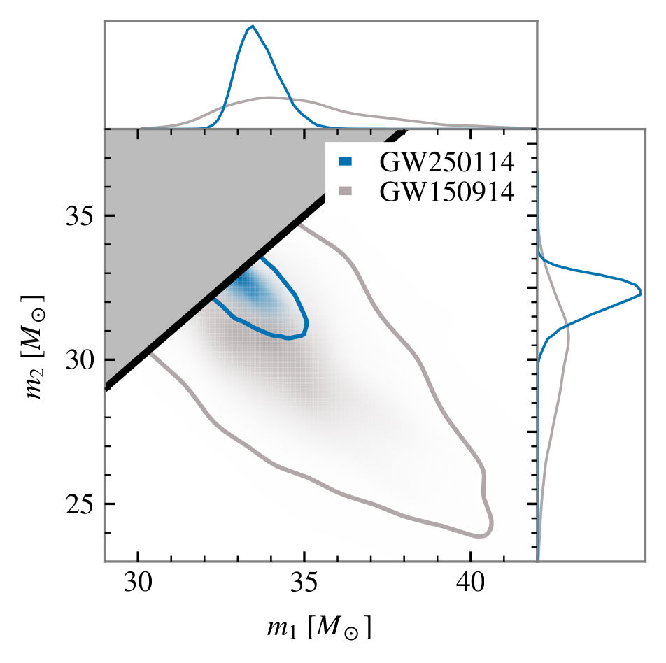

---
format:
    html:
        code-fold: true
        bibliography: ../../rehear.bib
    pdf:
        execute:
            echo: false
        bibliography: ../../rehear.bib
---

# Intrinsic parameters and waveform modeling {#sec-intrinsic}

This section will continue in the dissection of the gravitational signal emitted by the coalescence of two compact objects by considering its intrinsic parameters, those relating to the source itself and not to its relation to the observer.

## Component masses {#sec-masses}

The two objects giving rise to the coalescence are labelled "primary" and "secondary" based on their masses, respectively $m_{1}$ and $m_{2}$ with $m_{1}>m_{2}$. 
These masses are typically measured in units of the solar mass $M_{\odot} \approx 1.99\times 10^{30} \text{kg}$.

Some common combinations of these include the total mass $M = m_{1}+m_{2}$, the mass ratio $q=m_{2} / m_{1} \leq 1$,^[Conventions for this parameter differ, with some authors using $q=m_{1} / m_{2}>1$, but within `BILBY`, the standard piece of software for gravitational wave inference, it is defined to be less than 1 [@romero-shawBayesianInferenceCompact2020].] the reduced mass $\mu = m_{1} m_{2} / M$ and the symmetric mass ratio $\nu = \mu / M = m_{1} m_{2} / M^{2}$.

The waveform at low frequencies is most affected by their combination called _chirp mass_ $\mathcal{M}$, which is defined as follows:

$$ \mathcal{M} = \nu^{3/5}M = \frac{(m_1 m_2 )^{3/5}}{(m_1 + m_2)^{1/5}}
$$

A general Post-Newtonian expression for the phase of a compact binary reads as follows [@abacScienceEinsteinTelescope2025, eq. 1.1]:
$$
\Psi(f) = 2 \pi f t_{c} - \phi_{c} - \frac{\pi}{4} + \frac{3}{128 \nu x^{5}}  \left( 1+  \sum_{n=2}^{n _\text{max}} \left[ \varphi_{n} + \varphi_{n}^{(l)} \log x \right] x^{n}\right)\,.
$${#eq-post-newtonian-phase-generic}

Here, the expansion parameter represents the velocity of the binary: $x = v / c = (\pi M f)^{1 / 3}$.
The chirp mass appears as a prefactor in @eq-post-newtonian-phase-generic: $\nu x^{5} = \nu (\pi M f)^{5/3} = (\pi \mathcal{M} f)^{5/3}$.
This means it affects the phase evolution of the signal at a basic level, and its measurement will be precise if we can constrain a large number of signal cycles.

On the other hand, the Post-Newtonian coefficients $\varphi_{n}$^[A terminology note: the $n$-th term in the sum is called the $(n /2)$PN contribution. For example, the $n=5$ term is called 2.5PN.] contain information about various other contributions, such as mass ratio and spin @blanchetPostNewtonianTheoryGravitational2024.
For example, the symmetric mass ratio $\nu$ enters in the expression at 1PN order, spin-orbit effects at 1.5PN, and spin-spin effects at 2PN.

### The component masses of GW250114

This signal was quite similar to the first-ever detection, GW150914. The inferred masses of the component black holes were in fact compatible, and the distances were similar as well. 
However, due to the improvements in the detectors' sensitivity over the decade between them, the precision in measurement is now significantly better. 
@fig-gw250114-component-masses shows the posterior distribution on the component masses for these two events.

{#fig-gw250114-component-masses width=50%}

### At lower frequencies

At very low frequencies we might expect to only be able to constrain the chirp mass, with a large uncertainty on the mass ratio and all other parameters appearing later in the Post-Newtonian expansion such as spin.
While this is qualitatively true, an interesting observation 
[@toubianaParameterEstimationStellarmass2020]
is that low frequency posterior distributions can still exhibit strong correlations between chirp mass and mass ratio.

If chirp mass were the only parameter allowed to vary, the frequency derivative of the signal $\dot{f}$, or equivalently (in the SPA approximation @sec-stationary-phase-approximation) the second derivative of the FD phase $\Psi''$ in @eq-post-newtonian-phase-generic, would be sufficient to constrain it.
However, in general, fixing this frequency derivative will determine a surface --- for example, a 1D curve in the $(\mathcal{M}, \nu)$ space, or a 2D surface in the $(\mathcal{M}, \nu, \chi _\text{eff})$ space.

@toubianaParameterEstimationStellarmass2020 show this curve in the $\mathcal{M}, \nu$ plane, in the case of a stellar-mass black hole binary observed by LISA. 
Qualitatively, it is very "shallow": a variation of $\nu$ from 0.2 to 0.25 (a 25% increase) only corresponds to a variation in $\mathcal{M}$ by $10^{-3}M_{\odot}$ (a 0.003% increase). 
Nevertheless, the scale of the variation in chirp mass is comparable to typical uncertainties in this parameter obtained with long observations, and an anticorrelation between $\mathcal{M}$ and $\nu$ is systematically observed.

### Prior distribution

Typically, sampling is performed in terms of the variables $\mathcal{M}$ and $q$, but the prior distribution is required to be uniform in the $(m_{1}, m_{2})$ plane. 
The equivalent distribution can then be obtained by computing the Jacobian of the transformation [@dupletsaValidatingPriorinformedFishermatrix2025]:
$$
\pi(\mathcal{M}, q) = \mathcal{M} \frac{(1+q)^{2/5}}{q^{6/5}}\,.
$$

When sampling, it is also importanto to identify which object is the primary and which is the
secondary [@gerosaWhichWhichIdentification2025]. 
The distinction would be well-specified if we had access to the exact masses of the objects, $m_1$ and $m_2$, 
but due to measurement error we do not: any given posterior sample will describe two objects
with masses $m_a$ and $m_b$ and corresponding spins $\vec{\chi}_a$ and $\vec{\chi}_b$.

The current standard approach is to establish the correspondence $a \iff 1$ and $b \iff 2$
based on the criterion that $m_a > m_b$, on a sample-by-sample basis.
If the masses are well-distinguished (_i.e._ the mass ratio is considerable) this can be reliable,
but for comparable masses and low SNRs it is prone to bias inference.
A generic, nonparametric and non-data-driven labelling procedure is not currently available.
A practical stopgap approach is to discuss results based on relabeling invariant
parameters. 

## Spin and orbital angular momentum {#sec-spin}

In a generic binary with orbital angular momentum $\vec{L}$, the component objects will have two spin vectors $\vec{S}_{1,2}$. These three vectors will generally not be aligned, neither to each other nor with the observation direction $\vec{N}$.^[In this section we shall use this letter for the observation direction to conform with the convention, though elsewhere we use $m$.]  

In principle we could use Cartesian coordinates to describe these spins; 
however in gravitational wave analysis it is more convenient use the following decomposition:

3. $a_{1} = \lvert \vec{S}_{1} \rvert / m_{1}^{2}$, 
    the dimensionless _magnitude_ of the primary object's spin;
4. $a_{2} = \lvert \vec{S}_{2} \rvert / m_{2}^{2}$, 
    the dimensionless _magnitude_ of the secondary object's spin;
5. $\theta_{1} = \arccos (\vec{S}_{1} \cdot \vec{L})$, 
    the tilt angle between the orbital angular momentum and the primary object's spin; 
6. $\theta_{2} = \arccos (\vec{S}_{2} \cdot \vec{L})$, 
    the tilt angle between the orbital angular momentum and the secondary object's spin;
7. $\phi_{12} = \arccos(\vec{S}_{1}^{\parallel}\cdot \vec{S}_{2}^{\parallel})$, 
    the azimuthal angle between the projections 
    of the component spins in the orbital plane, 
    $\vec{S}_{i}^{\parallel} = \vec{S}_{i} - \vec{S}_{i} \cdot \hat{L}$;
8. $\phi_{\text{JL}}$, the azimuthal angle of $\vec{L}$, 
    which parameterizes rotations around the $\vec{J}$ axis.

These six parameters describe the two spin vectors in terms of their relation
to the orbital angular momentum.
The orientation of the total angular momentum is an extrinsic parameter, 
since it describes the geometric relation of the source and the observer: it is described by

1. $\theta_{\text{JN}} = \arccos(\vec{J}\cdot \vec{N})$, 
    the angle between the total angular momentum 
    $\vec{J}=\vec{L}+\vec{S}_{1}+\vec{S}_{2}$ and the observation direction $\vec{N}$.
2. $\phi_0$, the orbital phase, 
    the azimuthal angle of the observation direction $\vec{N}$ around the orbital angular momentum.

Also see @romero-shawBayesianInferenceCompact2020 for the definitions of these parameters within `BILBY`.

{#fig-spin-diagram}

Due to precession, the orbital angular momentum $\vec{L}$ and the spins $\vec{S}$ are time-dependent. The total angular momentum $\vec{J}$ is not exactly conserved for an inspiralling, precessing binary [@boyleGeometricApproachPrecession2011], but we can consider a reference frame aligned to its value early in the evolution of the binary, $\vec{J} = \lim_{ t \to -\infty }\vec{J}(t)$, so its angle with the observation direction $\theta_{\text{JN}}$ is a well-defined parameter [@prattenComputationallyEfficientModels2021].
The magnitudes of the spins $a_{i}$ are exactly conserved. 
The four remaining parameters --- two tilts and two azimuthal angles --- measurably evolve through precession, and thus need to be specified at a given reference frequency.

The angle between orbital angular momentum and observation direction, or _inclination angle_, is denoted as $\iota = \arccos(\vec{L}\cdot \vec{N})$. In the aligned-spin case it is constant and equal to $\theta_{\text{JN}}$, but in general it is a time-dependent quantity.

The best-constrained spin-related quantity is generally the effective spin parameter
$$
\chi _\text{eff} = \left(\frac{m_{1} \vec{\chi}_{1} + m_{2}\vec{\chi}_{2}}{m_{1}+m_{2}}  \right) \cdot \hat{L}\,.
$$

The extent to which precessing spin affects a binary is often characterized through the precessing spin parameter 
$$
\chi_{p} = \max \left( \chi_{1}^{\perp}, q(3q+4) / (4q+3) \chi_{2}^{\perp} \right) \,,
$$
where $\chi_{i}^{\perp} = |a_{1} \sin(\theta_{i})|$ denotes the magnitude of the in-plane component of the spins.

{#fig-chip-chieff-gw250114 width=50%}

In @fig-chip-chieff-gw250114 we show the posterior distribution on these parameters
for GW250115, obtained with several different waveform approximants. 
Qualitatively, $\chi_{\text{eff}}$ was slighty negative while $\chi_p$ was small.
The apparent decrease in posterior mass for $\chi_p \to 0$ is an artefact of the prior used 
on the component spins (@sec-spin-priors), whose distribution in terms of $\chi_p$ is shown
in grey: the data prefer small values of $\chi_p$. 

Modelling precession is generally accomplished through a change in reference frame: a waveform is obtained in a co-precessing frame, whose $z$ axis is the orbital angular momentum, and then transformed to an inertial frame by means of a time-dependent transformation, which can efficiently be computed with a Post-Newtonian approximation. We give more details on the procedure in @sec-twisting.

### Prior distribution {#sec-spin-priors}

The prior to adopt for spin variables is a matter of convention. 
Within `BILBY` [@romero-shawBayesianInferenceCompact2020], it is defined so that the dimensionless spin magnitudes $a_{i}$ are uniformly distributed in the range $[0, 0.99]$, while the spins are uniformly distributed on the sphere, meaning that $\phi_{12}$, $\phi_{JL}$, $\cos \theta_{1}$, $\cos \theta_{2}$ are uniformly distributed.

If one wishes to restrict sampling to the aligned-spin case only, care must be taken to use compatible priors: given a prior $\pi(a)$ on the spin magnitude and a prior $\pi(\cos\theta)$ on the cosine of the tilt, the equivalent prior on the aligned spin component is 
$$
\pi(\chi) = \int_{0}^{1} \text{d}a \int_{-1}^{1} \text{d}\cos\theta
        \left[  \pi(a) \pi(\cos\theta) \delta(\chi - a \cos\theta) \right]\,.
$$


## Eccentricity

In Newtonian gravity, the two-body problem is analytically solvable.
The corresponding trajectories are all planar, and they can be expressed in polar coordinates as [@karttunenCelestialMechanics2017]:
$$
r = \frac{p}{1 + e\cos f}\,,
$$
where $f$ is a polar angle in the orbital plane, measured  from the center of mass of the system, while $r = |r_{1}-r_{2}|$ is the distance between the two objects.
The motion of either body can easily be recovered from this equation: their position vectors measured from the center of mass will always have opposite signs, and magnitudes $r_{1} = q r / (1+q)$ and $r_{2} = r / (1+q)$, where $q$ is the mass ratio. 
The constants of motion $p$ and $e$ are called _semilatus rectus_ and _eccentricity_. 
The former has the dimensions of a length and it characterizes the orbit's scale; the latter is a pure number, which determines the type of conic section the orbit describes:

- $e=0$ is a circular orbit;
- $0 < e< 1$ is an elliptical orbit; 
- $e=1$ is a parabolic trajectory;
- $e>1$ is a hyperbolic trajectory.

Systems with $e<1$ are _bound_, they repeat their motion and have negative total energy.
Let us define some parameters for the elliptical case: the points $(x, y)$ of an ellipse with semimajor axis $a$ and semiminor axis $b$ obey
$$\frac{x^2}{a^2} + \frac{y^2}{b^2} = 1$$

In terms of these variables, the *eccentricity* $e$ is given by $e^2 = 1- ( b / a)^2$, the *focal distance* $c$ by $c = \sqrt{ a^{2} - b^{2} }$, and the _semilatus rectum_ $p$ by $p=a \sqrt{ 1-e^{2} }$. 

We have previously used the *true anomaly* $f$ as a polar angle: it is the angle from the periastron to the orbiting body, measured using the *focus of the ellipse* as the center. 
There are some other choices: the *eccentric anomaly* $E$ is the angle from the periastron to the *projection* of the orbiting body onto the smallest circle containing the ellipse, measured using the *center of the ellipse* as the center.
The *mean anomaly* $M$ is an angle increasing proportionally to time from a periastron pass to the next.

::: {#nte-eccentric-parameter-conversion .callout-note collapse="true"}
#####  Converting between eccentric parameters

Mean anomaly and eccentric anomaly are related through Kepler's equation, which is transcendental and therefore must be solved numerically if we want to compute $E$ as a function of $M$:
$$M = E - e \sin E$$

True anomaly and eccentric anomaly are related through the equation:
$$(1 - e) \tan^2(f/2) = (1+e) \tan^2(E/2)$$

but solving it is numerically unstable (the tangent diverges), so there is a better way [@brouckeNoteRelationsTrue1973]:
define $\beta = e / (1 + \sqrt(1-e^2))$, then
$$f = E + 2 \text{atan2}(\beta \sin E, 1 - \beta \cos E)$$

where $\text{atan2}(y, x) = \arctan( y / x)$ is the two-argument tangent function, which is also stable for $x=0$.

Finally, one may close the circle of conversions with the following relation:
$$M = \text{atan2}(-\sqrt{ 1-e^{2} \sin f }, -e - \cos f) + \pi -e \frac{\sqrt{ 1 - e^{2} } \sin f}{1+e \cos f}$$


In @fig-anomalies-visualization we illustrate how these anomalies can vary as a function of time. Also see [this animated visualization](https://www.youtube.com/watch?v=Mr9t7SLo0I0). 

{#fig-anomalies-visualization}

:::


They provide a useful starting point toward an understanding general-relativistic eccentric binaries, but their characteristics do not fully generalize: 
when gravity is strong eccentricity is not a constant of motion, nor is it covariantly defined; 
orbits are also not exactly elliptical, due to both precession and gravitational wave emission [@favataGravitationalwaveMemoryEccentric2011].

Furthermore, the strict classification of Newtonian binaries breaks down in General Relativity: 
eccentricity decreases in a process known as _circularization_, and an unbound system can 
become bound if the gravitational wave emission during a hyperbolic encounter is 
enough to make its total energy negative.^[In GR this Newtonian condition should be phrased as: "make the total energy of the system $E$ smaller than the sum of the rest masses of the components, $M$."]

It is possible to define a notion of eccentricity based on the evolution of the emission frequency of the binary.
This frequency is monotonic when the orbit is quasi-circular, while for eccentric orbits it exhibits peaks and trophs on the orbital timescale [@shaikhDefiningEccentricityGravitational2023].

Within the `TEOBResumS-DAlí` waveform model [@boninoInferringEccentricityEvolution2022;@albanesiEffectiveonebodyModelingGeneric2025], 
eccentricity and relativistic anomaly are used as an initial condition for the EOB variables, which are then evolved with fully relativistic prescriptions (see also @sec-eob). 

@gambaRevisitingGW150914Nonplanar2025 performed a first-of-its-kind reanalysis of the event GW150914 with a model including both eccentricity and precessing spins. 
Beyond the regular 15 parameters describing a precessing black hole binary,^[For convenience we give the list here: 2 masses, 6 independent spin components, 7 extrinsic parameters (inclination $\theta_{JN}$, phase $\phi_{0}$, 2 sky coordinates, luminosity distance $d_{L}$, polarization $\psi$, time of coalescence $t_{0}$.)] this analysis required two more: eccentricity and (true) anomaly.
The constraints on these two parameters are shown in @fig-ecc-zeta-gw150914.

{#fig-ecc-zeta-gw150914 width=70%}

### At lower frequencies

Most of the gravitational waves detected so far, in the audio band, have had no measurable eccentricity.
GW250114 was one such example: parameter estimation performed with an eccentric waveform [@boninoInferringEccentricityEvolution2022] model prefers eccentricity values very close to zero, as measured at a reference frequency of 13.33Hz.^[This specific value was chosen to correspond to the start of the generated waveform in the time domain. The frequency band used for the analysis started from 20Hz, but the waveform needed to be started earlier in order to account for the contributions at 20Hz of the $\ell=3$ modes, which appear at a frequency $3/2$ times higher.]

@fig-gw250114-eccentricity-posterior shows the posterior: the eccentricity is bounded to be lower than roughly 0.02.

```{python}
#| label: fig-gw250114-eccentricity-posterior
#| fig-cap: "Eccentricity posterior distribution for GW250114. A vertical line shows the location of the 90% upper limit on eccentricity."

from thesis_scripts import peters_evolution
from thesis_scripts import plt
import numpy as np
from scipy.stats import gaussian_kde

samples = peters_evolution.get_gw250114_samples()

ecc = samples['eccentricity']

plt.hist(ecc, density=True, histtype='step', bins=20, color='black')
plt.hist(ecc, density=True, bins=20, color='lightgrey')
plt.axvline(np.quantile(ecc, 0.9), ymin=0, ymax=0.5, color='black')
plt.xlabel('Eccentricity $e$ measured at 13.33Hz')
plt.ylabel('Posterior distribution $p(e)$')
plt.xlim(0, 0.05)
plt.show()
```

Despite this being the best constraint on the eccentricity of a black hole binary merger to date, based on this observation alone we cannot exclude the possibility that this binary had significant eccentricity at lower frequencies.
@fig-gw250114-eccentricity-evolution shows the posterior distribution for GW250114 evolved backward in time. 
This is done with a simple Post-Newtonian approach, namely Peters' equations [@petersGravitationalRadiationPoint1963;@maggioreGravitationalWavesVolume2007], as it only serves to illustrate the point.

```{python}
#| label: fig-gw250114-eccentricity-evolution
#| fig-cap: "Backward-extrapolated eccentricity evolution for GW250114."

from thesis_scripts import peters_evolution, data_path
from thesis_scripts import plt

fig, axs = plt.subplots(
    1, 2, sharey=True, figsize=(6, 2.5),
    gridspec_kw={'wspace':0.1}
    )


fname_cache = data_path / 'cache' / 'gw250114_eccentricity_extrapolation.npy'
freqs, lo, med, hi = peters_evolution.get_gw250114_eccentricity_extrapolation(fname_cache)

axs[0].fill_between(freqs, lo, hi, color='blue', alpha=.3, label='90\% credible interval')
axs[0].plot(freqs, med, c='blue', label='Median')
axs[0].set_title('Uniform prior on $e$')

fname_cache = data_path / 'cache' / 'gw250114_eccentricity_extrapolation_loguniform.npy'
freqs, lo, med, hi = peters_evolution.get_gw250114_eccentricity_extrapolation_loguniform(fname_cache)

axs[1].fill_between(freqs, lo, hi, color='blue', alpha=.3, label='90\% credible interval')
axs[1].plot(freqs, med, c='blue', label='Median')

for ax in axs:
    ax.set_xscale('log')
    ax.set_xlim(2e-2, 13.33)
    ax.set_ylim(0, 1)
    ax.set_xlabel('Frequency [Hz]')
axs[0].set_ylabel('Eccentricity')
axs[1].legend()
axs[1].set_title('Log-uniform prior on $e$')

plt.show()
```

While the limits and analysis quoted in the discovery paper [@abacGW250114TestingHawkings2025] used a uniform prior in $e$, 
a conservative choice, we also show results obtained with a log-uniform prior $p(e) \propto 1/e$.
The qualitative scenario is similar in both cases: eccentricities on the order of $e \sim 0.5$ are plausible in the deci-hertz band.
However, the prior significantly affects whether these lie on the edge of the distribution or along its bulk.

This is not surprising: the data is not very informative on the $e_{13.33\text{Hz}} \sim 0$ tail of the distribution, so we get back out of the analysis the assumptions we started with.
This result can lead us to reflect on the meaning of the prior on eccentricity: a flat distribution in $e_{13.33\text{Hz}}$ is not a neutral statement, but instead one which heavily favors eccentric binaries at lower frequencies. 

## Tidal parameters {#sec-tidal-parameters}

Objects such as neutron stars can be deformed by the tidal gravitational field caused by the presence of a nearby object, such as the binary companion. 
This deformation enhances the gravitational attraction between the two objects,
but it is only effective at relatively short separations: the net effect, therefore,
is to leave the early inspiral almost unchanged, while accelerating its late stages.

In the static case, this tidal field can be expressed as $\mathcal{E}_{ij}=C_{0i0j}$, where $C$ is the Weyl curvature tensor [@misnerGravitation1973, eq. 13.50], the trace-free component of the Riemann curvature tensor. At leading order, this tidal field will induce a quadrupole moment $Q_{ij}$, given by 

$$
Q_{ij} = - \Lambda M^{5} \mathcal{E}_{ij}
$$

where $\Lambda$ is the _tidal deformability_ or _polarizability_ parameter, written as

$$
\Lambda = \frac{2}{3} \kappa_{2} \left( \frac{Rc^{2}}{GM} \right)^{5}
$${#eq-tidal-polarizability}

where $R$ is the radius of the object, while $\kappa_{2}$ is its $\ell=2$ dimensionless tidal Love number, which for neutron stars is generally on the order of 0.1.

The main tidal contribution to the waveform is through the effective tidal parameter, which comes in at 5PN order [@wadeSystematicStatisticalErrors2014]:
$$
\tilde{\Lambda} = \frac{8}{13} \left[ 
(1+7\nu -31\nu^{2}) (\Lambda_{1}+\Lambda_{2})
+\sqrt{ 1-4\nu } (1+9\nu-11\nu^{2})(\Lambda_{1}-\Lambda_{2})
\right] 
$$
while secondary contributions arise depending on the tidal deviation parameter
$$
\begin{aligned}
\delta \tilde{\Lambda} = \frac{1}{2} \bigg[ 
&\sqrt{ 1-4\nu } \left( 1 - \frac{13272}{1319}\nu + \frac{8944}{1319}\nu^{2} \right) (\Lambda_{1}+\Lambda_{2})
\\
&+ \left( 
1- \frac{15910}{1319}\nu + \frac{3380}{1319}\nu^{2}  
\right)
(\Lambda_{1}-\Lambda_{2})
\bigg]\,.
\end{aligned}
$$
While their expressions are intimidating, note that several terms vanish in the equal-mass case, where $\nu = 1 / 4$; if that is true then $\tilde{\Lambda} =f(\nu) (\Lambda_{1}+\Lambda_{2})$ and $\delta \tilde{\Lambda} = g(\nu)(\Lambda_{1}-\Lambda_{2})$ for some functions $f$ and $g$. 
Furthermore, if the masses are equal and so are the tidal parameters ($\Lambda_{1}=\Lambda_{2}=\Lambda$), then we have $\Lambda = \tilde{\Lambda}$ and $\delta \tilde{\Lambda} =0$.


Love numbers are generally expected to vanish for black holes, 
and to be nonzero for other compact objects such as neutron stars.
GW250114 provided an opportunity to test this prediction:
if it had a measurable deviation from $\tilde{\Lambda}=0$, 
it would have indicated a potential violation of 
General Relativity or some other missing aspect in our description
of this binary, such as the components not being black holes but other compact objects. 
@andres-carcasonaNoLoveBlack2025 have shown this not 
to be the case within current experimental uncertainties, 
constraining $\tilde{\Lambda}$ to be less than 
155 (with uniform priors) or 35 (with log-uniform priors) for this event.

## Waveform modelling

General relativity is a complex non-linear theory, 
and in order to analyze signals from binaries with strong gravity
we must understand its predictions precisely, 
and be able to compute them quickly. 

There are several approaches to waveform modelling, 
with varying degrees of computational complexity, 
completeness in the inclusion of physical effects,
and accuracy.
Often, these approaches are calibrated or validated against full Numerical Relativity simulations. 
These have been possible for around 20 years as of this writing [@pretoriusEvolutionBinaryBlack2005;@gourgoulhon3+1FormalismBases2007], and despite being a gold standard suffer from their own set of uncertainties. 

Gravitational waves can be extracted from them based on the Weyl scalar $\Psi_4 = C_{abcd} m^a m^b n^c n^d$, where $m$ and $n$ are component vectors of a null tetrad while $C$ is the Weyl tensor. 
At large separations from the binary, this is related to the gravitational time-domain polarizations $h_+ - i h_\times$ by

$$ -\Psi_4 = \ddot{h}_+ - i \ddot{h}_\times\,,
$$

so this scalar must be computed at the edges of the simulation, integrated twice in the time variable, and then decomposed into spherical harmonics [@lofflerEinsteinToolkitCommunity2012]. 

We will focus on the Post-Newtonian (@sec-post-newtonian) and EOB (@sec-eob) approaches to waveform generation; we also note the existence of Numerical Relativity surrogates and phenomenological models for comparable mass binaries, and the gravitational self-force formalism for extreme mass ratios.

### Post-Newtonian {#sec-post-newtonian}

Post-Newtonian waveforms are obtained by analytically expanding Einstein's equations in powers of $v/c$. Thanks to the SPA approximation, this can lead to an analytical expression for the amplitude and phase as a function of frequency. 

@buonannoComparisonPostNewtonianTemplates2009 give a comparison of some commonly used Post-Newtonian templates, including the frequency-domain one `TaylorF2`, whose waveforms read [@messinaQuasi55PNTaylorF2Approximant2019]:
$$
\tilde{h}(f) = \sqrt{ \frac{5}{24} }\frac{c}{\pi^{2/3} d_{L}} \left( \frac{G\mathcal{M}}{c^{3}} \right)^{5/6}  f^{-7/6} \left( 1 + \sum_{n=2}^{n_\text{max}} A_{n} \left( \pi M f \right) ^{n} \right)  e^{i \Psi(f)}\,,
$$
where the phase $\Psi$ is in the form reported in @eq-post-newtonian-phase-generic.

Post-Newtonian templates including eccentricity also exist, though their validity is limited to the small-eccentricity regime. 

### Effective One Body {#sec-eob}

Effective One-Body waveforms are obtained by mapping the relativistic two-body problem to the motion of a test particle in a deformed metric. 
The following description will mainly describe the components of the `TEOBResumS` family of models, though similar considerations also apply to other models, such as those in the `SEOB` family.

The problem is described in a Hamiltonian setting,
in terms of the dimensionless variables $(r, p_{r}, \varphi, p_{\varphi})$, 
which are rescaled relative polar coordinates in the orbital plane. 

The effective Hamiltonian of the problem is given by [@nagarTimedomainEffectiveonebodyGravitational2018]:
$$
\hat{H} = \frac{H}{\mu} = \frac{1}{\nu} \sqrt{ 1 + 2 \nu (\hat{H}_\text{eff} - 1) }
$$
where the effective Hamiltonian contains a plethora of physical effects and Post-Netwonian contributions. 
For the `TEOBResumS` model, it is given by
$$
\hat{H}_{\text{eff}} = \sqrt{ p_{r_{*}}^{2} + A \left( 1 + \frac{p_\varphi^{2}}{r_c^{2}} + 2 \nu (4-3\nu) \frac{p_{r_{*}}^{4}}{r_{c}^{2}} \right)  }
+ p_{\varphi}(G_{S} \hat{S} + G_{S_{*}}\hat{S}_{*})\,,
$$
where the following quantities appear: 

- the potential $A$ is a generalization of the $1 - 2 GM / r c^{2}$ term in the Schwarzschild metric, which can also include corrections due to e.g. tidal effects; though it does not explicitly feature here, the Hamiltonian also depends on the $B$ potential, which at leading order reads $1 + 2 GM / r c^{2}$;
- the radial momentum $p_{r_{*}}$ expressed with respect to the tortoise coordinate $r_{*} = \int \sqrt{ B /A } \text{d}r$;
- the centrifugal radius $r_{c}$, introduced in @damourNewEffectiveonebodyDescription2014;
- a spin term, which depends on the variables $\hat{S} = (S_{1} + S_{2}) / M^{2}$ and $\hat{S}_{*} = ( q S_{1} + S_{2} / q) /M^{2}$;

The potentials $A$ and $B$ are computed with Padé resummation in order to improve stability where the Taylor approximant would diverge. 

Since we are working within General Relativity the equations of motion are not conservative: they include _radiation reaction_ terms which affect the evolution of the momenta. 
These terms also need to be computed to high order and Padé-resummed.

::: {#nte-pade-approximant .callout-note collapse="true"}
##### Padé approximation

A $(n, m)$ Padé approximant [@padeRepresentationApprocheeDune1892] to a function $f(x)$ is a ratio of polynomials, in the form:
$$
P_m^n(x) = \frac{\sum _{i=0}^{n} a_{i} x^{i}}{1+\sum _{i=1}^{m} b_{i} x^{i}},
$$

where the coefficients are determined such that 
they agree with the Taylor series:
$$
\frac{\text{d}^{r}}{\text{d}x^{r}} f(0) = \frac{\text{d}^{r}}{\text{d}x^{r}} P_{m}^{n} (0)
$$
for all $r \leq n+m$.
In fact, a Taylor series is a special case of a Padé approximant with $m=0$. 

One advantage of using Padé approximants is that, for large values of $x$, they have a lower asymptotic order, and thus tend towards less "extreme" behavior, as @fig-pade-approximant shows.

```{python}
#| label: fig-pade-approximant
#| fig-cap: "A Padé approximant for the sine function. Even when the approximation breaks down, the Padé approximant outputs values somewhat close to those of the actual function, while the Taylor series quickly diverges."

import numpy as np
from scipy.interpolate import pade
from scipy.special import factorial

from thesis_scripts import plt

sine_taylor_coefficients = [0, 1, 0, -1/factorial(3), 0, +1/factorial(5), 0]

p, q = pade(sine_taylor_coefficients, 4)
pade_sine = np.vectorize(lambda x : p(x) / q(x))
taylor_sine = np.poly1d(list(reversed(sine_taylor_coefficients)))

x = np.linspace(-10, 10, num=1000)

plt.plot(x, np.sin(x), label='$\sin(x)$', c='black')
plt.plot(x, taylor_sine(x), label='Taylor series to order 7', ls='--')
plt.plot(x, pade_sine(x), label='Padé $(3, 4)$ approximant')
plt.legend()
plt.ylim(-10, 10)
plt.xlabel('$x$')
plt.show()
```

:::

The waveform obtained by computing a solution to the EOB dynamics 
is then completed with corrections for the "plunge" regime [@damourFaithfulEffectiveonebodyWaveforms2007], 
and --- for black hole binaries --- a smooth connection to the ringdown [@damourIntroductoryLecturesEffective2008], which is modelled as a superposition of 
quasi-normal modes as described in @sec-ringdown.
The treatment for the post-merger regime of other compact objects such as neutron stars is significantly more complex, as the phenomenology is much more variable and not currently constrained by observational data. 
Nevertheless, approaches have been proposed to handle it [@breschiKilohertzGravitationalWaves2022].

A numerical solution to the EOB evolution equations is not always necessary: 
@nagarRushInspiralEfficient2019 showed that a post-adiabatic approximation allows for the 
analytic solution to these equations. 
@gambaFastFaithfulFrequencydomain2020 further applied a stationary phase approximation (SPA, see @sec-stationary-phase-approximation)
to these waveforms, allowing for direct generation in the frequency domain.

The SPA approach is not always feasible: for example, eccentric-hyperbolic binaries
do not satisfy the requirements for the SPA, and their waveforms need to 
be computed in the time domain [@nagarEffectiveonebodyWaveformModel2024, @gambaRevisitingGW150914Nonplanar2025].

The EOB approach is also amenable to being extended with beyond-GR parameters, see e.g. @chiaramelloParametrizedModelGravitational2025. 

### Surrogate models: the `mlgw_bns` example {#sec-mlgw-bns}

The evaluation of gravitational waveform models is commonly a bottleneck for the likelihood, therefore significant efforts have been devoted to the development of _surrogate models_, which reproduce the results from a computationally expensive model.

As an example, we show results from `mlgw_bns` [@tissinoCombiningEffectiveonebodyAccuracy2023],
a surrogate of the frequency-domain model `TEOBResumSPA` [@gambaFastFaithfulFrequencydomain2020] for aligned-spin neutron star binaries
with tidal effects --- a 5-dimensional parameter space, with parameters $(q, \chi_1, \chi_2, \Lambda_1, \Lambda_2)$, since all others can be modeled analytically.

As a surrogate, it is trained on the base model, which can be evaluated at arbitrary points in the parameter space. 
The surrogate's accuracy depends on the number of training data points, and it is measured in terms of the mismatch
$$
\bar{\mathcal{F}} = 1 - \max_{t_{0}, \phi_{0}} \frac{(h_\text{true}| h _\text{surr}(t_0, \phi_0))}{\sqrt{ (h _\text{true}| h _\text{true}) (h _\text{surr}| h _\text{surr})}}
$${#eq-mismatch}
where the scalar products are computed as in equation @eq-noise-weighted-inner-product, and generally maximized over reference time and coalescence phase --- this is equivalent to allowing the surrogate model to have a different parameterization for timing and phase than its baseline. 
This is generally acceptable, since timing and phase have no astrophysical meaning.

{#fig-mlgw-bns-accuracy width=60%}

Whereas the mismatch is a global metric, reconstruction accuracy can also be locally measured by directly comparing the predictions with those of the base model. We show this in @fig-mlgw-bns-reconstruction-fd: the high accuracy achieved at low frequencies is by construction, as the model is constructed by incorporating an analytic Post-Newtonian baseline and only fitting the residual error.

{#fig-mlgw-bns-reconstruction-fd width=60%}

The surrogate model should also be faster to evaluate: this is indeed the case, as @fig-mlgw-bns-compared-timing shows.
The number of grid points in frequency has a significant impact on the evaluation time for all models, as is inevitable given the increased number of floating point operations.
Therefore, we separate out the constant-time contribution to the evaluation time from the one scaling with the number of grid points.

{#fig-mlgw-bns-compared-timing width=60%}

