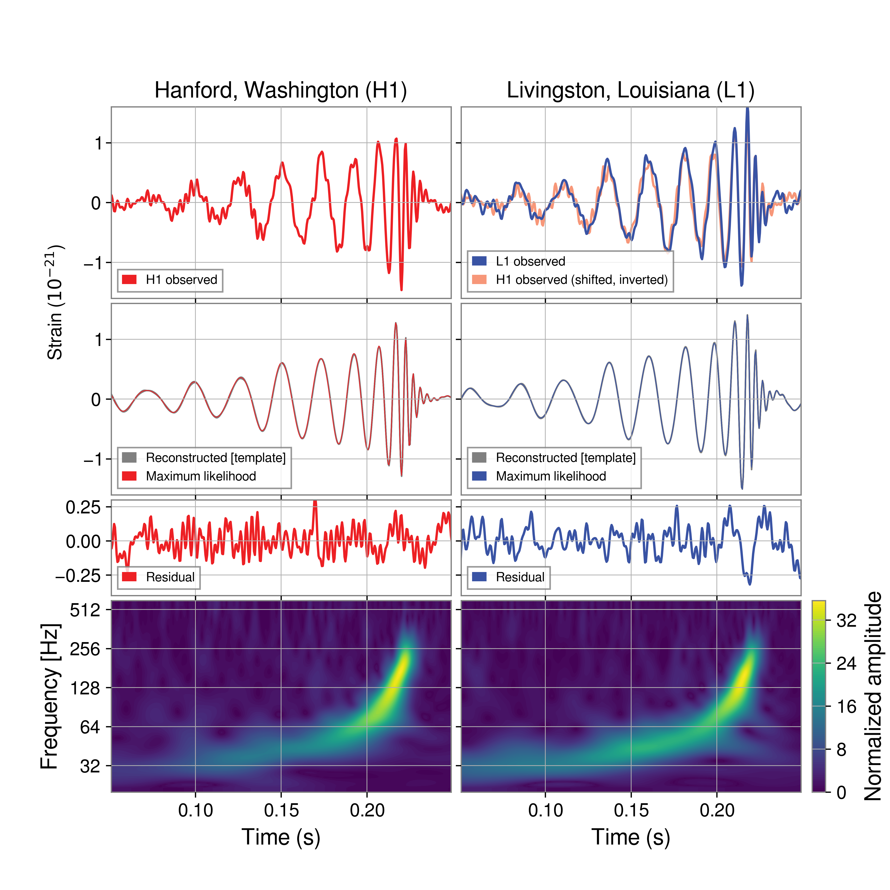

---
format:
    html:
        code-fold: true
        bibliography: ../../rehear.bib
    pdf:
        execute:
            echo: false
        bibliography: ../../rehear.bib
---
# Gravitational wave parameter estimation

This chapter will outline the basic tools used for the parameter estimation for gravitational waves. 

The starting point for our analysis is typically an estimate for the gravitational wave strain observed by one or more detectors, which is expressed as a discretized time series $d(i \Delta t)$, with integer $i$. 
Each of the entries in this time series is noisy, and they cannot be considered in isolation: due to the wide-band nature of the noise, any given pair of points $d(i \Delta t)$ and $d(j\Delta t)$ will in general be _correlated_.
Then, in order to analyze a data segment of duration $T$, with $N = T / \Delta t$ samples, we would naïvely need to consider all $N^{2}$ combinations.

The Fourier transform of the signal can come to our aid: its continuous version is
$$
\tilde{h}(f) = \int_{-\infty}^{\infty} h(t) \exp(-2\pi i ft)\text{d}t\,,
$$
while the discrete version, computed at a frequency $f = m / T$ with integer $m$, is
$$
\tilde{h}(m / T) = \Delta t \sum_{n=0}^{N-1} h(n \Delta t) \exp \left(  -\frac{2 \pi i mn }{N}  \right)\,.
$${#eq-fourier-transform-discrete}

::: {#nte-fourier-transform-periodicity .callout-note collapse="true"}
##### Fourier transform periodicity and range

While this  can be computed for any $m \in \mathbb{Z}$, it only contains independent information for $0 \leq m < N / 2$: since our time domain signal is real-valued $\tilde{h}(-m / T) = \tilde{h}^{*}( m / T)$, and $\tilde{h}(m /T) = \tilde{h}( (m+N) / T)$. 

Starting from $N$ real-valued samples in time we then get $N / 2$ complex-valued ones in frequency.
The frequency samples are spaced by $1 / T$, while the highest frequency available is $1 / 2 \Delta t$, the Nyquist frequency. 
Any signal with frequency higher than this would experience _aliasing_, since its period would be faster than the sample rate. 
:::


The Fast Fourier Transform algorithm allows us to compute this relatively quickly, in $O(N \log N)$ operations [@heidemanGaussHistoryFast1984].

Under some assumptions, the Fourier components of the data are uncorrelated, which reduces the computational complexity to $O(N)$.
Because of this, we will start our discussion with the Fourier-domain Whittle likelihood (@sec-whittle-likelihood), but also describe the way parameter estimation can be performed when those assumptions break down (@sec-time-domain-pe).

## The Whittle likelihood {#sec-whittle-likelihood}

The likelihood expresses the answer to the question:

> How likely are we to have observed the data $d$, under the assumption that this data 
> can be decomposed as noise $n$ plus a signal $h(\theta)$ with fixed parameters $\theta$?

If we are writing the data as $d = n + h(\theta)$, this is equivalent to asking:

> How likely are we to observe a noise realization equal to $n = d - h(\theta)$?

In order to answer this, we need a model for the noise. 
In gravitational wave data analysis, it is commonly assumed that the noise
can be described as a stationary time series, $n(t)$, whose autocorrelation
$\mathbb{E}[n(t)n(t+\Delta t)] \equiv \gamma(\Delta t)$ can be expressed as a function of $\Delta t$ only [@edwardsBayesianSemiparametricPower2015, section II.C].
A further assumption made is that the noise has zero mean ($\mathbb{E}[n(t)] = 0$ for any time).

The Fourier transform of the autocorrelation function $\gamma(\Delta t)$ is called the Power Spectral Density, $S_{n}(f)$,
which can alternatively be expressed as [@mooreGravitationalwaveSensitivityCurves2015]:
$$
 \langle n(f) n^{*}(f') \rangle = \frac{1}{2} \delta(f-f') S_{n}(f)\,.
$$

As defined, this is the _one-sided_ PSD, which satisfies
$$
\langle \lvert n(t) \rvert ^{2} \rangle = \int_{0}^{\infty} S_{n}(f) \text{d}f\,.
$$
We could have alternatively defined it without the $1 / 2$ factor, simultaneously extending the integral from $-\infty$ to $\infty$. The negative-frequency contribution to the integral is equal to the positive-frequency one, since the signal and noise are real.

The PSD can be used for the characterization of the second moment of any stationary noise; if we further assume that the noise is Gaussian, we can obtain the Whittle approximation to the Gaussian likelihood [@whittleCurvePeriodogramSmoothing1957;@rouletInferringBinaryProperties2024]:

$$
\begin{aligned}
\log \mathcal{L}(n) &= \log \mathcal{N_{1}} + \sum_{m>0} \left[  \log \left(\frac{2}{\pi T S_{n}(f_{m})} \right) - \frac{2 |n(f_{m})|^{2}}{T S_{n}(f_{m})} \right]  \\
&= \log \mathcal{N_{2}} - \frac{1}{2} \int_{0}^{f_\text{max}} \frac{4 |n(f)|^{2}}{S_{n}(f)} \text{d}f\\
&= \log \mathcal{N_{2}} - \frac{1}{2} (n|n)\,.
\end{aligned}
$$

The normalization terms $\mathcal{N_{1}}$ and $\mathcal{N_{2}}$ are different, but crucially they only depend on the Power Spectral Density, not on the specific noise realization.

In the last equation, we introduced the notation $(\cdot | \cdot)$ for the noise-weighed inner product between waveforms, defined as 

$$ (a | b) = 4 \Re \int_0^\infty \frac{a(f) b^*(f)}{S_n(f)}\text{d}f \,.
$${#eq-noise-weighted-inner-product}

More specifically, this likelihood answers the question: 

> How likely is it that noise distributed according to the PSD $S_{n}(f)$ will have the specific realization $n$?

It is possible to infer the PSD together with the signal parameters [@edwardsBayesianSemiparametricPower2015], but in the data analysis for gravitational wave signals from ground-based interferometers, it is common practice to fix the PSD to an estimate obtained considering data near the event.
This is acceptable, since variations in the noise distribution typically happen on much slower time scales than duration of the signal itself.

In such a case, we can rewrite the likelihood in terms of the signal $h(\theta) = d - n$ as follows:

$$
\begin{aligned}
\log \mathcal{L}(d | \theta) &= \log \mathcal{N_{2}} - \frac{1}{2} (d-h(\theta)| d- h(\theta)) \\
&= \log \mathcal{N_{2}} - \frac{1}{2} (d| d) + \mathrm{Re}(h(\theta)|d) - \frac{1}{2} (h(\theta)|h(\theta))\,.
\end{aligned}
$$

We can work around the messy normalization term [@rouletInferringBinaryProperties2024]. Our likelihood is written assuming that a signal is present in the data, but supposing that was not the case, we would have $d = n$ and therefore

$$
\log \mathcal{L}(d | \text{noise only}) = \log \mathcal{N_{2}} - \frac{1}{2} (d|d)\,.
$$

Since we are assuming the PSD is fixed, this model has zero parameters, and this likelihood can also be interpreted as an evidence: $\log \mathcal{L}(d | \text{noise only}) = Z _\text{noise}$.

Therefore, we can perform parameter estimation using the likelihood ratio

$$
\log \mathcal{L}_{r} (d|\theta) = \log \frac{\mathcal{L}(d|h(\theta))}{Z _\text{noise}} = \mathrm{Re}(h(\theta)| d) - \frac{1}{2} (h(\theta)| h(\theta))\,,
$$ {#eq-likelihood-ratio}

and the evidence we will obtain, the integral of $\mathcal{L}_{r}(d|\theta) \pi(\theta) \text{d}\theta$ over the parameter space, will actually be a Bayes Factor, $Z_\text{signal and model} / Z_\text{noise}$.

### Periodic data: windowing

The Fourier transform in equation @eq-fourier-transform-discrete is, technically speaking, only appropriate if the data is _periodic_. 
This is not the case for realistic data: on the contrary, we only want to consider a given segment in time around our event. Then, the noise matrix will not be exactly diagonalized by the Fourier transform.

We can model the process of selecting a finite chunk of data from a theoretically infinite process as multiplication by a window function $w(t)$ [@talbotInferenceFiniteTime2021]: if the data time series is $d_{i}$, originating from an infinite process $D_{i}$, we can define a corresponding window time series $w_{i}$ and get
$$
d_{i} = D_{i} w_{i}\,.
$$
The series $w_{i}$ is here simply defined to be 1 for indices inside the window, and 0 outside.
In the Fourier domain, multiplication is replaced by convolution:
$$
\tilde{d}_{k} = (\tilde{D} * \tilde{w})_{k} = \Delta t \sum_{j=0}^{N-1} D_{j} w_{j} \exp \left( - \frac{2 \pi i j k}{N} \right) \,.
$$

Any window function will therefore introduce _spectral leakage_, making the noise covariance significantly non-diagonal in the frequency domain. 

In gravitational wave science, the Tukey window is commonly chosen:
$$
w(t) = \begin{cases}
\frac{1}{2} \left[ 1-\cos \left( \frac{2 \pi t}{\alpha T} \right)  \right]  & 0\leq t \leq \alpha T / 2 \\ 
1 & \alpha T / 2 \leq t \leq T/2 \\
w(T-t) & 0 \leq t \leq T
\end{cases}
$$

It significantly decreases spectral leakage compared to the rectangular window, as seen in @fig-window-functions, despite leaving the central $1-\alpha$ seconds of the data unchanged.


```{python}
#| label: fig-window-functions
#| fig-cap: "A comparison of a rectangular and Tukey window function in the time and frequency domains."

import numpy as np
import matplotlib.pyplot as plt


N = 1000
x = np.arange(0, 2*N)

y_rect = np.zeros(2*N)
y_rect[:N] = 1

y_tuk = np.zeros(2*N)

alpha = .2

for n in range(int(alpha*N/2)):
    y_tuk[n] = .5 * (1-np.cos(2 * np.pi * n / alpha / N))
    y_tuk[N-n] = .5 * (1-np.cos(2 * np.pi * n / alpha / N))
for n in range(int(alpha*N/2), N//2+1):
    y_tuk[n] = 1
    y_tuk[N-n] = 1

fig, axs = plt.subplots(1, 2, figsize=(8, 3.5))

c1 = 'grey'
c2 = 'navy'

axs[0].plot(x-N//2, np.roll(y_rect, N//2), c=c1)
axs[0].plot(x-N//2, np.roll(y_tuk, N//2), c=c2)
axs[0].set_title('Time domain')
axs[0].set_xlabel('Time bins')
axs[0].set_ylabel('$w(t)$')

axs[1].loglog(abs(np.fft.rfft(y_rect)), c=c1, label='Rectangular window')
axs[1].loglog(abs(np.fft.rfft(y_tuk)), c=c2, 
label='Tukey window, $\\alpha=0.25$')
axs[1].set_ylim(1e-3, 5e3)
axs[1].set_title('Frequency domain')
axs[1].set_xlabel('Frequency bins [log]')
axs[1].set_ylabel('$\log|\\tilde{{w}}(f)|$')
axs[1].set_yticklabels([])
axs[1].legend()

plt.show()

```

Applying a Tukey function with parameter $\alpha$ to a stationary time series will, on average, reduce its power to a fraction of the total given by [@talbotInferenceFiniteTime2025]
$$
\beta = \int w^{2}(t) \text{d}t = 1- \frac{5\alpha}{8}\,.
$$

Before mid-2025, it was common practice in the analyses performed by the LIGO-Virgo-KAGRA collaboration to counteract this effect by rescaling the whole data segment by a factor $1/\sqrt{ \beta }$.

However, @talbotInferenceFiniteTime2025 showed that 

1. the non-diagonality in the noise matrix introduced by the Tukey window has no significant impact on inference if the data segment is long enough;^[The precise requirement is as follows: let us define $D_{w}$ as the diagonal matrix which applies the whitening operation in the time domain, and the whitening filter $\mathcal{W}$, written in terms of the noise covariance matrix $C$ as $\mathcal{W}^{\top} \mathcal{W} = C^{-1}$. Then, the impact on inference is small as long as the two quantities $\mathcal{W}h$ and $\mathcal{W}(1-D_{w})d$ do not significantly intersect.]
2. rescaling the data by $1 / \sqrt{ \beta }$ brings about a small, but detectable, systematic bias in inference.

The second point was shown through a pp-plot.
For a few thousand times, a signal was injected and recovered in a data segment, with or without the correction.
The recovery was performed only varying the luminosity distance of the signals. 

::: {layout-ncol=2}


:::

It shows signs of overconstraing: compare with the example in @fig-pp-plot-bias-overconstrain.
Rescaling the data is equivalent to multiplying the log-likelihood by $1/ \beta$, which makes its peak artificially too narrow.


### Non-periodic data: time domain parameter estimation {#sec-time-domain-pe}

The procedure of windowing and tapering the data works well enough for the analysis of a full gravitational wave signal, for which we can consider a relatively long segment around the event. 
However, in some cases we do not have that luxury: 
for example, in the analysis of the ringdown,
it is crucial to be able to isolate the perturbative regime, 
which only describes the data well starting a certain time after the merger (@sec-ringdown).

To this end, we want to only analyze data starting from a specific point in time which "cuts off" part of the signal in the region where it is stronger. 
Trying to impose this kind of sharp time-domain cut in the frequency domain is a losing endeavour.
The solution is to go back to a time-domain likelihood, in the form:
$$
\mathcal{L}(d|\theta) = - \frac{1}{2}\sum_{i,j=0}^{N} (d_{i}-h_{i}) C_{ij}^{-1} (d_{j}-h_{j}) + \text{const.}
$$
where $d_i$ and $h_i$ are the discretized time-domain data and predicted strain, defined so that the index $i=0$ corresponds to the cut time [@isiAnalyzingBlackholeRingdowns2021].

The time-domain covariance $C_{ij}$ is not diagonal, unlike the frequency-domain one. Still, there are some computational tricks one can use. 

We need two definitions: a matrix is said to be _Toeplitz_ if its diagonals contain constant values: for all $0\leq i,j < N$, we have $C_{ij} = C_{{(i+1)(j+1)}}$. An $N\times N$ Toepliz matrix has $2N-1$ independent entries.
A _symmetric Toeplitz_ matrix, furthermore, satisfies $C_{ij}=C_{ji}$, and only has $N$ independent entries.
It can be expressed in terms of a vector $\rho$ with $N$ entries: $C_{ij} = \rho_{|i-j|}$.
A _circulant_ matrix is a Toeplitz matrix in which every row is equal to the previous one, shifted by one:   $C_{ij} = \rho_{{(i-j) \text{ mod }N}}$; if the circulant matrix is symmetric, then $C_{ij} = \rho_{|i-j| \text{ mod } N}$. 
A symmetric circulant metric only has $\lceil N / 2 \rceil$ independent entries.

The time-domain noise covariance of a stationary process is always symmetric Toeplitz: its entry $C_{ij}$ describes the covariance between time $i\Delta t$ and time $j \Delta t$; by stationarity, this can only depend on the delay $(i-j)\Delta t$, therefore only on the difference $i-j$. As this is a covariance matrix it will be symmetric: the entries can actually only depend on the modulus of the index difference, $|i-j|$.
Furthermore, if we impose periodic boundary conditions then the covariance is also circulant; we cannot do so in the time-limited case.

Circulant matrices are exactly diagonalized by the discrete Fourier transform.
Toeplitz matrices are not, but they can be fully characterized by the autocovariance function $\rho$: $C_{ij}= \rho(|i-j|)$.

The time-domain likelihood can be written as in @eq-likelihood-ratio, but with scalar products in the form [@isiAnalyzingBlackholeRingdowns2021]
$$
(a|b)_{\text{TD}} = \sum_{i, j= 0}^{N-1} a_{i} C^{-1}_{ij} b_{j}\,.
$$
If $C$ is Toepliz, this can be efficiently computed with a standard routine such as Levinson–Durbin recursion, which returns a the solution $x$ to a linear system $b_{i}=C_{ij}x_{j}$ when $C$ is a Toeplitz matrix. 
Alternatively, one can compute the lower-triangular Cholesky factor $L$ such that $LL^{\top} = C$, invert it, and then compute the product as the scalar product of the _whitened_ vectors $L^{-1}a$ and $L^{-1}b$
$$
(a|b)_\text{TD} = (L^{-1}a)\cdot(L^{-1}b)\,.
$$

### Strain plotting and whitening {#sec-strain-whitening}

It is common for data analysts to wish to start their description of some signal by showing the corresponding _unprocessed_ data, the starting point for their endeavors to draw physical meaning. 
Being able to show unprocessed data is also useful in the context of scientific communication, since it allows the presenter to show a figure which can be immediately understood.

This task is made tricky in the context of gravitational wave analysis by the nature of the noise.
The sensitivity "bucket" in the frequency domain means that the magnitude of the noise outside a given band completely overwhelms the time-domain data: while typical strain magnitudes are on the order of $10^{-21}$ or less, raw time-domain strain data is often $> 10^{-18}$.

If we are determined to show strain, we need to filter the series: @fig-strain-gw250114 shows this for GW250114. A Butterworth band-pass filter between $35 \text{Hz}$ and $350 \text{Hz}$ was applied twice to the data, in addition to a notch filter at $60 \text{Hz}$ to remove power grid-driven noise.
The original detection paper for GW150914 [@ligoscientificcollaborationandvirgocollaborationObservationGravitationalWaves2016] used many more hand-tuned notches to eliminate the numerous spectral features present in the noise at that time, which have fortunately been reduced nowadays.

{#fig-strain-gw250114}

Besides the apparent technical complexity of this approach and its many parameters, its residuals are problematic. 
Residuals computed subtracting a filtered model from filtered strain data have little meaning, since their distribution is hard to model and frequency-dependent: one should refrain from trying to draw conclusions based on their patterns and magnitude, which essentially removes all of their utility.

A significant advantage of showing filtered data is being able to show the actual signal magnitude, on the order of $10^{-21}$, on the $y$-axis.
The alternative approach, which has become the standard nowadays, does not share this. 

_Whitening_ the data means normalizing it to the noise, so that in the absence of a signal it becomes white noise. 
In the frequency domain, whitening a series $h(f)$ means defining
$$
h_{w}(f) = h(f) \sqrt{ \frac{4}{T S_{n}(f)} }\,,
$$
where $S_{n}$ is the noise power spectral density, while $T$ is the segment duration. With this normalization, each noise entry has variance 2 (due to its independent real and imaginary components) [@BilbygwdetectorinterferometerInterferometerBilby28].
This can also be generalized to time-domain analyses, as discussed in @sec-time-domain-pe.

In the presence of a signal, whitened time-domain strain will deviate from its mean of zero; the deviation amount can be immediately interpreted as a number of standard deviations.
For GW250114, this reached the level of 15$\sigma$, as one can see in @fig-gw250114-whitened-strain.

## Matched filtering and the signal-to-noise ratio {#sec-snr}

The discussion so far has discussed the analysis of a signal we know to be present in the data. 
However, the tools we described can also be used to quantify the _detectability_ of a signal.

The _matched-filter_ signal-to-noise ratio (SNR) statistic $\rho$ for the data $d$, assuming a template $h$, is given by
$$\rho _\text{MF} = \frac{(d | h)}{\sqrt{(h|h)}}
$$
in terms of the scalar products defined in @eq-noise-weighted-inner-product.

A common approach when looking for a signal in the data, is to look for high values in this quantity for a large set of templates $h$.

If we fix the template $h$ we can also compute the expectation value of the SNR when varying the noise realization:
$$
\rho _\text{opt} = \mathbb{E}_{n} \left[ \frac{(d|h)}{\sqrt{ (h|h) }} \right] = \sqrt{ (h|h) }\,.
$$
While this is called _optimal_ SNR, it involves no optimization procedure. 
If a template with a given optimal SNR is injected into Gaussian noise, the matched-filter SNR is equally likely to be higher and lower than the optimal value.

Since the optimal SNR depends on an integral in the form $\rho _\text{opt}^2 \sim \int |h|^2 / S \text{d}f$, independent SNRs (such as ones from different detectors, or different frequency bands considered independently) add in quadrature:
$$
\rho _\text{tot}^{2} =  \sum_{i} \rho_{i}^{2}\,.
$$

The highest SNR for a gravitational wave signal, as of early 2026, was achieved by the event GW250114 [@abacGW250114TestingHawkings2025], which reached a value of nearly 80 when combining the Livingston and Hanford LIGO detectors.

### SNR thresholds

This section gives a brief outline of the way to estimate what value of SNR is sufficient for a signal to be detectable. This is useful information in the context of _forecasting_, i.e. estimating the number of detected signals by some detector that is not yet operational.

If we were searching for a signal without any possible shift in time and with the certainty 
that the noise did not contain any glitches or non-Gaussianities, then the SNR would simply follow
a $\chi^2$ distribution with two degrees of freedom [@babakSearchingGravitationalWaves2013], 
meaning that we could reach "five $\sigma$" significance ($p$-value of $5.7\times 10^{-7}$) 
with a threshold of $\rho = 5.5$. 

This is not the case in real data, since both the aforementioned assumptions are false:
the different possible arrival times of a signal are effectively "more trials", but more importantly
the non-Gaussianity of the noise means that high-SNR triggers in a matched filtering search will
be much more common than simple Gaussian statistics would indicate.
Accounting for these factors is tricky, and in real data it is typically accomplished 
by performing time-slides: taking real detector data, but shifted across detectors by more than $t_{\text{min}} = d/c$, where $d$ is the maximum distance separating them.
In the assumption that signals are rare (which holds for current detectors, for ET 
this will have to be challenged), this allows us to generate arbitrary amounts of noise-only 
realistic data by removing all possible coincidences.
We can then compute the rate of noise instances surpassing our threshold, even if this rate
is very low.
With this, we can compute the false-alarm rate (FAR) associated to a given SNR threshold.
It should be noted that real searches are significantly more sophisticated than SNR maximizers; for example, `PyCBC` requires
that each frequency band contributes appropriately to the SNR [@nitzRapidDetectionGravitational2018], which allows us to discard many loud glitches.

Nevertheless, high SNR is correlated with low FAR, and the scaling of the FAR as a function of SNR, in the absence of large outliers, is typically exponential [@lynchObservationalImplicationsLowering2018]:
$$ \text{FAR} \approx \text{FAR}_8 \exp \left( - \frac{\rho - 8}{\alpha}\right) \,.
$$

The specific values for the FAR at $\rho = 8$ and the scaling parameter $\alpha$ 
are found through a fit, and they depend on the signal template.
A fit of O1 data found $\alpha = 0.18$ and $\text{FAR}_8 = 5500 \text{yr}^{-1}$ for BBH, 
and $\alpha = 0.13$ and $\text{FAR}_8 = 30000 \text{yr}^{-1}$ for BNS.
This value of $\alpha$ means that the exponential cutoff is quite steep: 
for example, bringing the BNS FAR from 30 thousand per year to just one 
per year only requires us to raise the equivalent threshold to $\rho = 9.4$ on average.

For the purposes of forecasting, then, what SNR threshold should we consider 
as the minimum for detectability?
Despite not knowing which glitches will affect our future detectors, 
this sharp exponential behavior gives us confidence that values in the range of roughly 8 to 12 will be sufficient. 

## Likelihood acceleration {#sec-likelihood-acceleration}

This section will discuss common approaches which can be used to accelerate the computation of a frequency-domain Whittle likelihood.

The two terms we need to compute for the likelihood ratio [@eq-likelihood-ratio] are the following integrals:
$$
\mathrm{Re}(h(\theta)| d) = 4 \mathrm{Re}\int_{0}^{f_\text{max}} \frac{h(f; \theta) d^*(f)}{S_{n}(f)} \text{d}f\,,
$$
and

$$
(h(\theta)| h(\theta)) = 4 \int_{0}^{f_\text{max}} \frac{|h(f; \theta)|^{2}}{S_{n}(f)} \text{d}f\,.
$$

The baseline approach is to evaluate these as Riemann sums on the full Fourier-domain grid (also called the "FFT grid"), which as we outlined in @nte-fourier-transform-periodicity has $T / 2\Delta t$ frequency bins.
This becomes less and less practical the longer the data segment is. 

Several approaches to accelerate this computation have been proposed, see section 3 in @rouletInferringBinaryProperties2024 for a review. 
Here we will outline two of the most popular approaches: relative binning and reduced order quadrature.

The efficacy of both approaches is fundamentally driven by their ability to decrease the number of frequencies at which the waveform approximant is evaluated. 
This will generally reduce the total evaluation time, but only to a point: in @fig-mlgw-bns-compared-timing we illustrate the general scaling of waveform model evaluation: $t = t_1 + N t_{2}$, where $N$ is the number of grid points.
Decreasing $N$ significantly below $t_{1} / t_{2}$ is going to exhibit diminishing returns.

### Relative binning

Relative binning [@zackayRelativeBinningFast2018] is a technique to accelerate the evaluation of the integrals in the likelihood using the key idea that, while the waveform itself may be highly oscillatory, all the waveforms which are compatible with the data will be quite similar to each other (in a specific sense).

Starting from a reference waveform $h_{0}(f)$, we define the ratio $r(f) = h(f)  / h_{0}(f)$ of the generic waveform $h$ to the reference one $h_{0}$. 
Then, we can define a relatively coarse grid in frequency, and approximate $r(f)$ to linear order within each bin $b$: for all frequencies $f$ in the bin,
$$
r(f) = r_{0}(b) + r_{1}(b) (f-f_{m}(b)),
$$
where $f_{m}(b)$ is the central frequency in the bin.

Then, we compute some summary statistics: for each bin $b$, define
$$
\begin{aligned}
A_{0}(b) &= \int_{f\in b} \frac{d(f) h^{*}_{0}(f)}{S_{n}(f) / T} \\
A_{1}(b) &= \int_{f\in b} \frac{d(f) h^{*}_{0}(f)}{S_{n}(f) / T} (f-f_{m}(b)) \\
B_{0}(b) &= \int_{f\in b} \frac{|h_{0}(f)|^{2}}{S_{n}(f) / T} \\
B_{1}(b) &= \int_{f\in b} \frac{|h_{0}(f)|^{2}}{S_{n}(f) / T} (f-f_{m}(b))\,.
\end{aligned}
$$

These integrals need to be computed at maximum resolution in frequency, but only once, with the reference waveform.
With these at hand, the two terms are approximated as follows, in terms of a set of frequencies $b = \left\lbrace f_{i}\right\rbrace$:

$$
 \mathcal{L}_{hd} = \mathrm{Re} \sum_{b} (A_{0}(b) r_{0}^{*}(b) + A_{1}(b) r_{1}^{*} (b))
$$
and
$$
\mathcal{L}_{hh} = \sum_{b} ( B_{0}(b) |r_{0}(b)|^{2} + 2 B_{1}(b) \mathrm{Re}(r_{0}(b) r_{1}^{*}(b)))\,.
$$
The values of the constant and linear coefficients for each bin, $r_{0}$ and $r_{1}$, can be be computed from the values of the ratio at the bin edges as
$$
r_{0}(b) = \frac{r(b)+r(b+1)}{2}
\qquad \text{and} \qquad r_{1}(b) = \frac{r(b+1)-r(b)}{\text{d}f(b)}\,.
$$

Crucially, this depends on the ratio $r(f)$ being relatively smooth across the frequency axis.
This is expected to be approximately true for all the relevant points in the posterior, potentially not if we stray from its peak.

The formulation given here works well in the absence of orbital precession. 
In its presence it breaks down, since the smooth structure of the waveforms is not preserved - the residual $r(f)$, directly computed, is not smooth enough for . However, this can be counteracted by performing a mode-by-mode decomposition in the orbital frame of the binary (see @sec-twisting) [@narolaRelativeBinningComplete2023].

For an example of how the waveform ratio $r(f)$ looks, see @fig-projected-lgwa-waveforms-ratio, where it is computed with the Lunar Gravitational Wave Antenna.

### Reduced order quadrature

Whereas relative binning seeks to closely approximate the likelihood in the region where waveforms look like what was measured, reduced order quadrature allows us to obtain a representation which is valid for any point in the prior space [@morisakiRapidLocalizationInference2023].

The equations to approximate the terms in the likelihood are somewhat similar: some weights $\omega$ and $\psi$ are pre-computed, then the waveform is evaluated on a sparse grid and multiplied by these.
$$
\mathrm{Re} (d|h) \approx \sum_{j=1}^{N_{L}} h(f_{j}, \theta) \omega_{j}
$$
$$
(h|h) = \sum_{i=1}^{N_{Q}} |h(f_{i}, \theta)|^{2} \psi_{i}\,.
$$

The weights are typically computed with a greedy algorithm, which constructs a basis that will represent all waveforms sampled from the prior to a given tolerance.

@bakerSignificantChallengesAstrophysical2025 have argued that this method, while being the best currently available option to guarantee an unbiased analysis, can only be extended so far when considering next generation detectors such as the Einstein Telescope and Cosmic Explorer.
This is because, when accounting for the Earth's rotation and frequency-dependent antenna patterns, the computational burden for creating and storing the basis becomes too large.

## Marginalization

If the exact dependence of the likelihood on a given parameter is known, 
the integral over said parameter can sometimes be performed analytically
[@singerRapidBayesianPosition2016;@thraneIntroductionBayesianInference2019;@LIGOT1300326v1AnalyticMarginalisation].
This procedure is generally applied to reference phase $\phi$, distance $d_{L}$ and reference time $t_{0}$ [@thraneIntroductionBayesianInference2019].

With some more advanced techniques, it is possible to marginalize over all extrinsic parameter in order to minimize the number of times an expensive model for the intrinsic ones is evaluated [@rouletInferringBinaryProperties2024; @langeRapidAccurateParameter2018].

Here we will outline the analytic marginalization procedure only for the relatively simple case of reference phase, as we used this in @tissinoGeometryLunarGravitational2026.

### Reference phase {#sec-analytic-marginalization-phase}

Reference phase does not have any astrophysical significance, despite being crucial for a complete description of the signal [@LIGOT1300326v1AnalyticMarginalisation].

If the waveform is dominated by the $\ell |m| = 22$ mode of emission, 
its dependence on the coalescence phase $\phi_c$ is simply $h(\phi_c, \theta) = h(\phi_c=0, \theta) e^{2 \mathrm{i} \phi_c}$. 
For convenience, we shall denote the waveform at a reference phase, $h(\phi_{c}=0, \theta)$, simply as $h(\theta)$.

Therefore, the marginalized likelihood reads 

$$ 
\begin{aligned}
\int_{0}^{2\pi} \mathcal{L}(d| \phi_{c}, \theta) \pi(\phi_{c}) \text{d}\phi_{c} &= \mathcal{Z}_{N} \exp\left(  - \frac{1}{2}(h(\theta) | h(\theta)) \right) \int_{0}^{2 \pi} \exp(\Re (d | h(\phi_{c}, \theta))) \pi (\phi_{c}) \text{d} \phi_{c} \\ \\
&= \mathcal{Z}_{N} \exp\left(  - \frac{1}{2}(h(\theta) | h(\theta)) \right) I_{0}(|(d|h(\theta))|)\,.
\end{aligned} 
$${#eq-phase-marginalized-likelihood}

The function $I_{0}$ appearing in the last expression is a modified Bessel function of the first kind, the solution to the following integral:
$$
I_{0}(\sqrt{ A^{2} + B^{2} }) = \frac{1}{2 \pi} \int_{0}^{2\pi} \exp(A \cos \phi + B\sin \phi) \text{d} \phi\,.
$$

#### Recovering phase from marginalized samples

Since the analytical likelihood is known, it is possible to sample the phase after having performed a run with a phase-marginalized likelihood [@thraneIntroductionBayesianInference2019]. 

For any given sample $\theta$ from a phase-marginalized posterior we can write the posterior as a function of $\phi_{c}$, conditioned on $\theta$: the integrand in equation @eq-phase-marginalized-likelihood. 


