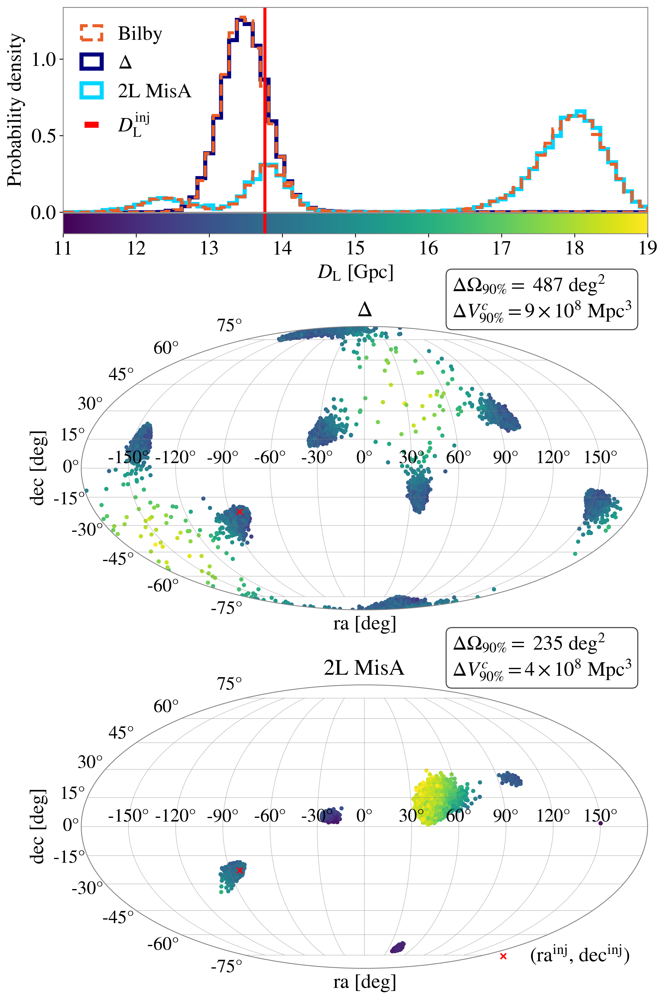

---
format:
    html:
        code-fold: true
        bibliography: ../../rehear.bib
    pdf:
        execute:
            echo: false
        bibliography: ../../rehear.bib
---

# Einstein Telescope {#sec-einstein-telescope}

The Einstein Telescope [@punturoEinsteinTelescopeThirdgeneration2010] is a planned next-generation (XG) gravitational wave detector in Europe.
It will consist of interferometers, like current ground-based detectors, but with several improvements enabling a ten-fold improvement in sensitivity [@hildSensitivityStudiesThirdgeneration2011]:

- it will be built underground, allowing for a significant reduction in seismic and anthropogenic noise noise;
- it will have a xylophone design: each detector will consist of two colocated interferometers, one operating cryogenically with low laser power to be sensitive at low frequencies, and one operating at room temperature at higher power to be sensitive at high frequencies;
- it will have longer arms, of 10km or more in length depending on the design.

There are currently two main proposed designs for it. 
One option is a set of three interferometers, each with an aperture angle of 60 degrees, forming an equilateral triangle. This is called ET-$\Delta$. 
The alternative consists of two L-shaped detectors, each with an aperture angle of 90 degrees, in two different locations within Europe, with a distance of little more than 1000km.
These two detectors may be aligned, like the two LIGO detectors, or misaligned - this choice between these configurations involves a tradeoff between sensitivity to compact binary sources and stochastic backgrounds [@branchesiScienceEinsteinTelescope2023].

There are different sites which may, as of this writing, host the Einstein Telescope within Europe [@serraLUSATIAOFFICIALLYTHIRD2025]:

- the Sos Enattos mine in the northeast of Sardinia, Italy, near the villages of Bitti, Onanì and Lula - we depict this in @fig-einstein-telescope-location;
- the Euregio Meuse-Rhine at the border of Luxembourg, Belgium and Germany, near the towns of Maastricht and Liège;
- the Lusatia region in Saxony, Germany. 

{#fig-einstein-telescope-location}

The scientific potential for a detector as sensitive as the Einstein Telescope is extremely wide. To quote @branchesiScienceEinsteinTelescope2023:

> ET, in its reference configuration, is a superb detector, with an extraordinary discovery potential in the domains of astrophysics, cosmology and fundamental physics.

A full description of this potential is beyond the scope of this thesis; we refer the reader to some among the many works which describe it in detail [@branchesiScienceEinsteinTelescope2023;@abacScienceEinsteinTelescope2025;@ronchiniPerspectivesMultimessengerAstronomy2022].

In the remainder of this chapter we shall discuss the challenges which come when trying to perform parameter estimation with such a sensitive detector, and how some recent advancements in these techniques are allowing for systematic forecasting studies, which can help in informing the urgent choices that need to be made regarding the construction of this instrument.

## Data analysis challenges

This section will give a brief summary of the primary challenges that remain unsolved in the data analysis of compact binary signals with the Einstein Telescope. 
They are described in significantly more detail in chapters 8 and 10 of @abacScienceEinsteinTelescope2025, which also describes some problems we will not consider here, such as the detection of CBCs and the analysis of different types of signals like continuous waves or stochastic backgrounds.

The main differences between the analyses performed with the Einstein Telescope, compared to current detectors, are as follows.

- The noise is overall lower, by approximately an order of magnitude, which leads to
	- more detected signals, approximately $10^{5}$ black hole and neutron star binaries per year in total,
	- higher signal-to-noise ratios for the closest events, reaching the level of $\rho \approx 10^{3}$.
- The sensitive band extends to both higher and lower frequencies than current detectors.
	- At lower frequencies and for low-mass binaries, this leads to them being in-band for several hours, which makes the effect of the Earth's rotation on the angles between detector and source non-negligible.
	- At higher frequencies, the improved sensitivity combined with the longer arm length leads to the necessity of considering a frequency-dependent antenna pattern as discussed in @sec-antenna-patterns.

Including time and frequency dependence in the antenna patterns is not an issue _per se_, as the way to account for these effects computationally is well-known.
These effects significantly increase the complexity of the space of possible waveforms which may reach the detector, and can in fact be beneficial by making signals with different parameters more distinguishable.
However, some of the current approaches for faster parameter estimation significantly suffer from their inclusion [@bakerSignificantChallengesAstrophysical2025]: the computational footprint for a reduced order model (@sec-reduced-order-quadrature), which guarantees accuracy for any point in a given prior space, dramatically increases when the antenna patterns are measurably time- and frequency-dependent.

The number of signals being much larger poses some issues of its own, besides the obvious one of requiring a proportionally larger amount of computational resources.
With the current generation of detectors, it can generally be assumed that the time before and after any given signal only contains noise, which allows for _off-source_ noise characterization. 
This will not be true anymore, especially in the presence of many long-lived, low-mass sources.

Furthermore, some of these signals may overlap [see_e.g._ @janquartAnalysesOverlappingGravitational2023]; this breaks another common assumption in gravitational wave analysis, that of only one signal being present in the data. 

Finally the high SNRs of the best-measured signals, while being crucial for many parts of the Einstein Telescope's science case (multimessenger science, tests of GR and so forth) significantly challenges several aspects of the current infrastructure, with waveform modelling likely being the most affected.
We can draw an approximate relation, based on a Fisher matrix argument, between the maximum mismatch (@eq-mismatch) which is expected not to bias parameter estimation at a given SNR $\rho$  [@bairdDegeneracyMassSpin2013]:
$$
\mathcal{\bar{F}} \lesssim \frac{\chi^2_D(1-p)}{2 \rho^{2}}\,,
$$
where $\chi^2_D(p)$ denotes the inverse CDF of a chi-square variable with $D$ degrees of freedom, where $D\approx 15$ is the number of waveform model parameters.

```{python}
from IPython.display import Markdown
from scipy import stats
import astropy.units as u

p = .9
D = 15
rho = 1000

chi2 = stats.chi2.ppf(p, D)/2
constraint = chi2 / rho**2 * u.dimensionless_unscaled

Markdown(f'For example, at a {100*p:.0f}\% credible level with {D} parameters, the constraint is $\mathcal{{\\bar{{F}}}} \lesssim {chi2:.2f} / \\rho^2$;'
f'at an SNR of {rho}, this translates to $\mathcal{{\\bar{{F}}}} \lesssim$ {constraint.to_string(precision=2, format="latex_inline")}.')
```

This level of accuracy is currently beyond the reach of any waveform model; the situation is better for the more "regular" waveforms with low spin and eccentricity, but when these assumptions are violated biases are already observable with current detectors [@abacGW231123BinaryBlack2025].

### GW250114 as seen by Einstein Telescope {#sec-gw250114-et}

We inject the maximum likelihood point from the LVK analysis of the gravitational wave event GW250114 into the data of a triangular Einstein Telescope.
We analyze the data using the software [`bilby`](https://github.com/bilby-dev/bilby) [@ashtonBilbyUserfriendlyBayesian2019] combined with the sampler [`nessai`](https://github.com/mj-will/nessai) [@williamsNestedSamplingNormalising2021].
Our analysis does not include time- nor frequency-dependent antenna patterns.

{#fig-gw250114-et-injection}

@fig-gw250114-et-injection shows the whitened strain of the injection: by construction, it is quite similar to @fig-gw250114-whitened-strain, but we can visually notice the slower decay as we move further back in time. 

This signal would have an SNR of approximately 680 when combining the three detectors.
In @sec-et-delta we describe how such a short signal is expected to exhibit an 8-fold multimodality in the sky; however, we only observe two modes in the sky for this injection, symmetrically across the local horizon. 
This is due to the fact that, in our simulation, the Einstein Telescope is made up of three detectors separated by 10km each which, due to the long-wavelength approximation, are effectively point-like. The temporal resolution for the arrival time of the signal at each them is so precise, on the scale of tens of microseconds, that is allows the our simulation of the ET to _triangulate_ the signal, despite its extremely short baseline.

## Comparing configurations

In order to investigate the possible configurations for the Einstein Telescope, we perform an injection campaign with neural posterior estimation (@sec-neural-posterior-estimation).
With the current technology, this is only possible for a population of high-mass signals at high redshift, which last for a short time in the detector band and have generally low SNRs.

These sources are expected to make up the "bulk" of black holes observed by the Einstein Telescope. 

### $\Delta$ shape {#sec-et-delta}

The $\Delta$ design for the Einstein Telescope consists of three co-located interferometers, 
the arms of each are two sides of an equilateral triangle.
These three interferometers are labelled ET-1, ET-2 and ET-3.
This detector design has the unique property of being able to "self-localize", 
that is, determine the position of a gravitational wave source with high precision 
without making use of travel-time measurements between detectors.

For the many of the expected CBC sources expected, though, this 
precise localization is sullied by an eight-fold multimodality.

In terms of the local azimuth $\lambda$, altitude $\beta$, and the polarization angle $\psi$ of the incoming gravitational wave, the antenna pattern functions read [@regimbauMockDataChallenge2012]:^[In @santoliquidoFastAccurateParameter2025 the labels "altitude" and "azimuth" are flipped.]
$$
\begin{aligned}
F_{+}^{\text{ET-1}}(\beta, \lambda, \psi) &= - \frac{\sqrt{ 3 }}{4}[(1+\cos ^{2}\beta)\sin 2\lambda \cos 2 \psi + 2 \cos \beta \cos 2 \lambda \sin 2 \psi] \\
F_{\times}^{\text{ET-1}}(\beta, \lambda, \psi) &= + \frac{\sqrt{ 3 }}{4}[(1+\cos ^{2}\beta)\sin 2\lambda \sin 2 \psi + 2 \cos \beta \cos 2 \lambda \cos 2 \psi]\,.
\end{aligned}
$$

The antenna patterns for ET-2 and ET-3 are obtained with the transformation $\lambda \to \lambda \pm 2 \pi / 3$.

These are all symmetric under a reflection across the local horizon ($\beta\to-\beta$), rotation around the locally vertical direction by half a turn ($\lambda\to\lambda+\pi$) and simultaneous rotation of the azimuth and polarization angle by a quarter of a turn ($\lambda\to\lambda+\pi /2$, $\psi \to \psi + \pi / 2$).

These symmetries can be combined in any way, leading to an eight-fold degeneracy in the sky position of any source, with four equally-spaced modes above the local horizon, and four below it.

This also leads to a bimodality in time at the geocenter, if that is used as a parameter. Arrival time at the detector is directly measured, and to convert it to time at the geocenter we must add a term $\hat{n} \cdot \vec{r} _\text{ET} / c$, which also equals $(\lvert \vec{r}_\text{ET} \rvert /c)\cos \beta$. 
The bimodality in $\beta$, then, is propagated to geocentric time. This can be seen in @fig-einstein-telescope-delta-sky-time: the posterior distribution on the sky position in local altitude/azimuth angular coordinates.

{#fig-einstein-telescope-delta-sky-time}

These degeneracies are expected to be present as long as no effect is able to make some modes preferred over others.

- Long signals, for which the Earth's rotation provides a significant modulation. The precise threshold for this will depend on the many specifics, but we can expect it to be on the order of an hour in duration.  
- Signals observed by another detector, not co-located with the Einstein Telescope. 

### 2L shape

{#fig-einstein-telescope-2l-sky}

## Data analysis challenges

## Scientific prospects

### Candidate sources

### Design comparison for high-mass black holes

{#fig-einstein-telescope-design-comparison-statistics}