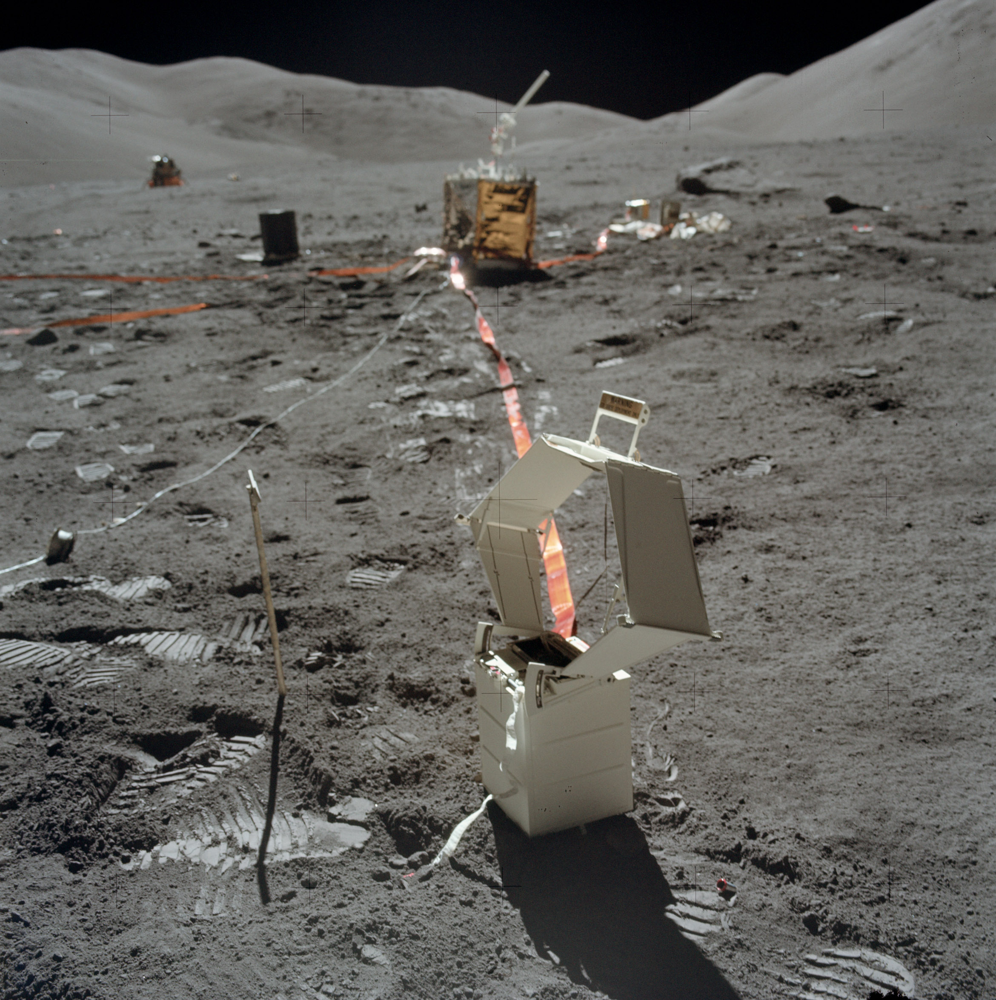
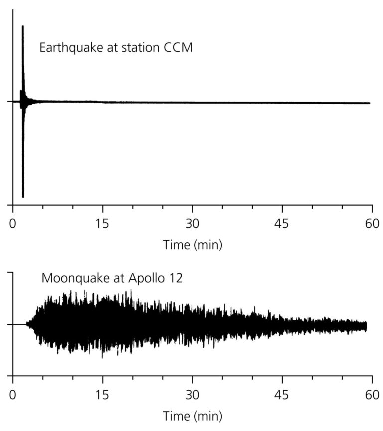

---
format:
    html:
        code-fold: true
        bibliography: ../../rehear.bib
    pdf:
        execute:
            echo: false
        bibliography: ../../rehear.bib
---
# The Lunar Gravitational Wave Antenna {#sec-lgwa}

## Detector concept

The idea of using a resonant body as a gravitational wave detector
was first proposed by Joseph Weber [@weberDetectionGenerationGravitational1960], following investigations on the effects of gravitational waves on matter by @piraniPhysicalSignificanceRiemann1956.

Weber led the efforts to deploy a gravimeter on the Moon with the Apollo 17 mission, with the stated aim to detect gravitational waves.
The Lunar Surface Gravimeter [@gigantiLunarSurfaceGravimeter1973] aimed for a sensitivity of around $10^{-10} \text{m}$ in vertical displacement when measuring vertical motion, around the $1.5\text{Hz}$ band. 

{#fig-lunar-surface-gravimeter width=60%}

We now know that, even operating nominally, this would have been far too noisy to actually measure gravitational waves. 
Furthermore, the sensor beam could not be stabilized upon deployment, due to some errors by the manufacturers when converting from terrestrial to lunar gravitational acceleration, which is approximately $g/6$. 


First LGWA paper: [@harmsLunarGravitationalwaveAntenna2021]
Whitepaper: [@ajithLunarGravitationalwaveAntenna2024]

### Site selection

A preliminary site selection study was performed in 2025 by a team at ETH Zürich [@gobeSeismicInvestigationLunar2025].
The choice of a site crucially depends on power generation: the main options are a radioisotope thermoelectric generator (RTG) and solar power.
With the former option, a lander could directly target the deployment region; with the latter, a solar station would need to transmit power to the stations. 

They identified a potential landing site in the lunar north polar region, at latitude 88.389
and longitude 280.76 degrees, which could be used to then deploy seismometers in a nearby Permanently Shadowed Region (PSR), around the latitude 88.50 and longitude 290.63 degrees.
This PSR lies roughly between the Hermite A and Hinshelwood craters.
We show these locations in figure @fig-lgwa-landing-site; useful free and interactive mapping tools to explore them include [LROC Norther Polar Mosaic](https://lroc.im-ldi.com/images/gigapan) and  [Quickmap](https://bit.ly/4bFltcB).

![LGWA proposed landing site on the North Pole (right blue dot) and PSR (left blue dot), in 3D perspective. The color on the lunar surface indicates maximum summer temperatures, ranging from 50K (deep blue), through 100K (white) to red (150K or more). The Earth's and Sun's apparent orbits are shown for reference. The large crater whose rim is visible to the right is Hermite A. This figure was generated with `QuickMap` [@LunarLROCQuickMap].](figures/quickmap-lroc-2.png){#fig-lgwa-landing-site}

The distance between the landing site and the PSR center is only around 8.6km, but their temperature profiles are significantly different.
The landing site is a flat hilltop, illuminated for most of the (northern) summer months, April-September. In the winter, it receives at least a week of illumination every month, but it is predominantly in the shade, with continuous shade periods of up to 22.4 days. 
Its temperatures range between 66K and 250K across the year.
The PSR, on the other hand, has a mean temperature of 46K, with maximum recorded values of less than 60K. 
A comparatively flat path connects the landing and deployment sites, with slopes of less than 15 degrees. 

An alternative landing site near the South Pole was also explored, within the de Gerlache crater at latitude -88.381 and longitude 266.8.
Both this deployment site and the North Pole sites are rather flat themselves, with maximum slopes of few degrees. 
However, the South Pole is generally more rugged: the path from an illuminated landing site to the PSR location, which would likely have to be taken by a rover, nears slopes of 20 degrees. 

### Displacement noise

Seismic noise: 
Payload: [@vanheijningenPayloadLunarGravitationalwave2023]

![Upper bound on the lunar seismic spectrum, from [@coughlinConstrainingGravitationalWave2014].](figures/Moon-noise-spectrum.png)



### The lunar seismic response

Formalism: [@ben-menahemExcitationEarthsEigenvibrations1983]
Then discuss the results of [@biResponseMoonGravitational2024].


### Projected gravitational wave strain {#sec-lgwa-response}

The LGWA will consist of seismometers measuring displacement along the horizontal direction.

As we anticipated in @sec-lgwa-antenna-patterns, the displacement corresponding to an impacting monochromatic gravitational wave can be modeled through a detection tensor
$$
\mathcal{D}_{ij}(t; f_{0}) = n_{i}(t) b_{j}(t) L(f_{0}) = \hat{D}_{ij}(t; f_{0})L(f_{0}) \,,
$$
where $n_{i}(t)$ is the normal to the lunar surface at the detector location at time $t$, while $b_{j}(t)$ is a vector parallel to the lunar surface and aligned to the measurement channel.
We compute all vectors in a fixed frame, so that the source's position is constant.

In @sec-timing-general we outlined the effect of detector motion on the waveform in the time domain. Applying a Stationary Phase Approximation, we can combine the effect of a moving detector and a rotating antenna pattern in the frequency domain: the measured frequency-domain strain will satisfy
$$
s(f) = h_{ij}(f) \mathcal{D}_{ij}(t(f); f) \exp\left( 2 \pi i f \left( t_{0} + \frac{\vec{r}(t(f)) \cdot \hat{m}}{c} \right)  \right)\,,
$${#eq-lgwa-strain-projection-spa}
where: 

- $t(f)$ is the time-to-frequency map given by the Stationary Phase Approximation (@eq-spa-time-from-phase);
- $h_{ij}(f)$ is the frequency-domain gravitational wave strain tensor;
- $\hat{m}$ is the _propagation_ unit vector (which has opposite sign to the _source position_ unit vector, and points "inward");^[As a sanity check, consider the relative signs of $t_{0}$ and this phase term: increasing $t_{0}$ means the introduction of a delay, and accordingly increasing the scalar product $\vec{r} \cdot \hat{n}$ means moving the detector further from the source, which also delays the signal's arrival.]
- $\vec{r}(t)$ is the position of the detector as a function of time, measured in an ICRS-aligned coordinate frame, centered at some point in space;
- $t_{0}$ is the reference time, _i.e._ the time at which the event which occurs at $t=0$ in the time-domain waveform $h_{ij}(t)$ reaches the center of the reference frame, $\vec{r}=0$.

Let us define an orthonormal reference frame at the lunar surface: $(a, b, n)$, where $n$ is aligned to the local normal direction, while $a$ and $b$ define the horizontal measurement directions of the two LGWA channel.
In order to compute the geometric portion of the antenna pattern tensor, $\hat{D}_{ij}$, we need to know these vectors as a function of time.
Once we have them, computed these vectors, we can recover the strain through the antenna pattern functions, which are obtained as described in @sec-antenna-patterns:
$$
\begin{aligned}
F_{+} &= (n\cdot u)(b\cdot u)-(n\cdot v)(b\cdot v)) \\
F_{\times} &= (n\cdot u)(b\cdot v)+(n\cdot v)(b\cdot u)\,.
\end{aligned}
$$

```{python}
#| label: fig-response-functions-of-time
#| fig-cap: "Response functions in terms of time."

from lgwa_response.likelihood import LunarLikelihood
import matplotlib.pyplot as plt
import numpy as np

like = LunarLikelihood()
t_0 = 1577491218.
day = 3600*24
times = np.linspace(t_0, t_0+day*28, num=1000)
hp1, hp2, hc1, hc2 = like.get_antenna_response(times, ra=0, dec=np.pi/2, psi=.9)

times_days = (times - t_0)/day

plt.plot(times_days, hp1, label='$F_+$ response, $x$ channel', color='#117733')
plt.plot(times_days, hc1, label='$F_\\times$ response, $x$ channel', color='#44AA99')
plt.plot(times_days, hp2, label='$F_+$ response, $y$ channel', color='#CC6677')
plt.plot(times_days, hc2, label='$F_\\times$ response, $y$ channel', color='#882255')
plt.legend()
plt.xlabel('Days from January 1st 2030')
plt.title('Antenna patterns for a source at declination 90 degrees')
plt.show()
```

::: {#nte-scalar-products-spherical .callout-note collapse="true"}
##### Scalar products in spherical coordinates

The scalar product between two unit vectors in spherical coordinates can be computed from their colatitudes and azimuths as follows:
$$
a\cdot b = \cos \theta_{a} \cos\theta_{b} + \sin \theta_{a} \sin \theta_{b} \cos(\phi_{a} - \phi_{b})\,.
$$
:::

Computing these vectors can be somewhat expensive (on the scale of tens of milliseconds per evaluation), and their variation is relatively slow, on the scale of a month.
Therefore, it is advantageous to pre-compute them on a grid, cache the results and interpolate them as required.
We compute them in an ICRS frame with the `lunarsky` package [@lanmanAelanmanLunarsky2024].
We store them in spherical coordinates, with which we can still directly compute any scalar products (@nte-scalar-products-spherical).

::: {#nte-lgwa-location .callout-note collapse="true"}
##### The position of the LGWA

The precise location of the LGWA is a required input for the computation of these vectors as a function of time. It is defined by three angles: lunar latitude, lunar longitude and azimuth of one LGWA arm, the other being perpendicular to it. 

We choose a lunar latitude of 88.5 degrees, a longitude of 290 degrees, and an azimuth of 0.

:::

In order to evaluate how dense the interpolation grid must be to satisfy a given accuracy requirement, we compute it with different grid sizes for a duration of 10 years,^[Specifcally, from 2030 to 2040.] and for each grid size we:

- uniformly sample a moment in time $t$ within the interpolation region;
- uniformly sample a unit vector $u$ on the sphere;
- compute the error in the scalar products, $|u \cdot (n^{\text{interp}}(t) - n^{\text{true}}(t)|$ and similarly for $a$ and $b$.

As figure @fig-response-interpolation-errors shows, we can achieve errors on the scale of $10^{-4}$ on the scalar products with only $10^{4}$ points, which take about a minute to compute, and adding more as required is easy.
Linear interpolation is sufficient to achieve this level of accuracy.

```{python}
#| label: fig-response-interpolation-errors
#| fig-cap: "Errors in scalar products computed with an interpolated version of the detector-centric basis vectors. The errors are computed from 400 randomly sampled points in the sky and time. Since the detector is located near the pole, the normal vector varies less across the month, and is therefore easier to interpolate."

from lgwa_response.lunar_coordinates import make_response_interpolation_plot
from thesis_scripts import data_path
cache_path = data_path / 'cache'

make_response_interpolation_plot(cache_path)
```

In order to compute the strain in @eq-lgwa-strain-projection-spa we also need the detector position. 
We apply the interpolation approach here as well, pre-computing the position on an equally spaced grid, and we can run a similar test to that in @fig-response-interpolation-errors to determine how fine the interpolation grid needs to be.
 
The results in figure @fig-position-interpolation-errors show that in order to
achieve an error of $10^{-4}$ radians we need as many as 160 thousand interpolation points for the 10-year span we are considering. 
The maximum phase error is computed by comparing the position error to the angular wavelength corresponding to the smallest angular wavelength in the LGWA band (i.e. the highest frequency): $c/(2 \pi \times 3 \mathrm{Hz}) \approx 1.6 \times 10^7 \mathrm{m}$.
This is the worst-case scenario, as to achieve it we would need a source at the upper edge of the detector's band to also be perfectly aligned with the position error vector $\vec{r} _\text{interp} - \vec{r}_\text{true}$.

```{python}
#| label: fig-position-interpolation-errors
#| fig-cap: "Interpolation errors in position, by the number of interpolation points."

from lgwa_response.lunar_coordinates import make_position_interpolation_plot
from thesis_scripts import data_path
cache_path = data_path / 'cache'

make_position_interpolation_plot(cache_path)
```

The position interpolation requires about 10 times more points to achieve a comparable level of accuracy, but each evaluation of the position of the detector is roughly 10 times faster than an evaluation of the basis vectors.

In @fig-position-function-of-time we illustrate how the position vector encodes several "epicycles": motion of the Earth-Moon system around the Sun, of the Moon around the Earth, and finally of the detector location from the lunar center.

```{python}
#| label: fig-position-function-of-time
#| fig-cap: "Position of the detector as a function of time."

from lgwa_response.likelihood import LunarLikelihood
from astropy.coordinates import get_body_barycentric
from astropy.time import Time
import numpy as np
import matplotlib.pyplot as plt
import warnings

warnings.filterwarnings('ignore', module='erfa')


like = LunarLikelihood()
t_0 = 1577491218.

times = np.linspace(t_0, t_0+3600*24*29.5*4, num=1000)

earth = get_body_barycentric('earth', Time(times, format='gps'), ephemeris='jpl')
earth.representation_type = 'cartesian'

moon = get_body_barycentric('moon', Time(times, format='gps'), ephemeris='jpl')
moon.representation_type = 'cartesian'

x, y, z = like.get_detector_position(times)

fig, axs = plt.subplots(3, 1, sharex=True, gridspec_kw={'hspace': .3})

x_color = '#332288'
y_color = '#44AA99'
z_color = '#CC6677'

times_lunar_months = (times - t_0)/(29.5*3600*24)

axs[0].plot(times_lunar_months, x, color=x_color, label='$x$')
axs[0].plot(times_lunar_months, y, color=y_color, label='$y$')
axs[0].plot(times_lunar_months, z, color=z_color, label='$z$')
axs[0].legend()
axs[0].set_title('Position from SSB')

axs[1].plot(times_lunar_months, x-earth.x.si.value, color=x_color)
axs[1].plot(times_lunar_months, y-earth.y.si.value, color=y_color)
axs[1].plot(times_lunar_months, z-earth.z.si.value, color=z_color)
axs[1].set_title('Position from geocenter')
axs[1].set_ylabel('Position vector [meters]')

axs[2].plot(times_lunar_months, x-moon.x.si.value, color=x_color)
axs[2].plot(times_lunar_months, y-moon.y.si.value, color=y_color)
axs[2].plot(times_lunar_months, z-moon.z.si.value, color=z_color)
axs[2].set_title('Position from lunar center')
_ = axs[2].set_xlabel('Time from January 1 2030 (lunar months)')
```

#### The importance of computing time to merger correctly

In the Stationary Phase Approximation, the time left until merger for a source whose phase in the frequency domain is known is given by @eq-spa-time-from-phase. 

One may think that. for these purposes, a precise description of the phase to a high PN order is not necessary. 
If we only consider the leading order in the phase (@eq-post-newtonian-phase-generic), we get the following expression for the time to merger:
$$
t_\text{lowest order}(f) = - \frac{5}{256 \pi^{8/3}} \frac{1}{\mathcal{M}_{c}^{5/3}} \frac{1}{f^{8/3}}\,.
$$

The next-order correction to this expression for the phase comes with a factor of $v^{2}\propto f^{2/3}$, which carries over during the differentiation, leading to the leading term in the  error scaling with $f^{-2}$.
In figure @fig-time-to-merger-error we show the error  it leads to errors of several hours to days in the deci-Hertz band for a light source.

```{python}
#| label: fig-time-to-merger-error
#| fig-cap: "Error in the time to merger estimation by using the lowest-order Post-Newtonian term only. The source considered here is a neutron star binary with equal components, of 1.4 solar masses each."

import matplotlib.pyplot as plt
from lgwa_response.simple_waveforms import time_to_merger, time_to_merger_simple, Phif3hPN, SUN_MASS_SECONDS
import numpy as np

q = 1
eta = q / (1+q)**2
M = 2.8


f = np.geomspace(1e-1, 3, num=10_000)

phase = Phif3hPN(
	f, 
	M, 
	eta, 
	0., 
	0, 
	0., 
	0.
)

mchirp = M * eta**(3/5) * SUN_MASS_SECONDS

dt = (
	+time_to_merger_simple(f, mchirp)
	-time_to_merger(f, phase)
)
t = -time_to_merger(f, phase)

plt.loglog(f, t, label='Time to merger', color='#88CCEE')
plt.loglog(f, dt, label='Error by using the lowest order phase', color='#CC6677')

plt.text(f[7000], t[7000]*2, s='$\propto f^{-8/3}$')
plt.text(f[5000], dt[5000]*2, s='$\propto f^{-2}$')

plt.xlabel('Frequency [Hz]')
plt.ylabel('Time [s]')
plt.legend()

plt.show()
```

### Projected waveforms

```{python}
#| label: fig-projected-lgwa-waveforms-ratio
#| fig-cap: "Ratio of projected waveforms with slightly different declination (difference of 10 arcminutes)."

from lgwa_response.likelihood import LunarLikelihood
import numpy as np
import matplotlib.pyplot as plt

like = LunarLikelihood(gps_time_range=(1500000000., 2000000000.))
t0 = 1893024018.

f = np.geomspace(1e-1, 3, num=100000)
parameters = {
	'chirp_mass': 1.2,
	'mass_ratio': 1.,
	'time_at_center': t0,
	'inclination': 0.5,
	'phase': 0.,
	'right_ascension': 0.,
	'declination': 0.,
	'polarization': 0.,
	'luminosity_distance': 1.,
	'spin_1z': 0.,
	'spin_2z': 0.,
	'lambda_eff': 0.,
	'd_lambda': 0.,
}

hx, hy = like.projected_waveform(f, parameters)
hx2, hy2 = like.projected_waveform(f, parameters | {'declination': np.deg2rad(10/60)})

fig, axs = plt.subplots(2, 1, sharex=True)

axs[0].semilogx(f, abs(hx/hx2))
# axs[0].semilogx(f, abs(hy/hy2))

axs[1].semilogx(f, np.unwrap(np.angle(hx/hx2)), label='Center at SSB')
# axs[1].semilogx(f, np.unwrap(np.angle(hy/hy2)))

like.compute_center(t0)

hx, hy = like.projected_waveform(f, parameters)
hx2, hy2 = like.projected_waveform(f, parameters | {'declination': np.deg2rad(10/60)})


axs[1].semilogx(f, np.unwrap(np.angle(hx/hx2)), label='Center at merger-time detector location')
# axs[1].semilogx(f, np.unwrap(np.angle(hy/hy2)))
axs[1].legend()
plt.show()
```

## Scientific prospects

### Sky localization

## Reference frames for long observations

