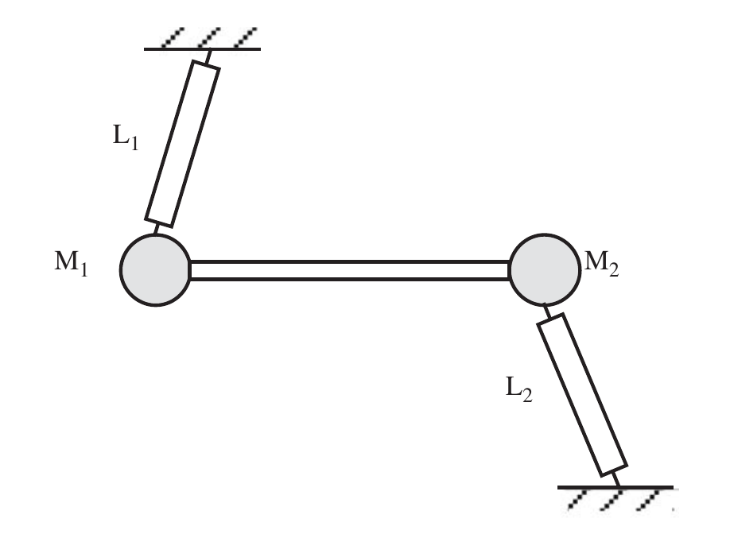
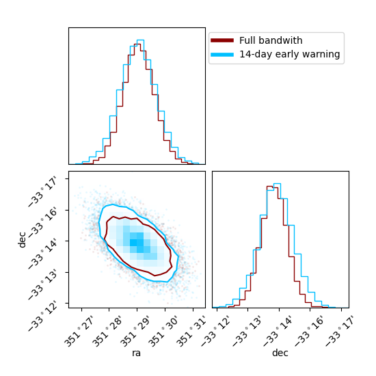

---
format:
    html:
        code-fold: true
        bibliography: ../../rehear.bib
    pdf:
        execute:
            echo: false
        bibliography: ../../rehear.bib
---
# Lunar Gravitational Wave Antenna {#sec-lgwa}

In this chapter we introduce the Lunar Gravitational Wave Antenna,
following the whitepaper we recently published as a collaboration [@ajithLunarGravitationalwaveAntenna2025].
Then, we outline some novel contributions, 
namely the first discussion of the issues related to full 
Bayesian parameter estimation for compact binaries with this detector, 
which we presented in @tissinoGeometryLunarGravitational2026 and @iacovelliGravitationalwaveParameterEstimation2026.

## Detector concept

The idea of using a resonant body as a gravitational wave detector
was first proposed by Joseph Weber [@weberDetectionGenerationGravitational1960], following investigations on the effects of gravitational waves on matter by @piraniPhysicalSignificanceRiemann1956.

Weber led the efforts to deploy a gravimeter on the Moon with the Apollo 17 mission, with the stated aim to detect gravitational waves.
The Lunar Surface Gravimeter [@gigantiLunarSurfaceGravimeter1973] aimed for a sensitivity of around $10^{-10} \text{m}$ in vertical displacement when measuring vertical motion, around the $1.5\text{Hz}$ band. 

[{#fig-lunar-surface-gravimeter width=60%}](https://commons.wikimedia.org/w/index.php?curid=7042350)

We now know that, even operating nominally, this would have been far too noisy to actually measure gravitational waves. 
Furthermore, the sensor beam could not be stabilized upon deployment, due to some errors by the manufacturers when converting from terrestrial to lunar gravity. 

Nevertheless, the Apollo program provided valuable insights into the structure of the Moon.
In the following decades, both technology and our understanding of gravitational waves have advanced.

@harmsLunarGravitationalwaveAntenna2021 proposed the concept for a Lunar Gravitational Wave Antenna, which uses seismometers to measure vibrations of the lunar surface induced by gravitational waves.
The plan is to deploy this antenna in a Permanently Shadowed Region at the lunar pole (see @sec-lgwa-site-selection), in order to achieve low-noise cryogenic operation with a displacement noise ASD (@eq-amplitude-spectral-density) below one $\text{fm} / \sqrt{ \text{Hz} }$.
Combined with a sufficiently strong lunar response to gravitational waves, this would be enough to directly measure gravitational waves in the deci-Hertz band.

In the following years, a collaboration has been formed to study the science of the Lunar Gravitational Wave Antenna; this has resulted in the publication of several works, among them the _whitepaper_ [@ajithLunarGravitationalwaveAntenna2025], which details several aspects of the possible science achievable in this band.

This chapter will focus on the full LGWA mission and its projected sensitivity, 
but a preliminary mission, dubbed Soundcheck, is also planned.
Whereas the LGWA will require advancements in sensor technology compared to the current
state of the art, Soundcheck will use off-the-shelf components. 
Even so, if deployed at the lunar pole, it will provide extremely valuable data, 
though the chance it will detect gravitational waves is slim.
The Soundcheck mission has been included in the Reserve Pool of Activities by the European Space Agency.

### Site selection {#sec-lgwa-site-selection}

Permanently Shadowed Regions (PSRs) exist in the lunar polar regions: due to the low tilt of the Moon's orbit, the Sun remains close to the horizon throughout the year, therefore some low-elevation regions never receive direct sunlight.
While some PSRs receive reflected sunlight, such as from a crater's rim, temperatures within them are typically extremely cold, in the range of tens of degrees Kelvin. 

A preliminary site selection study for the LGWA was performed in 2025 by a team at ETH Zürich [@gobeSeismicInvestigationLunar2025].
The choice of a site crucially depends on power generation: the main options are a radioisotope thermoelectric generator (RTG) and solar power.
With the former option, a lander could directly target the deployment region; with the latter, a solar station would need to transmit power to the stations, for example with a long cable.

@gobeSeismicInvestigationLunar2025 identified a potential landing site in the lunar north polar region, at latitude 88.389
and longitude 280.76 degrees, which could be used to then deploy seismometers in a nearby PSR, around the latitude 88.50 and longitude 290.63 degrees.
This PSR lies roughly between the Hermite A and Hinshelwood craters.
We show these locations in figure @fig-lgwa-landing-site; useful free and interactive mapping tools to explore them include [LROC Northern Polar Mosaic](https://lroc.im-ldi.com/images/gigapan) and  [Quickmap](https://bit.ly/4bFltcB).

![LGWA proposed landing site on the North Pole (right blue dot) and PSR (left blue dot), in 3D perspective. The color on the lunar surface indicates maximum summer temperatures, ranging from 50K (deep blue), through 100K (white) to red (150K or more). The Earth's and Sun's apparent orbits are shown for reference. The large crater whose rim is visible to the right is Hermite A. This figure was generated with `QuickMap` [@LunarLROCQuickMap].](figures/quickmap-lroc-2.png){#fig-lgwa-landing-site}

The distance between the landing site and the PSR center is only around 8.6km, but their temperature profiles are significantly different.
The landing site is a flat hilltop, illuminated for most of the (northern) summer months, April-September. In the winter, it receives at least a week of illumination every month, but it is predominantly in the shade, with continuous darkness for up to 22.4 days. 
Its temperatures range between 66K and 250K across the year.
The PSR, on the other hand, has a mean temperature of 46K, with maximum recorded values of less than 60K. 
A comparatively flat path connects the landing and deployment sites, with slopes of less than 15 degrees,
though the elevation difference between them is significant.

An alternative landing site near the South Pole was also explored, within the de Gerlache crater at latitude -88.381 and longitude 266.8.
Both this deployment site and the North Pole sites are rather flat themselves, with maximum slopes of few degrees. 
However, the South Pole is generally more rugged: the path from an illuminated landing site to the PSR location, which would likely have to be taken by a rover, nears slopes of 20 degrees. 

### Measurement principle and displacement noise

The operational principle for the LGWA is the measurement of horizontal seismic motion of the lunar surface, which will be performed along two orthogonal axes.
This measurement requires a reference whose movement is inertial along the two measurement directions, whereas the surface will move non-inertially, due to the Moon being an elastic body.

This reference will be a mass suspended through a Watt's linkage [@bertoliniMechanicalDesignSingleaxis2006], 
a compact way to achieve a low resonance frequency.

::: {#nte-watts-linkage .callout-note collapse="true"}
##### Watt's linkage

A Watt's linkage is, at its core, the combination of a pendulum and an inverted pendulum.

{#fig-watts-linkage width=60%}

The resonance angular velocity of the system depicted in @fig-watts-linkage is
$$
\omega_{0}^{\text{Watt's linkage}} = \sqrt{ \left( \frac{M_{1}}{L_{1}}- \frac{M_{2}}{L_{2}} \right) \frac{g}{(M_{1}+M_{2})}+\gamma }\,,
$$
where $g$ is the gravitational acceleration, $M_{i}$ and $L_{i}$ are the two masses and lengths shown in the figure, while $\gamma$  represents the effect of cumulative flex-joint stiffness.
This allows for very low resonance frequencies with a comparatively small apparatus.
For comparison, let us consider a simple pendulum: it achieves the same objective, but its resonance is at
$$
\omega_{0}^{\text{pendulum}} = \sqrt{ \frac{g}{L} }\,.
$$

To achieve the resonance angular velocity planned for the LGWA, $\omega_{0} \approx 1.57 \text{rad/s}$, it would require a length of $L \approx 0.66 \text{m}$, making it quite unwieldy.

The formulas above are only valid in the small-angle regime; the plan with the LGWA is to have an actuator keep the linkage in this position.
Then, the required output from this actuator will contain the displacement signal.

:::

In @fig-lgwa-station we show a conceptual overview of a single LGWA station; its subsystems and the tilt of the lunar surface are not to scale. 
A platform leveling system is crucial in order to avoid vertical-to-horizontal coupling. 
The expected operating temperatures for the proof masses are much lower than the ambient temperature; this can be achieved through sorption cooling, which involves no mechanical moving parts besides a few passive valves. 
This is helpful both for the mission's lifetime and for vibration reduction. 

{#fig-lgwa-station width=60%}

The main source of readout noise at low frequencies ($\lesssim 0.7 \text{Hz}$) is expected to be suspension thermal noise, which scales as 
$$
S_\text{thermal}(\omega) = \frac{4 k_{B}T \omega_{0}^{2}  / Q}{m \omega \left[ (\omega_{0}^{2}- \omega^{2})^{2}  + \omega_{0}^{4} / Q^{2} \right] }\,,
$$
where $\omega$ is the angular frequency, $\omega_{0}$ is its resonance value, $k_{B}$ is the Boltzmann constant, $T$ is the temperature, while $Q$ is the mechanical quality factor [@ajithLunarGravitationalwaveAntenna2025, eq. 2.1]. 

At higher frequency, readout noise starts to dominate; its specific spectral shape depends on the specific readout scheme adopted to measure relative displacement between ground and test mass. @fig-lgwa-station schematically depicts a SQUID readout, which makes use of superconducting magnets. In @fig-lgwa-displacement-noise we compare this choice with another candidate: laser-interferometric readout.

```{python}
#| layout: [[47,-6, 47], [47,-6, 47]]
#| fig-cap: "Displacement noise estimates for the LGWA. For both concepts, thermal noise dominates at low frequency, while displacement noise dominates at high frequency."
#| fig-subcap: 
#|   - "Pessimistic model: a Niobium suspension and laser readout."
#|   - "Optimistic mode: a Silicon suspension and a SQUID readout."
#| label: fig-lgwa-displacement-noise


from thesis_scripts import *
import numpy as np
from thesis_scripts import plt
import astropy.units as u
import astropy.constants as ac

# there is an extra sqrt(2) in the shot noise, which is explained by the
# fact that only one the two interferometer arms picks up the signal

def get_noise_asd(ff, temperature, quality_factor, m, P, dL):
	hbar = ac.hbar.si.value
	kB = ac.k_B.si.value
	c = ac.c.si.value
	laser_wavelength = 1.064e-6
	reference_frequency = 0.1

	omega0 = 2*np.pi*c/laser_wavelength

	n_shot = laser_wavelength/(2*np.pi)*np.sqrt(2*hbar*omega0/P)*np.sqrt((reference_frequency**2-ff**2)**2+(reference_frequency**2/quality_factor)**2)/ff**2

	n_freq = dL*(4e4+5e4*(0.1/ff)**1.2)/omega0*np.sqrt((reference_frequency**2-ff**2)**2+(reference_frequency**2/quality_factor)**2)/ff**2

	n_readout = np.sqrt(n_shot**2 + n_freq**2)
	
	n_therm = np.sqrt(4*kB*temperature*(2*np.pi*reference_frequency)**2/(m*quality_factor*2*np.pi*ff))/(2*np.pi*ff)**2

	return n_readout, n_therm

def get_noise_asd_squid(ff, energy_resolution, critical_frequency, coupling_efficiency, suspended_mass, quality_factor, temperature, natural_frequency):
	hbar = ac.hbar.si.value
	kB = ac.k_B.si.value
	c = ac.c.si.value

	n_therm = np.sqrt(
		4*kB*temperature*(
		2*np.pi*natural_frequency)**2
		/(suspended_mass*quality_factor*2*np.pi*ff)
	) / (2*np.pi*ff)**2

	eA = energy_resolution * hbar
	omega_0 = 2 * np.pi * natural_frequency
	omega = 2 * np.pi * ff

	n_squid = np.sqrt(
		2*eA*(1+critical_frequency/ff)
		/ (suspended_mass * omega_0 * coupling_efficiency )
		 * (
			(omega**2-omega_0**2)**2 + omega_0**2 / quality_factor
		) / omega**4
	)

	return n_squid, n_therm

def plot(ff, n_readout, n_therm, title):
	n_total = np.sqrt(n_readout**2 + n_therm**2)
	
	plt.figure(figsize=(4, 3))

	plt.loglog(ff,  n_readout, label='Readout', c='#FFC107')
	plt.loglog(ff, n_therm, label='Thermal', c='#D81B60')
	plt.loglog(ff, n_total, label='Total', c='#004D40', ls='--')

	plt.ylim(1e-17, 1e-10)
	plt.xlim(ff[0], ff[-1])

	plt.grid()
	plt.xlabel('Frequency [Hz]')
	plt.ylabel('Noise ASD [$\\mathrm{{m}} /$ $\\sqrt{{\\mathrm{{Hz}}}}$]')
	plt.legend()

	plt.title(title)
	plt.show()


ff = np.logspace(-3,1,500)

f_stab = 100

noise_params_lgwa = {
	'temperature': 4, 
	'quality_factor': 1e4, 
	'm': 10, 
	'P': 5e-3, 
	'dL': 1e-3/f_stab
}

noise_params_lgwa_si = {
	'energy_resolution': 50,
	'suspended_mass': 10,
	'quality_factor': 1e6,
	'critical_frequency': 0.1,
	'natural_frequency': 0.25,
	'coupling_efficiency': 0.25,
	'temperature': 5,
}

plot(ff, *get_noise_asd(ff, **noise_params_lgwa), 'Niobium suspension')
plot(ff, *get_noise_asd_squid(ff, **noise_params_lgwa_si), 'Silicon suspension')
```

#### Other noise sources {#sec-other-lgwa-noise}

Displacement sensitivity curves similar to those in @fig-lgwa-displacement-noise were adopted in all forecasting studies; no other noise sources were considered.

While a PSR is undoubtedly a quiet place, it is warranted to ask whether the seismic environment of the Moon can interfere with gravitational wave measurements, or prevent them entirely.
Unfortunately, the current data on this is quite limited. 
@coughlinConstrainingGravitationalWave2014 analyzed one year of data from the Apollo Lunar Surface Experiments Package (ALSEP) mission, which consisted of four seismometers deployed on the near side of the Moon by the Apollo 12, 13, 14 and 16 missions.

![Upper bound on the lunar seismic spectrum, from [@coughlinConstrainingGravitationalWave2014]. The dashed lines indicate the minimum and maximum for a model of seismic noise on the Earth.](figures/Moon-noise-spectrum.png){#fig-lunar-seismic-spectrum width=60%}

In @fig-lunar-seismic-spectrum one can see the average of this measurement. 
The flat spectrum at around $10^{-10} \text{m} / \sqrt{\text{Hz}}$ 
is an upper limit, as the instrument's precision limited 
the measurement from reaching lower values. 
Despite this, it is considerably lower than the minimum achieved anywhere on Earth (dash-dotted curve).

From theoretical considerations, we expect the actual seismic background to be significantly lower;
furthermore, a spectrum computed this way is not necessarily representative of the "typical" spectrum
one would observe at any given time on the Moon: it is a root-mean-square of values observed over a year,
which means it includes the contribution of loud events which are well-localized in time.
For the purposes of the LGWA, these may simply lead to a fraction of the data being unusable, as opposed to making
the entirety of the data too noisy. 

The LGWA will also operate in a PSR without dawns or dusks, removing their thermal stresses as a noise source.
Finally, the intra-station distance among the four seismometers is planned to be close enough that the seismic signal from gravitational waves is strongly correlated among them, but far enough that events such as meteorite impacts arrive at each station with measurably different amplitude and phase, and can therefore be subtracted.

Nevertheless, more measurements are needed to quantify the impact of the lunar seismic background. 
Moonquakes remain a significant issue, and it is likely that some fraction of the data will need to be unusable due to their effect. The low damping of the lunar regolith makes their duration much longer than what typically happens on Earth, as illustrated in @fig-moonquake-duration.

{#fig-moonquake-duration width=60%}

Other sources of noise yet may affect the measurement, such as human activity from other nearby projects, magnetic noise from lunar dust and so forth. 
Mitigating these will be a significant challenge as the mission is developed.

### The lunar seismic response {#sec-lgwa-response}

The fundamental lunar normal mode, which describes quadrupolar vibration of the whole Moon, has a frequency just above $1 \text{mHz}$.
While plenty of gravitational wave sources are expected at these frequencies, which are a target of the LISA mission, the LGWA detector concept is not expected to be very sensitive there, mostly due to thermal noise (see @fig-lgwa-displacement-noise).
Computing the lunar response at frequencies two to three orders of magnitude higher than the fundamental is challenging with the normal mode formalism, as one needs to include a very large number of modes, 
and local topography is expected to play a significant role.

The standard treatement for the problem of an elastically coupled medium to gravitational waves was introduced by @dysonSeismicResponseEarth1969 and applied to the computation of the excitation of the normal modes of a planetary body by gravitational waves by @ben-menahemExcitationEarthsEigenvibrations1983. 
Recent years have seen significant theoretical and computational advancements in this regard.
@belgacemCouplingElasticMedia2024 formulated the coupling problem with a fully relativistic  Effective Field Theory approach, which generalizes well to high frequencies beyond the reach of the normal-mode approach. 
@biResponseMoonGravitational2024 investigated the impact of a layered geological structure using a half-space model, showing that it can significantly amplify the lunar response compared to a uniform Moon.
A significant amount of work has also been recently performed regarding numerical simulations of the lunar response [@zhangNumericalSimulationLunar2025; @zhangSuperAmplificationLunar2025; @zhangThickLunarCrust2026].

For the remainder of this discussion, we will make two strong assumptions:

1. the lunar response is _linear_, meaning that a gravitational wave at a frequency $f_0$ only induces a 
	seismic response with the same frequency, without exciting any other vibration;
1. the lunar response has zero phase: the vibration excited is in phase with its source.

Neither of these are going to be exactly realized in practice, 
and relaxing them is an important part of future efforts. 
We expect that the zero-phase assumption will be significantly violated in practice,
but this is immaterial for the purposes of the studies in this work. 
As we will discuss in @sec-lgwa-pe-limitations, 
we perform injections assuming the response is known, 
which means that any assumption we could make about the response's phase would be exactly 
cancelled within our likelihood. 

Under these assumptions, the scalar lunar response $L$ is a function of frequency with units of length, and it is defined as the ratio between the amplitude of the surface displacement $s$ and the amplitude of the gravitational wave strain $h$ which drives it:
$$
L(f_{0}) = \frac{s(t;f_{0})}{h(t; f_{0})}\,,
$$
where the amplitude of the gravitational wave is obtained by contracting the gravitational wave strain tensor $h_{ij}$ with a geometric detector response $\hat{D}_{ij}$, and where the strain is assumed to be a monochromatic wave with a frequency $f_{0}$.

Here we limit ourselves to a simple justification, within Dyson's description of the problem in the transverse-traceless gauge as outlined by @biResponseMoonGravitational2024, of the geometry of the detection tensor $\hat{D}_{ij}$.
The LGWA sensors will be set up to measure horizontal vibration, as most of the seismic waves near the surface are expected to be vertically propagating shear waves.
Within the Dyson description, gravitational waves couple to the elastic medium through the gradient of the shear modulus $\nabla _{i}\mu(\vec{r})$, giving rise to an effective force term in the form
$$
f_{i} = h_{ij} \nabla _{j}\mu(\vec{r})\,. 
$$

Then, if we want to compute horizontal acceleration along an axis $b$ we will need to consider forces along that direction. Then, the relevant component of the gravitational wave strain tensor will be proportional to
$$
h_{ij} b_{i} \nabla_{j} \mu\,.
$$

The shear modulus will vary across geologic layers and across the surface: 
these are horizontally-placed strata, hence the gradient is expected to be vertical.
This is the origin of the geometric expression we use in @sec-lgwa-projection; 
corrections to it will be necessary based on local topography,
but for the purposes of current studies the uncertainty in the scalar response is the dominant one.

### Projected gravitational wave strain {#sec-lgwa-projection}

As we anticipated in @sec-lgwa-antenna-patterns, the displacement corresponding to an impacting monochromatic gravitational wave can be modeled through a detection tensor
$$
\mathcal{D}_{ij}(t; f_{0}) = n_{i}(t) b_{j}(t) L(f_{0}) = \hat{D}_{ij}(t; f_{0})L(f_{0}) \,,
$$
where $n_{i}(t)$ is the normal to the lunar surface at the detector location at time $t$, while $b_{j}(t)$ is a vector parallel to the lunar surface and aligned to the measurement channel.
We compute all vectors in an ICRS-aligned frame (where the spherical angles are right ascension and declination), so that the source's position is constant.

In @sec-timing-general we outlined the effect of detector motion on the waveform in the time domain. Applying a Stationary Phase Approximation, we can combine the effect of a moving detector and a rotating antenna pattern in the frequency domain: the measured frequency-domain strain will satisfy
$$
s(f) = h_{ij}(f) \mathcal{D}_{ij}(t(f); f) \exp\left( 2 \pi i f \left( t_{0} + \frac{\vec{r}(t(f)) \cdot \hat{m}}{c} \right)  \right)\,,
$${#eq-lgwa-strain-projection-spa}
where: 

- $t(f)$ is the time-to-frequency map given by the Stationary Phase Approximation (@eq-spa-time-from-phase);
- $h_{ij}(f)$ is the frequency-domain gravitational wave strain tensor;
- $\hat{m}$ is the _propagation_ unit vector (which has opposite sign to the _source position_ unit vector, and points "inward");^[As a sanity check, consider the relative signs of $t_{0}$ and this phase term: increasing $t_{0}$ means the introduction of a delay, and accordingly increasing the scalar product $\vec{r} \cdot \hat{n}$ means moving the detector further from the source, which also delays the signal's arrival.]
- $\vec{r}(t)$ is the position of the detector as a function of time, measured in an ICRS-aligned coordinate frame, centered at some point in space;
- $t_{0}$ is the reference time, _i.e._ the time at which the event which occurs at $t=0$ in the time-domain waveform $h(t)$ reaches the center of the reference frame, $\vec{r}=0$.

Let us define an orthonormal reference frame at the lunar surface: $(a, b, n)$, where $n$ is aligned to the local normal direction, while $a$ and $b$ define the horizontal measurement directions of the two LGWA channel.
In order to compute the geometric portion of the antenna pattern tensor, $\hat{D}_{ij}$, we need to know these vectors as a function of time.
Once we have them, we can recover the strain through the antenna pattern functions, which are obtained as described in @sec-antenna-patterns:
$$
\begin{aligned}
F_{+} &= (n\cdot u)(b\cdot u)-(n\cdot v)(b\cdot v) \\
F_{\times} &= (n\cdot u)(b\cdot v)+(n\cdot v)(b\cdot u)\,.
\end{aligned}
$$

```{python}
#| label: fig-response-functions-of-time
#| fig-cap: "Evolution of the response functions for the two LGWA channels over one month. The _x_ and _y_ channels correspond to two orthogonal horizonal directions across which displacement is measured."

from lgwa_response.likelihood import LunarLikelihood
from thesis_scripts import plt
import numpy as np

like = LunarLikelihood()
t_0 = 1577491218.
day = 3600*24
times = np.linspace(t_0, t_0+day*28, num=1000)
hp1, hp2, hc1, hc2 = like.get_antenna_response(times, ra=0, dec=np.pi/2, psi=.9)

times_days = (times - t_0)/day

plt.plot(times_days, hp1, label='$F_+$ response, $x$ channel', color='#117733')
plt.plot(times_days, hc1, label='$F_\\times$ response, $x$ channel', color='#44AA99')
plt.plot(times_days, hp2, label='$F_+$ response, $y$ channel', color='#CC6677')
plt.plot(times_days, hc2, label='$F_\\times$ response, $y$ channel', color='#882255')
plt.legend()
plt.xlabel('Days from January 1st 2030')
plt.title('Antenna patterns for a source at declination 90 degrees')
plt.show()
```

::: {#nte-scalar-products-spherical .callout-note collapse="true"}
##### Scalar products in spherical coordinates

The scalar product between two unit vectors in spherical coordinates can be computed from their colatitudes and azimuths as follows:
$$
a\cdot b = \cos \theta_{a} \cos\theta_{b} + \sin \theta_{a} \sin \theta_{b} \cos(\phi_{a} - \phi_{b})\,.
$$
:::

Computing these vectors can be somewhat expensive (on the scale of tens of milliseconds per evaluation), and their variation is relatively slow, on the scale of a month.
Therefore, it is advantageous to pre-compute them on a grid, cache the results and interpolate them as required.
We compute them in an ICRS frame with the `lunarsky` package [@lanmanAelanmanLunarsky2024].
We store them in spherical coordinates, with which we can still directly compute any scalar products (@nte-scalar-products-spherical).

::: {#nte-lgwa-location .callout-note collapse="true"}
##### The position of the LGWA

The precise location of the LGWA is a required input for the computation of these vectors as a function of time. It is defined by three angles: lunar latitude, lunar longitude and azimuth of one LGWA sensing direction, with the other being perpendicular to it. 

Based on the results discussed in @sec-lgwa-site-selection, we tentatively choose a lunar latitude of 88.5 degrees, a longitude of 290 degrees, and an azimuth of 0.

:::

In order to evaluate how dense the interpolation grid must be to satisfy a given accuracy requirement, we compute it with different grid sizes for a duration of 10 years,^[Specifcally, from 2030 to 2040.] and for each grid size we:

- uniformly sample a moment in time $t$ within the interpolation region;
- uniformly sample a unit vector $u$ on the sphere;
- compute the error in the scalar products, $|u \cdot (n^{\text{interp}}(t) - n^{\text{true}}(t)|$ and similarly for $a$ and $b$.

As figure @fig-response-interpolation-errors shows, we can achieve errors on the scale of $10^{-4}$ on the scalar products with only $10^{4}$ points, which take about a minute to compute, and adding more as required is easy.
Linear interpolation is sufficient to achieve this level of accuracy.

```{python}
#| label: fig-response-interpolation-errors
#| fig-cap: "Errors in scalar products computed with an interpolated version of the detector-centric basis vectors. The errors are computed from 400 randomly sampled points in the sky and time. Since the detector is located near the pole, the normal vector varies less across the month, and is therefore easier to interpolate."

from lgwa_response.lunar_coordinates import make_response_interpolation_plot
from thesis_scripts import data_path
cache_path = data_path / 'cache'

make_response_interpolation_plot(cache_path)
```

In order to compute the strain in @eq-lgwa-strain-projection-spa we also need the detector position. 
We apply the interpolation approach here as well, pre-computing the position on an equally spaced grid, and we can run a similar test to that in @fig-response-interpolation-errors to determine how fine the interpolation grid needs to be.
 
The results in figure @fig-position-interpolation-errors show that in order to
achieve an error of $10^{-4}$ radians we need as many as 160 thousand interpolation points for the 10-year span we are considering. 
We compute the maximum phase error by comparing the position error to the angular wavelength corresponding to the smallest angular wavelength in the LGWA band (i.e. the highest frequency): $c/(2 \pi \times 3 \mathrm{Hz}) \approx 1.6 \times 10^7 \mathrm{m}$.
This is the worst-case scenario, as to achieve it we would need a source at the upper edge of the detector's band to also be perfectly aligned with the position error vector $\vec{r} _\text{interp} - \vec{r}_\text{true}$.

```{python}
#| label: fig-position-interpolation-errors
#| fig-cap: "Interpolation errors in position as a function of the number of interpolation points."

from lgwa_response.lunar_coordinates import make_position_interpolation_plot
from thesis_scripts import data_path
cache_path = data_path / 'cache'

make_position_interpolation_plot(cache_path)
```

The position interpolation requires about 10 times more points to achieve a comparable level of accuracy, but each evaluation of the position of the detector is roughly 10 times faster than an evaluation of the basis vectors.

In @fig-position-function-of-time we illustrate how the position vector encodes several "epicycles": motion of the Earth-Moon system around the Sun, of the Moon around the Earth, and finally of the detector location from the lunar center.

```{python}
#| label: fig-position-function-of-time
#| fig-cap: "Position of the detector as a function of time over 4 months. We show the evolution of the displacement vector from three different reference points. From the Solar System Barycenter we can only visually resolve a yearly modulation. From the Earth's center we can clearly see the effect of the lunar orbit. From the lunar center we see the displacement due to the detector's position vector. Due to the low tilt of the lunar rotation, this position vector is approximately constant. In all cases, the three Cartesian coordinates are computed in an ICRS frame."

from lgwa_response.likelihood import LunarLikelihood
from astropy.coordinates import get_body_barycentric
from astropy.time import Time
import numpy as np
from thesis_scripts import plt
import warnings

warnings.filterwarnings('ignore', module='erfa')


like = LunarLikelihood()
t_0 = 1577491218.

times = np.linspace(t_0, t_0+3600*24*29.5*4, num=1000)

earth = get_body_barycentric('earth', Time(times, format='gps'), ephemeris='jpl')
earth.representation_type = 'cartesian'

moon = get_body_barycentric('moon', Time(times, format='gps'), ephemeris='jpl')
moon.representation_type = 'cartesian'

x, y, z = like.get_detector_position(times)

fig, axs = plt.subplots(3, 1, sharex=True, gridspec_kw={'hspace': .3}, figsize=(7, 5))

x_color = '#332288'
y_color = '#44AA99'
z_color = '#CC6677'

times_lunar_months = (times - t_0)/(29.5*3600*24)

axs[0].plot(times_lunar_months, x, color=x_color, label='$x$')
axs[0].plot(times_lunar_months, y, color=y_color, label='$y$')
axs[0].plot(times_lunar_months, z, color=z_color, label='$z$')
axs[0].legend()
axs[0].set_title('Position from SSB')

axs[1].plot(times_lunar_months, x-earth.x.si.value, color=x_color)
axs[1].plot(times_lunar_months, y-earth.y.si.value, color=y_color)
axs[1].plot(times_lunar_months, z-earth.z.si.value, color=z_color)
axs[1].set_title('Position from geocenter')
axs[1].set_ylabel('Position vector [meters]')

axs[2].plot(times_lunar_months, x-moon.x.si.value, color=x_color)
axs[2].plot(times_lunar_months, y-moon.y.si.value, color=y_color)
axs[2].plot(times_lunar_months, z-moon.z.si.value, color=z_color)
axs[2].set_title('Position from lunar center')
_ = axs[2].set_xlabel('Time from January 1 2030 (lunar months)')
```

#### The importance of computing time to merger correctly

In the Stationary Phase Approximation, the time left until merger for a source whose phase in the frequency domain is known is given by @eq-spa-time-from-phase. 

One may think that, for the purpose of computing the time to merger, a precise description of the phase to a high PN order is not necessary, since high-PN order corrections only affect the late stages of the binary's evolution. 
If we only consider the leading order in the phase (@eq-post-newtonian-phase-generic), we get the following expression for the time to merger:
$$
t_\text{lowest order}(f) = - \frac{5}{256 \pi^{8/3}} \frac{1}{\mathcal{M}_{c}^{5/3}} \frac{1}{f^{8/3}}\,.
$$

The next-order correction to this expression for the phase comes with a factor of $v^{2}\propto f^{2/3}$, which carries over during the differentiation, leading to the leading term in the  error scaling with $f^{-2}$.
In figure @fig-time-to-merger-error we show the error in time we get by only looking at the leading order: it can reach several hours to days in the deci-Hertz band for a light source.

```{python}
#| label: fig-time-to-merger-error
#| fig-cap: "Error in the time to merger estimation by using the lowest-order Post-Newtonian term only. The source considered here is a binary with equal components, of 1.4 solar masses each, compatible with neutron stars such as those in GW170817."

from thesis_scripts import plt
from lgwa_response.simple_waveforms import time_to_merger, time_to_merger_simple, Phif3hPN, SUN_MASS_SECONDS
import numpy as np

q = 1
eta = q / (1+q)**2
M = 2.8


f = np.geomspace(1e-1, 3, num=10_000)

phase = Phif3hPN(
	f, 
	M, 
	eta, 
	0., 
	0, 
	0., 
	0.
)

mchirp = M * eta**(3/5) * SUN_MASS_SECONDS

dt = (
	+time_to_merger_simple(f, mchirp)
	-time_to_merger(f, phase)
)
t = -time_to_merger(f, phase)

plt.loglog(f, t, label='Time to merger', color='#88CCEE')
plt.loglog(f, dt, label='Error by using the lowest order phase', color='#CC6677')

plt.text(f[7000], t[7000]*2, s='$\propto f^{-8/3}$')
plt.text(f[5000], dt[5000]*2, s='$\propto f^{-2}$')

plt.xlabel('Frequency [Hz]')
plt.ylabel('Time [s]')
plt.legend()

plt.show()
```

The motion of the Moon over a day is comparable to the wavelength of a gravitational wave, band, hence incorrectly computing this time can lead to an error of several radians. 

#### Projected waveforms

We end the discussion on waveform projection by analyzing the projected waveform for an injection modeled after GW250114.
The pattern in amplitude is illustrated in @fig-projected-waveforms-gw250114-ppd: the general scaling is $h_{c} \sim f^{-1/6}$, as expected since we are computing the characteristic strain amplitude of a source whose emission is dominated by low-order Post-Newtonian effects.
On top of this trend we see modulations; their period in the time domain is a month (or rather half a month, since we are showing the absolute value of a sinusoid), and they are out of phase across the two LGWA channels, which measure displacement in two orthogonal horizontal direction.

Along with the injected waveform, we show the posterior predictive distribution obtained after performing an injection and recovery.

![Upper panel: Posterior Predictive Distribution and injected waveforms for our GW250114-like injection with the LGWA. The two colors represent the two horizontal measurement channels of the LGWA. We show the sensitivity curve of the LGWA in grey. Both are displayed as characteristic strains (@sec-characteristic-strain). Lower panel: accumulation of SNR as a function of frequency, which can be referenced to time through the upper markers on the $x$ axis. From @tissinoGeometryLunarGravitational2026.](figures/lgwa_ppd_fb.pdf){#fig-projected-waveforms-gw250114-ppd}

The phase of the response is more difficult to visualize, as it spans thousands of cycles during an observation.
We illustrate one aspect of its variation by computing the ratio of two waveforms computed with identical parameters --- again, the injection ones for GW250114 --- but with a difference in 1 degree in right ascension. 
In the upper panel of @fig-projected-lgwa-waveforms-ratio we see the ratio of amplitudes for both channels, with a periodicity of one month. 
The phase, on the other hand, primarily exhibits variation with a slower period, which corresponds to the yearly modulation driven by the lunar orbit around the Sun.^[The phase is computed in a frame centered close to the Moon's location at merger --- for the details, see @sec-lgwa-reference-frames.]

```{python}
#| label: fig-projected-lgwa-waveforms-ratio
#| fig-cap: "Ratio of projected waveforms, each compatible with GW250114, but with different right ascension by one degree."

from lgwa_response.likelihood import LunarLikelihood
from lgwa_response.simple_waveforms import from_bilby
import numpy as np
from thesis_scripts import plt

like = LunarLikelihood(gps_time_range=(1500000000., 2000000000.))
t0 = 1893024018.

f = np.geomspace(0.02, 3, num=200000)
mc = 31.27177785
t0 = 1.42087814e+09
ra = 2.33323452
parameters = from_bilby({
    "chirp_mass": mc,
    "mass_ratio": 0.97828418,
    "luminosity_distance": 413.79263441,
    "theta_jn": 0.71793531,
    "psi": 1.32899451,
    "phase": 1.5664732,
    "ra": ra,
    "dec": 0.19024356,
    "time_at_center": 0,
    "time_at_center_baseline": t0,
    'chi_1': -0.05063882, 
    'chi_2': 0.01304105,
	'lambda_1': 0.0,
	'lambda_2': 0.0,
})
mod_parameters = parameters | {'right_ascension': ra + np.deg2rad(1)}

hx, hy = like.projected_waveform(f, parameters)
hx2, hy2 = like.projected_waveform(f, mod_parameters)

fig, axs = plt.subplots(2, 1, sharex=True)

axs[0].semilogx(f, abs(hx/hx2), label='$x$ channel')
axs[0].semilogx(f, abs(hy/hy2), label='$y$ channel')

# axs[1].semilogx(f, np.unwrap(np.angle(hx/hx2)), label='Center at SSB')
# axs[1].semilogx(f, np.unwrap(np.angle(hy/hy2)))

like.compute_center(t0)

hx, hy = like.projected_waveform(f, parameters)
hx2, hy2 = like.projected_waveform(f, mod_parameters)

axs[1].semilogx(f, np.unwrap(np.angle(hx2/hx)), label='Phase difference (equal for the channels)')
# axs[1].set_ylim(-0.1, 2)
# axs[1].semilogx(f, np.unwrap(np.angle(hy/hy2)))
axs[0].legend()
axs[1].set_xlabel('Frequency [Hz]')
axs[1].set_ylabel('$\phi_2(f) - \phi_1(f)$ [rad]')
axs[0].set_ylabel('$A_2(f) / A_1(f)$')
plt.show()
```

## Scientific prospects

### Lunar science

The scientific potential of a very sensitive seismometer array at the lunar pole
does not only include gravitational wave science [@ajithLunarGravitationalwaveAntenna2025].
Indeed, all the seismic motion which is a nuisance for gravitational wave observations
would include valuable data on seismic events on the Moon.
Here we give a brief glimpse into what problems may be probed thanks to LGWA data.

The seismometers deployed by the Apollo mission detected thousands of moonquakes, originating both near the surface (shallow moonquakes) and near the core (deep moonquakes).
The information available comes from the lunar near side, but it seems to point to an asymmetry between it and the far side in terms of moonquake event rate. 
Whether this is a genuine effect or an artefact of selection bias is an open question. 

Furthermore, the LGWA would be able to precisely measure the excitation of lunar normal modes by Moonquakes.^[As discussed earlier, their excitation by gravitational waves would require an improbably strong signal.] 
This would provide insights into the lunar interior structure, enabling the exploration of lunar origin models.

The formation mechanism of the Moon could also be investigated, as this is not a settled debate: the giant impact scenario, in which a large planetary object dubbed _Theia_ impacted a young Earth forming a disk of debris which coalesced into our satellite, is the dominant theory, but it does have issues. 
The _isotopic crisis_ is the problem posed by the observation that the Earth and Moon's mantles have nearly identical ratios of isotopes such as $^{17}\text{O} / ^{16}\text{O}$, $^{50}\text{Ti} / ^{47}\text{Ti}$ and $^{182}\text{W} / ^{184}\text{W}$. 
Simulations show that, under the giant impactor scenario, a majority of the Moon's mass would be inherited from the impactor, while only a relatively small fraction of the Earth's mass would be.
Therefore, we expect different isotopic ratios: the Earth and the impactor, having
formed independently, are likely to have different isotopic compositions.
Indeed, the composition of other objects in the Solar System such as Mars
is quite different from the Earth's.

There are a number of theories proposed to solve this issue, including 
some mechanism for material equilibration between a proto-Earth and
the orbiting disk that would become the Moon, and a different description
of the impact, both in terms of improving numerical simulations and
reevaluating their assumptions [@meloshNewApproachesMoons2014].

Mapping the composition of the lunar interior, 
which can be accomplished through seismic observations, 
will aid in the resolution of this problem.

### Gravitational wave sources

#### Compact binaries

The range of gravitational wave sources observable in the most sensitive band for the LGWA, $[0.05, 2]\text{Hz}$, is quite wide.
Compact binaries are a natural candidate: they are significant emitters of gravitational waves, and their study is a blossoming field due to the wealth of data from ground-based observations.


```{python}

#| fig-cap: "Time to merger as a function of mass, highlighting at which point various sources would cross the decihertz band. For the purposes of the time to merger computation, the sources are assumed to have equal mass and no spin --- including these effects changes the results, but not the overall qualitative picture. Furthermore, we only consider the dominant, $\\ell|m| = 22$ mode of emission. We include the total mass of the three events considered in this chapter: GW170817, GW250114, and GW231123, with uncertainties as reported in the respective detection papers [@abbottGW170817ObservationGravitational2017;@abacGW250114TestingHawkings2025;@abacGW231123BinaryBlack2025]."
#| label: fig-time-to-merger-lgwa

from thesis_scripts.plot_signals import time_to_merger, chirp_mass
import numpy as np
from thesis_scripts import plt
from matplotlib import ticker, cm, colors


plt.rcParams.update({
    "text.usetex": True,
    "font.family": "Serif"
})

mass_grid = np.geomspace(1, 1e7, num=200)
freq_grid = np.geomspace(1e-5, 1e2, num=200)

F, M = np.meshgrid(freq_grid, mass_grid)

M_CHIRP = chirp_mass(M/2, M/2)

T = time_to_merger(F, M_CHIRP)

times = {
        1: 'second',
        60: 'minute',
        3600: 'hour',
        3600*24: 'day',
        3600*24*30: 'month',
        3600*24*365.24: 'year',
        3600*24*365.24*10: '10 years',
}

plt.contourf(F, M, T, levels=list(times.keys()), cmap=cm.PuBu_r, norm=colors.LogNorm())

# plt.axvline(x=0.05, c='black')
# plt.axvline(x=2, c='black')
plt.fill_betweenx([mass_grid[0], mass_grid[-1]], 0.05, 2, alpha=.2, color='red')

m_170817 = (2.72, 2.77)
m_250114 = (65.8-1.2, 65.8+1.1)
m_231123 = (190, 265)

plt.axhspan(*m_170817, color='black', alpha=.5)
plt.text(2e-5, m_170817[1]*1.3, 'GW170817')
plt.axhspan(*m_250114, color='black', alpha=.5)
plt.text(2e-5, m_250114[1]*1.3, 'GW250114')
plt.axhspan(*m_231123, color='black', alpha=.2)
plt.text(2e-5, m_231123[1]*1.3, 'GW231123')

plt.text(1e-1, 4e6, 'decihertz')

plt.xscale('log')
plt.yscale('log')
plt.xlabel('Frequency [Hz]')
plt.ylabel('Total binary mass [$M_\odot$]')
_ = plt.colorbar(format=ticker.FixedFormatter(list(times.values())), label='Time to merger')

```

@fig-time-to-merger-lgwa illustrates their time to merger as a function of mass.
It is truncated at 10 years, an approximate upper bound for the LGWA mission's duration. 
We events shown include: GW170817 and GW231123, respectively the lightest and heaviest out of the current population of _stellar-mass binaries_ we detected.
Depending on their mass, these may cross the deci-Hertz band hours to years before their merger. 

{#fig-231123-asd-lgwa width=80%}

In @fig-231123-asd-lgwa we further illustrate this aspect: a very massive binary like GW231123 would have been detectable by the LGWA, accumulating most of its SNR in the last day before merger.^[This figure is meant to give an order of magnitude comparison between detector noise and signal magnitude, but since it does so with several different detectors and binaries it cannot be an apples-to-apples comparison: we should compare _projected_ strain at the detector to the detector's noise, but this would mean showing several different strain curves for every signal, as the projection onto each detector will be different. 
Here, instead, we are showing the amplitude of the strain polarizations before projection, $|h_{+}(f)+i h_{\times}(f)|$. 
Nevertheless, it communicates the correct qualitative message, as the variation in amplitude due to projection does not significantly change the signal magnitude.]

We can also see that the "area" between signal and noise^[As we discussed in @sec-characteristic-strain, the integral $\int (h_{c} / h_{n})^{2} \text{d}\log f$ gives us the square SNR; in this plot we show both signal and noise strains divided by $\sqrt{ f }$, but this is immaterial as it leaves the integral unchanged.] is generally similar between LGWA and current ground based detectors. 
Indeed, a more systematic analysis confirms this. 
In @fig-gwtc-snr-lgwa we compute several realizations of a population compatible with the Gravitational Wave Transient Catalog, and compute their SNRs with various detectors, compared with the observed SNRs of the actual catalog.
The SNRs obtained with the LGWA are indeed compatible, within catalog variance, with the original ones.

{#fig-gwtc-snr-lgwa width=70%}

Despite their signal-to-noise ratios not being much higher than current observations, these low-frequency observations will provide qualitatively different information compared to high-frequency ones; we discuss this in more detail in @sec-lgwa-pe-stellar.

The deci-Hertz band will also introduce the possibility to constrain the coalescence of heavier binaries, which are inaccessible to ground-based observatories. Specifically, its sensitivity is optimal for binaries in the middle of the Intermediate-Mass Black Hole range, $100$ to $10^{5}M_{\odot}$. 
We illustrate this with a horizon plot in @fig-horizon-multiband: as a function of mass, we show the maximum redshift $z$ (and corresponding luminosity distance $d_{L}$, under a fixed cosmology compatible with Planck data) to which an optimally oriented binary with that mass would be detectable.

{#fig-horizon-multiband width=80%}

The LGWA's optimal sensitivity is for binaries with total detector-frame mass $(1+z)M$ around $10^{4}M_{\odot}$ (see @sec-distance-redshift).
At the moment, full injections and recoveries for binaries in this range has not been performed.
At these masses, the signals' mergers will be in band, therefore (like with current observatories) several higher order modes will be necessary for a complete description of the signal. 
Stellar mass binaries are comparatively simpler, as their low-frequency emission is dominated by the $\ell |m| = 22$ mode, hence we chose them as the first target for our studies.

So far we discussed comparable-mass binaries, but Intermediate Mass Ratio Inspirals, 
binaries with mass ratios in the range $q=10^{-2}$ to $10^{-4}$, 
would also be a fascinating way to shed light into the formation of intermediate-mass black holes: 
the presence and orbits of lighter black holes in the vicinity 
of an intermediate-mass black hole provide a precise probe of its environment, 
and in turn knowing about that can inform our understanding of its formation pathways.

Specifically, the LGWA's operating frequency band allows for 
a long observation of these sources' inspiral, which would allow for a precision 
measurement of any environmental effects, such as dynamical friction from 
a dark matter halo or migration torques from an accretion disk
[@cardosoConstraintsAstrophysicalEnvironment2020;@speriQuantifyingScientificPotential2026].
Also, these early-time orbits would likely be non-circular, and measuring their 
eccentricity could provide evidence for or against different formation channels.

#### Non-CBC sources

Probing any previously unexplored region brings the possibility to find some completely new kinds of sources. 
These may have been previously theorized, their electromagnetic signatures may be known, but they may also be completely serendipitous new discoveries.  
While keeping in mind the last of these options is a possibility, it is useful think of the candidate sources of gravitational waves in this band based on our current knowledge, as was done in the LGWA whitepaper [@ajithLunarGravitationalwaveAntenna2025] as well as in earlier work such as the review by @branchesiLunarGravitationalWaveDetection2023.

Mergers of white dwarfs (WDs) are interesting events, as they may be the origin of certain supernovae. They generally happen when the binary is emitting gravitational waves in the deciHertz band.
Their collision is not preceded by a measurable "chirp", as the binary is still quite wide then, due to the large radius of white dwarfs: three to four orders of magnitude larger than black holes with the same mass.
The nuclear detonation or deflagration which is expected as the two WDs impact each other is hard to model, with accurate 3D simulations of this scenario becoming available only recently [@zhangNumericalSimulationLunar2025;@zhangThickLunarCrust2026].
Collisions of WDs with other compact objects, such as neutron stars, are also of interest: they would emit at higher frequencies, which places them closer to the best sensitivity of LGWA around 0.3Hz, whereas double white dwarf systems generally collide before this point.
The main limitation in the study of these systems is their low rate: they are comparatively rare in the local Universe, and the gravitational wave amplitudes they emit are not very high, meaning that they would need to be quite close --- on the scale of a Megaparsec or less --- to be detectable [@benettiObservingDoubleWhite2025].

Tidal disruption events can also involve white dwarfs, for example a WD being disrupted after orbiting an intermediate mass black hole would produce a short-lived signal peaking in the deci-Hertz band [@pfisterObservableGravitationalWaves2022;@toscaniGravitationalWavesTidal2022].

Core-collapse supernovae may also exhibit significant emission in the deci-Hertz band, but current simulations typically last for a few seconds, and are therefore unable to resolve this part of the spectrum [@vartanyanGravitationalwaveSignatureCorecollapse2023]. 

Finally, the LGWA could contribute to the detection of a stochastic cosmological background of gravitational waves, but it would give significant results only by correlating the measurements of stations with a large separation, which would require an extension to the mission with seismometers placed at both lunar poles [@ajithLunarGravitationalwaveAntenna2025; section 3.2.3].

### Parameter estimation for stellar-mass binaries {#sec-lgwa-pe-stellar}

We investigate the parameter estimation capabilities of the LGWA by performing injections and recoveries of some signals with parameters compatible with events detected by the LVK collaboration. 

These injections are performed in zero noise, meaning that we investigate a Whittle likelihood ratio (@sec-whittle-likelihood) in the form
$$
\log \mathcal{L}(\theta) = \Re (h(\theta)|h(\theta_{0})) - \frac{1}{2} (h(\theta)|h(\theta)) \,,
$$
where the scalar products are computed according to the estimated LGWA strain noise PSD, which is computed based on the displacement noise PSD for the optimistic Silicon model in @fig-lgwa-displacement-noise and the estimated response discussed in @sec-lgwa-response:
$$
S_{n}^{\text{LGWA}}(f) = \frac{S_{n}^{\text{displacement}}(f)}{L(f)}\,.
$$

We inject parameters compatible with two of the most well-known signals detected by the LVK collaboration:

- GW170817, the best-constrained neutron star binary detected with gravitational waves, and the only multi-messenger GW detection to date [@abbottGW170817ObservationGravitational2017;@theligoscientificcollaborationPropertiesBinaryNeutron2019];
- GW250114, the best-constrained black hole binary to date, whose detection by the LVK collaboration we discussed in detail in @sec-gw250114 [@abacGW250114TestingHawkings2025]. We also provide comparisons with the injections with the Einstein Telescope discussed in @sec-gw250114-et.

We consider a 10-year observation of GW170817, which corresponds to the frequency band $[208.1, 3000]\text{mHz}$, and a 1-year observation of GW250114, in the band $[27.1, 3000]\text{mHz}$. 
For GW170817, the limiting factor is the mission lifetime. 
For GW250114 we could have chosen a longer observation, but as most of the SNR is accumulated in the last year before merger, this does not lead to significantly different results; truncating the observation this way highlights the fact that the constraints we see only require one year to be established.

The total SNR for GW170817 as seen by LGWA is 21.9, that of GW250114 is 34.8.

We perform these injections with the following software:

- the likelihood, including waveform generation and projection onto the LGWA, is handled within the [`lgwa-response`](https://github.com/jacopok/lgwa-response) package;
- prior distributions and interfacing across modules are handled through [`bilby`](https://github.com/bilby-dev/bilby) [@ashtonBilbyUserfriendlyBayesian2019];
- for sampling we use [`nessai`](https://github.com/mj-will/nessai) [@williamsNestedSamplingNormalising2021].

```{python}
#| label: tbl-priors-full-analysis
#| tbl-cap: Priors and injected values for our GW250114-like injection. The notation $[a, b] + c$ represents the interval $[a+c, b+c]$. The timing parameter $\Delta t$ represents a deviation from the injected value, a GPS time for the merger of 1420878140.0 seconds, as measured at the location of the LGWA at this time. Phase is not included in this list as we do not explicitly sample over it, but by using a phase-marginalized likelihood we implicitly employ a uniform prior in $[0, 2 \pi]$. 

from thesis_scripts import data_path
from IPython.display import Markdown

string = """| Parameter        |   Injected value | Unit      | Prior function              | Prior range                                  |
|:------------|---------------------------:|:----------|:----------------------------|:---------------------------------------------|
| $\mathcal{M}$|       31.2718    | $M_\odot$ | Uniform                     | $[-2, 2]\\times 10^{-3} M_\odot + \mathcal{M}_0$ |
| $q$|        0.98  |           | Uniform                     | [0.125, 1]                                   |
| $\chi_1$|       -0.05 |           | Aligned spin (@eq-aligned-spin-prior-uniform-in-magnitude)                | [-0.9, 0.9]                                  |
| $\chi_2$|        0.01 |           | Aligned spin (@eq-aligned-spin-prior-uniform-in-magnitude)                | [-0.9, 0.9]                                  |
| $d_L$|      414     | Mpc       | Uniform in the source frame (@eq-uniform-source-frame-volume) | [100, 1000]                                  |
| $\\theta_{JN}$|        0.7  | rad       | Sine                        | [0, $\pi$]                                   |
| $\psi$|        1.3   | rad       | Uniform                     | [0, $\pi$]                                   |
| $\mathrm{RA}$|        2.3   | rad       | Uniform                     | [0, 2$\pi$]                                  |
| $\mathrm{DEC}$|        0.2  | rad       | Cosine                      | [$-\pi / 2$, $\pi / 2$]                      |
| $\Delta t$ |        0         | s         | Uniform                     | [-2, 2]                                      |
| $m_1$|       36.3    | $M_\odot$ | Constraint                  | [5, 100]                                     |
| $m_2$|       35.5    | $M_\odot$ | Constraint                  | [5, 100]                                     |
"""

Markdown(string)
```

For more details, see @tissinoGeometryLunarGravitational2026 and the attached data release [@tissinoGeometryLunarGravitational2026a].

In @tbl-priors-full-analysis-gw170817 we outline the injected parameters 
for our GW170817-like binary neutron star injection. 
In this case, the posterior distribution occupies a significantly
smaller volume; for computational efficiency, therefore, we perform 
these injections with restricted priors in several parameters, including 
the sky location. 
This is risky, since it may lead us to miss a mode in the posterior distribution
on the sky location;
while we expect no such additional modes to exist due to the structure of the Doppler modulation
in the observed waveform, this remains a potential systematic
bias in our analysis. 
Future work will be required to relax this assumption.

```{python}
#| label: tbl-priors-full-analysis-gw170817
#| tbl-cap: Priors and injected values for our GW170817-like injection. The notation is the same as in @tbl-priors-full-analysis, though for this injection we explicitly sample over phase.

from thesis_scripts import data_path
from IPython.display import Markdown

string = """
| Parameter                                      |   Injected value | Unit      | Prior function              | Prior range                                                  |
|:-----------------------------------------------|-----------------:|:----------|:----------------------------|:-------------------------------------------------------------|
| $\mathcal{M}$                                  |        1.19757   | $M_\odot$ | Uniform                     | $[-2, 2]\\times 10^{-6} M_\odot + \mathcal{M}_{\mathrm{inj}}$ |
| $q$                                            |        0.76  |           | Uniform                     | [0.5, 1]                                                     |
| $\chi_1$                                       |        0.02 |           | Aligned spin (@eq-aligned-spin-prior-uniform-in-magnitude)                     | [-0.8, 0.8]                                                  |
| $\chi_2$                                       |       -0.01 |           | Aligned spin (@eq-aligned-spin-prior-uniform-in-magnitude)                     | [-0.8, 0.8]                                                  |
| $\Lambda_1$                                    |      414      |           | Uniform                     | [0, 5000]                                                    |
| $\Lambda_2$                                    |      369      |           | Uniform                     | [0, 5000]                                                    |
| $d_L$                                          |       37    | Mpc       | Uniform in the source frame (@eq-uniform-source-frame-volume) | [5, 100]                                                     |
| $\\theta_{JN}$                                  |        2.4   | rad       | Sine                        | [0, $\pi$]                                                   |
| $\psi$                                         |        0.4   | rad       | Uniform                     | [0, $\pi$]                                                   |
| $\mathrm{RA}$                                  |        6.1   | rad       | Uniform                     | $[-0.01, 0.01]\mathrm{rad} + \mathrm{ra}_{\mathrm{inj}}$                 |
| $\mathrm{DEC}$                                 |       -0.6  | rad       | Cosine                      | $[-0.01, 0.01]\mathrm{rad} + \mathrm{dec}_{\mathrm{inj}}$                |
| $\phi$                                         |        3.2   |           | Uniform                     | [0, 2$\pi$]                                                  |
| $\Delta t_{\mathrm{merger}}^{\mathrm{center}}$ |        0         | s         | Uniform                     | [-3, 3]                                                      |
"""

Markdown(string)
```

#### Limitations {#sec-lgwa-pe-limitations}

While they represent a significant improvement over Fisher-matrix estimates,
our injections are not yet representative of a realistic data analysis pipeline
for LGWA data, for several reasons.

The procedure we employ regarding response modelling is equivalent to performing inference assuming that 

1. the lunar response is given by our model $L(f)$;
2. the lunar response is perfectly known during inference.

The first assumption is necessary --- 
we need to establish a single reference model for the lunar response, 
though of course improvements to it will be useful, 
especially if they are driven by actual measurements 
from upcoming lunar missions.
The second assumption can in principle be relaxed by injecting a signal computed
with a response from our model, and recovering it with a variable response inferred
simultaneously with the signal parameters, analogously to what is currently 
done for the calibration of ground-based detectors (@sec-calibration).

Unfortunately, we have no reason to believe that a direct application 
of the smooth Gaussian process envelopes used for the inference of interferometric data 
(@sec-calibration) would be appropriate in this context. 
On the contrary, a general feature observed in models and simulations 
of the lunar response is small-scale frequency dependence --- 
the response is expected to be a "spiky" function of frequency,
due to the combined effect of many local resonant modes.
Defining an appropriate parametric model for it, therefore, is challenging, 
and it will require future work.

Another limitation of our analysis is a lack of data gaps. 
As we discussed in @sec-other-lgwa-noise, moonquakes are likely to make sections of the data unusable, at an expected rate of roughly one hour every day.
While this may not significantly reduce the overall SNR, it is not trivial computationally to perform a coherent analysis in this context. 
@burkeMindGapAddressing2025 thoroughly investigate the problem in the context of LISA, 
and it may be possible to investigate this problem using techniques borrowed from continuous wave science [@tenorioSFTsScalableDataanalysis2025]. 
Nevertheless, in @sec-area-validation we will present an argument as to why we 
do not expect our results in terms of source parameter constraints and sky localization
to be significantly affected by this limitation.

Working directly with the zero-noise likelihood ratio simplifies the problem, meaning that we never have to leave the frequency domain; this is a blessing and a curse, since it also means that we are not performing a full pipeline test, which would need to start from simulated time-domain data. 
Furthermore, we are performing inference assuming that the signal's presence is known, and no other signals nor non-Gaussian noise sources are present in the data.
As we transition from forecasting to developing the analysis infrastructure for the mission, these issues can be addressed, eventually leading to a realistic simulation and blind analysis of simulated time-domain seismometer data.

Finally, the impact of working in the zero-noise case as opposed to generating a noise realization 
is comparatively minor. We explore this in more detail in @sec-zero-noise-impact.

#### Sky localization

Based on analytical results (@eq-wen-chen-area), we expect long observations to tightly constrain the sky position of the sources, due to the significant Doppler modulation of the signal throughout the year.

For GW170817 this is indeed the case, as shown in @fig-lgwa-gw170817-sky: the posterior is extremely tight, and it remains so when repeating the same experiment with a lower upper limit in frequency of $710\text{mHz}$, which corresponds to removing the last 14 days before merger. This only reduces the SNR from 21.9 to 21.3.

{#fig-lgwa-gw170817-sky width=60%}

For GW250114, despite the higher SNR, the localization is much less precise.
In @fig-lgwa-gw250114-sky we can see two nearby modes in the sky, corresponding respectively to a face-on source with $\theta_{JN} < \pi / 2$ and a face-off source with $\theta_{JN}> \pi / 2$.
The LVK posterior distribution exhibits the same qualitative behavior, which in both cases is due to the sky position being also constrained by the relative amplitude of the signal in two detectors (for the LVK) and in the two LGWA channels at various times.

{#fig-lgwa-gw250114-sky width=80%}

The Einstein Telescope in its 2L configuration would measure this position with extreme precision, due to its SNR of more than 600.
As we discussed in @sec-gw250114-et, ET in its $\Delta$ configuration would constrain the position of this source to two modes in the sky; if operational at the same time, the LGWA would easily allow us to discriminate among them. 

#### Intrinsic parameter constraints {#sec-lgwa-intrinsic-parameter-constraints}

An observation of the gravitational waves emitted by a binary system constrains both of the masses, but as discussed in @sec-masses the chirp mass is the lowest-order contribution, while the mass ratio has a higher PN order. 
For stellar mass binaries, the LGWA provides extremely precise constraints on the chirp mass, while
its constraints on higher order parameters are not as tight.

In @fig-lgwa-gw250114-mqchi we show the posterior distribution on chirp mass, mass ratio and effective spin for GW250114. 
The LGWA measurement of chirp mass is extremely precise, with a 90% width of $0.0002M_{\odot}$; for reference, the interval for the Einstein Telescope is roughly 20 times wider, and the one in the original LVK analysis is 4000 times wider, at roughly $0.8M_{\odot}$.
In contrast, the effective spin and mass ratio measurements from the LGWA have comparable precision with the LVK analysis, being respectively slightly narrower and wider.
The Einstein Telescope, in contrast, exhibits extremely precise posterior distributions for both.
The performance of the 2L and $\Delta$ configurations is almost identical for these parameters.

{#fig-lgwa-gw250114-mqchi width=80%}

An important technical aspect to note is the fact that the relative precision on the detector-frame chirp mass of this observation, better than one part in $10^{5}$, requires us to precisely account for the Doppler shift between reference frames in a multi-detector context: 
as we discussed in @sec-timing-general, ground based observations often use a geocentric frame, which can be approximated as _moving with constant velocity_, but not as _stationary_ compared to the SSB: at this precision level on the chirp mass, the distinction is appreciable. 

While the chirp mass itself does not have a particular astrophysical significance, these analyses provide an indication of the LGWA's sensitivity to tiny fluctuations at low PN order, which affect the long-duration frequency evolution of the signal.
We expect this to mean it will be very effective at constraining other effects, such as contributions from dark matter in the environment, or eccentricity, both of which modify the phase of the binary at low frequencies.

### Impact of non-zero Gaussian noise {#sec-zero-noise-impact}

Throughout this thesis we perform zero-noise injections, meaning that 
we assume the realization of the Gaussian noise process is the maximum-likelihood one, $n=0$; 
however, we still compute scalar products (@eq-noise-weighted-inner-product) accounting for 
the distribution it is drawn from, which we describe through the spectral density $S_n(f)$.

If the Fisher approximation holds, _i.e._ the posterior distribution is Gaussian in the parameters,
then the effect of the noise realization is to bias the mean of the distribution away
from its true value, but it will leave the covariance unchanged, as we can see from @eq-linearized-signal-approximation.

Under realistic conditions, this will not be the case, and we expect to see noise-driven fluctuations 
in the covariance as well. However, we do expect the zero-noise posterior distribution $p(\theta | d=h_0)$ 
to be _representative_ of the distributions $p(\theta | d = h_0 + n)$.
In this section we investigate the impact of non-zero Gaussian noise realizations on our GW250114 injection
with the Lunar Gravitational Wave Antenna.

Similar investigations have already been performed in other contexts, such as for example 
the ringdown of  GW150914 [@cotestaAnalysisRingdownOvertones2022] or 
the estimation of the neutron star equation of state [@wadeSystematicStatisticalErrors2014].
Our results are qualitatively compatible with theirs.

We need to explore the space of distributions $p(\theta | d = h_0 + n)$ with varying noise $n \sim \mathcal{L}(n)$,
which requires a representative number of noise realizations, at least in the hundreds. 

Repeating the same injection we performed hundreds of times is not possible for us due to computational constraints.
In order to circumvent this issue, we take two complementary approaches. 
The first (@sec-restricted-noisy-pe) is direct: we perform a campaign of 250 injections, 
all identical except for a different noise realization, and compare them to the corresponding zero-noise injection.
To reduce the computational expense of the task, however, we perform these
in a simplified scenario: we condition on the injected values for intrinsic parameters,
use a phase-marginalized likelihood, and only sample over a reduced parameter space: 
time, sky position, distance, polarization and inclination angle, 
with priors as described in @tbl-priors-full-analysis.

The second approach (@sec-full-noisy-reweighting) is more computationally efficient, 
and it allows us to explore the full parameter space, but it comes at the expense of a potential bias. 
We start from samples obtained in the zero-noise case, 
define the likelihood with a noise realization, and reweight them 
as described in @sec-weighted-samples, with weights

$$ w_i = \frac{\mathcal{L}(d = h_0 + n | \theta_i)}{\mathcal{L}(d = h_0 | \theta_i)}\,.
$${#eq-noisy-reweight-correction}

The concern, as usual with reweighting, is that this procedure might fail to 
accurately model regions in the parameter space which are not adequately covered by the
noiseless posterior distribution.
However, by reweighting the nested samples directly, 
we are able to obtain a satisfactory amount of effective samples.

In all cases, we are able to avoid simulationg full-length data 
by exploiting the properties of relative binning summary data, 
as described in @sec-noisy-relative-binning.

The results obtained with the two approaches are discussed in 
@sec-restricted-noisy-pe and @sec-full-noisy-reweighting respectively.^[For clarity, we also note here that the results here are not expected 
to produce a diagonal $p$-$p$ plot (@sec-pp-plot): for that to be true, we 
would need to vary the injected value as well as the noise realization.
For example, the mass ratio we are injecting is close to 1; with the 
typical uncertainties of this measurement, the injected 
value will always correspond to a high quantile of the distribution.
This is expected and does not indicate a bias in our setup.]

These injections are closer to a realistic scenario than the zero-noise case,
but still not fully realistic: they are performed assuming that the noise is Gaussian, 
and colored according to a known power spectral density; neither of these will be true in practice.

#### Restricted noisy parameter estimation {#sec-restricted-noisy-pe}

We perform a series of 250 injections with the same prior assumptions and injected values reported in @tbl-priors-full-analysis, but fixing chirp mass, mass ratio, and spins to their injected valus. 
For each injection, we keep an identical analyis setup, and only vary the noise realization.
Furthermore, we perform one extra reference analysis the same setup but with a noise realization $n=0$.

![Boxplot comparing several summary statistics between the noisy and zero-noise case, for our campaign of injections. $I_{90} (p)$ denotes the 90 percent symmetric interval for paramer $p$. $\Delta \Omega$ denotes the 90% HPD area in the sky. For all summary statistics, we report the ratio of their values in the noisy injections versus the zero-noise case. We show this as follows: an orange line denotes the distribution median, a box around it shows the 25-75th percentile range, whiskers show the 5th and 95th percentiles, and outliers beyond this range are individually shown as circles.](figures/summary_boxplot_injections.pdf){#fig-boxplot-noisy-injections}

In figure @fig-boxplot-noisy-injections we show the distribution of summary statistics obtained in the noisy 
case, compared to the zero-noise one. 
As a general pattern, we can see that for most parameters the distribution of the noisy statistics is quite close to the zero-noise case. 
The width of the distribution varies significantly across parameters. For example, the polarization angle is nearly unconstrained in all cases, resulting in nearly identical intervals.

Other parameters exhibit more variation, but the value 1 (_i.e._ the summary statistic being equal to the zero-noise case) is generally quite close to the median of the distribution.
The main outlier is the luminosity distance, for which the interval width in the noisy case is systematically larger than the zero-noise case: the difference is small (less than 10% additional width) but consistent across realizations.
The reason for this effect is nonlinearity in the mapping between parameter and log-likelihood values; specifically, in this case, the degeneracy between distance and inclination.

{#fig-distance-kdes-noisy}

As shown in @fig-distance-kdes-noisy, the right boundaries of the distance 90% credible intervals in the noisy case are well-represented by the zero-noise case, while a sistematic difference arises in the left boundaries, which corresponds to a peak at low values of distance appearing in many of these distributions.
This peak corresponds to a significant amount of posterior mass in the $\theta_{\text{JN}} \approx 0$ region, which is excluded in the zero-noise case.

Finally, we investigate whether the values for the maximum likelihood, maximum posterior, evidence and posterior volume in the noisy case are consistent with theoretical expectations.
It can be shown [@guttmanLicenceBinAccurate2026, appendix C] that the log-likelihood is expected to be distributed according to $\log \mathcal{L} \sim \mathcal{N}(\mu = \rho_{\text{opt}}^2 / 2, \sigma = \rho_{\text{opt}}^2)$, where $\rho_{\text{opt}}$ is the optimal SNR (@eq-optimal-snr).
Then, when comparing with the noise-free case, we expect to see that _e.g._ the ratio of log-likelihood peaks will be distributed according to $\log \mathcal{L} / \log \mathcal{L}_{n=0} \sim \mathcal{N}(\mu = 1, \sigma = 2/\rho_{\text{opt}})$.

{#fig-boxplot-noisy-likes}

As shown in @fig-boxplot-noisy-likes, this expectation also holds when considering the maximum value of the log-posterior, as well as the log-evidence (for signal against noise, _i.e._ the integral of the residual likelihood).
It appears that the tails of the distribution of these statistics in our noisy injections are slightly less populated 
than what one might expect based on a normal distribution. 

#### Full noisy posterior reweighting {#sec-full-noisy-reweighting}

In order to estimate the effect of noise with the full parameter space, we 
reweight the samples obtained in zero noise for GW250114 (for injected values and priors see @tbl-priors-full-analysis) with 1000 realizatons of the noisy likelihood.

We can quantify the extent to the reweighted samples accurately describe the distribution
they ought to be drawn from with the effective sample size (@eq-effective-sample-size). 
We start from $2.6 \times 10^4$ posterior samples, and as @fig-sampling-efficiencis-noisy shows, we are sometimes left with less than a hundred effective samples after the reweighting procedure: too few to make robust claims.

However, as that figure also shows, there is an alternative: we can perform the reweighting starting from the full set of $1.7 \times 10^5$ nested samples.
These are already weighted, with weights given by @eq-weights-nested-sampling, which we can update by multiplying them by the factor in @eq-noisy-reweight-correction.

{#fig-sampling-efficiencis-noisy}

In @fig-sampling-efficiencis-noisy we compare 
the sample efficiencies obtained when starting from the nested
samples to the ones we get with the posterior samples. 
The increase in median sample efficiency is by a factor 3 compared to 
what we get by weighting posterior samples, and the tail toward
lower sample efficiencies is significantly less pronounced. 
Heuristically, the nested samples do not only cover the typical posterior 
volume in the baseline, zero-noise scenario, 
but also provide coverage of regions which are unlikely with it, 
but which may be more likely with a given noise realization.

{#fig-boxplot-noisy-reweight}

In @fig-boxplot-noisy-reweight we show the fluctuations of some summary statistics describing the posterior distributions, analogously to @fig-boxplot-noisy-injections. 
The results are generally similar: the widths and sky areas in the zero-noise case are near the bulk of their distribution in the noisy case. 
The distance distributions are systematically wider in the noisy case than the zero-noise one, as observed in @fig-boxplot-noisy-injections.

For the sky area and coordinates, we observe a trend reversal: while in @fig-boxplot-noisy-injections we typically observed narrower distributions in the noisy case than the zero-noise one, in @fig-boxplot-noisy-reweight we find them to be systematically broader. 
The cause of this is unclear: for the sky areas,
it may be related to imprecision of the kernel density
estimate we use when working with weighted samples.
However, the trend is also observed in right ascension
and declination alone: no density estimate is required
to compute their quantiles, so it cannot be the sole cause.

Overall, when looking at the results obtained with our two approaches,
we can say that the inclusion of Gaussian noise can 
modify posterior distributions in nontrivial ways, 
both by making them narrower and broader;
which of these is more often the case depends on the specific
scenario.
Nevertheless, at least for this injection,
the impact of the inclusion of noise in the injection is generally
quite minor, inducing a scatter 90% quantile width on the order
of a few tens of percent points at most.

## Reference frames for long observations {#sec-lgwa-reference-frames}

In @sec-timing-general we introduced the problem of choosing a reference frame to perform the analysis in. 
LGWA observations of stellar mass binaries are generally at least a month long, therefore the curvature of the lunar orbit around the Sun is non-negligible: a frame centered on the Earth or Moon would be measurably accelerated compared to the source.

This would seem to indicate that we should analyze our signals from the Solar System Barycenter frame; however, that is not actually necessary. 
We need a frame that is _comoving_ with the SSB, but not necessarily _centered_ there, and this is an important distinction for the LGWA.
Let us consider again the example from @fig-projected-lgwa-waveforms-ratio, only now we shall compare the phases in two different reference frames: one centered at the SSB, and one comoving with the SSB, but centered close to the Moon's location when it receive the merger.
For clarity, we also switch to a linear scale in frequency.

```{python}
#| label: fig-projected-lgwa-waveforms-ratio-ssb
#| fig-cap: "Phase difference of projected waveforms, each compatible with GW250114, but with different right ascension by one degree, shown in two different frames."

from lgwa_response.likelihood import LunarLikelihood
from lgwa_response.simple_waveforms import from_bilby
import numpy as np
from thesis_scripts import plt

like = LunarLikelihood(gps_time_range=(1500000000., 2000000000.))
t0 = 1893024018.

f = np.geomspace(0.02, 3, num=200000)
mc = 31.27177785
t0 = 1.42087814e+09
ra = 2.33323452
parameters = from_bilby({
    "chirp_mass": mc,
    "mass_ratio": 0.97828418,
    "luminosity_distance": 413.79263441,
    "theta_jn": 0.71793531,
    "psi": 1.32899451,
    "phase": 1.5664732,
    "ra": ra,
    "dec": 0.19024356,
    "time_at_center": 0,
    "time_at_center_baseline": t0,
    'chi_1': -0.05063882, 
    'chi_2': 0.01304105,
	'lambda_1': 0.0,
	'lambda_2': 0.0,
})
mod_parameters = parameters | {'right_ascension': ra + np.deg2rad(1)}

hx, hy = like.projected_waveform(f, parameters)
hx2, hy2 = like.projected_waveform(f, mod_parameters)

plt.figure(figsize=(6, 3))

plt.plot(f, np.unwrap(np.angle(hx/hx2)), label='Center at SSB')

like.compute_center(t0)

hx, hy = like.projected_waveform(f, parameters)
hx2, hy2 = like.projected_waveform(f, mod_parameters)

plt.plot(f, np.unwrap(np.angle(hx2/hx)), label="Center close to the Moon's position at merger")
plt.legend()
plt.xlabel('Frequency [Hz]')
plt.ylabel('$\phi_2(f) - \phi_1(f)$ [rad]')
plt.show()
```

In @fig-projected-lgwa-waveforms-ratio-ssb we can see how 
the phase dramatically changes, even for a small fluctuation in the parameters, if the center is at the SSB.

Furthermore, we can see that the change of phase is roughly linear in frequency. 
Such a phase shift is equivalent to a global time shift: consider a frequency domain signal whose phase includes a linear component, $\tilde{h}(f) = A(f) e^{i(\phi(f) + xf)}$ for some constant $x$. Its inverse Fourier transform will be
$$
h(t) = \int \text{d}f A(f) e^{i(\phi(f) + xf) - 2 \pi i f t} = 
\int \text{d}f A(f) e^{i\phi(f) - 2 \pi i f (t - \delta t)}\,,
$$
where $\delta t=x / 2 \pi$. This is the Fourier transform of the signal without the linear term, $A(f) e^{i \phi(f)}$, evaluated at a time $t - \delta t$. 

We can visualize what is happening: if the reference frame center is at the SSB, that is where all times are measured. 
In this example, we are moving the source position alone, keeping all other parameters constant, including the time. 
A signal which reaches the Sun at a time $t_{0}$ will reach our detector at a time $t_{0} + \vec{r} \cdot \vec{k} / c$, as described in @sec-timing-general. Since $\vec{r}$ is large in magnitude, small perturbations in $\vec{k}$ change the arrival time of the signal significantly, which is what we are seeing here.

In practice, using the SSB as a frame center entails considerable degeneracies between the sky position and the reference time, which is also less precisely measured.
The situation can be significantly improved by finding a position where time is well measured, so that this effect will be minimized. Fortunately, we can do so without repeating the analysis several times, as detailed in @sec-time-shifting.

We combine this with another possible optimization, which regards the choice of reference event within our waveform. 
Typically, for the analysis of signals observed by ground-based interferometers, this event is the merger; however, this event is out of band for the LGWA, so one may wonder if there is a better choice. We can compute the SPA time at a given frequency based on @eq-spa-time-from-phase:
$$
t _\text{merger} - t_{22}(f;\theta) = - \frac{1}{2\pi} \frac{\text{d}\phi_{22}(f;\theta)}{\text{d}f}\,.
$$

Then, we can parameterize our waveforms based on $t_{22}(f_{0}; \theta)$ as opposed to the merger time.

```{python}
#| label: fig-different-reference-frequency-illustration
#| fig-cap: "An illustration of what it means to parameterize waveforms based on an evolutionary stage other than the merger. For each value of the chirp mass in range between 10 and 40 solar masses, we show the evolutionary track of frequency as a function of time. In the top panel, all curves correspond to binaries which reach coalescence at time 0 seconds, while in the bottom panel, they reach a frequency of 30Hz at time 0 seconds. These descriptions are equivalent, but the corresponding timing parameter may have a different variance, depending on the detector's noise curve."

import numpy as np
import matplotlib 
from thesis_scripts import plt

T_20_HZ = 157.86933774
REF_FREQ = 20.
REF_MCHIRP = 1.2187707886145736

def time_to_merger(f, mchirp = REF_MCHIRP):
    # time in seconds, frequency in Hz, chirp mass in solar masses
    return T_20_HZ * (f / REF_FREQ)**(-8/3) * (mchirp / REF_MCHIRP)**(-5/3)


f = np.geomspace(5, 1000, num=1000)

fig, axs = plt.subplots(2, 1, sharex=True, figsize=(8, 5))

cmap = plt.get_cmap('cividis_r')
mrange = (10, 40)
norm = matplotlib.colors.Normalize(*mrange)

for mchirp in np.linspace(*mrange, num=500):

    axs[0].plot(-time_to_merger(f, mchirp), f, c=cmap(norm(mchirp)))
    axs[1].plot(-time_to_merger(f, mchirp)+time_to_merger(30, mchirp), f, c=cmap(norm(mchirp)))

for ax in axs:
    ax.set_ylim(0, 60)
    ax.set_xlim(-5, 2)
    ax.set_ylabel('Frequency [Hz]')
axs[0].set_title('Reference stage: merger')
axs[1].set_title('Reference stage: $f_{{22}} = 30$ Hz')
axs[1].set_xlabel('Time [s]')
_ = plt.colorbar(matplotlib.cm.ScalarMappable(norm=norm, cmap=cmap), label='Chirp mass [$M_{\odot}$]', ax=axs)
```

### Shifting reference frame in post-processing {#sec-time-shifting}

We start from the assumption of having successfully performed a parameter estimation run, in which we measured merger time referring to some center $r_{0}$. 
We can convert each timing posterior sample to one measuring $t_{22}(f)$ at a different position $r$ by the expression
$$
t_{i}^{f, r} = t_{i}^{\text{mrg}, r_0} 
- \frac{(r-r_0 ) \cdot \hat{n}_{i}}{c}
+ \frac{1}{2 \pi} \frac{ \text{d} \varphi_{22}(f; \theta_i)}{ \text{d} f}\,,
$$

where $\hat{n}$ is a unit vector pointing toward the source.

This gives us a new set of samples for the time, whose variance may be higher or lower than the baseline depending on the specifics of the signal. 
The timing uncertainty is a function of four variables ($\vec{r}$, $f$),
which we can visualize in a few different ways, 
using the injection with GW250114 described in @sec-lgwa-pe-stellar as our reference example.

```{python}
#| label: tbl-uncertainty-by-frequency-and-location
#| tbl-cap: 'Timing uncertainty for some choices of reference frame and evolutionary stage, for our GW250114-like injection. By "Earth" and "Moon" we refer to their location at a given time, our reference frames are always comoving with the Solar System Barycenter.'

from IPython.display import Markdown

Markdown(r"""| Location | Stage | Timing uncertainty (90\% interval) |
|---:|----:|---:|
| global optimum  | $f_{22}=0.56$ Hz | 0.1 s |
| Earth | $f_{22}=0.56$ Hz | 0.15 s |
| Moon | merger | 0.24 s |
| Earth | merger | 0.25 s |
| Solar System Barycenter | merger | 11.66 s |
| Solar System Barycenter | $f_{22}=0.56$ Hz | 11.72 s |
| Earth | $f_{22}=0.03$ Hz | 238 s |
""")
```

In @tbl-uncertainty-by-frequency-and-location we show the timing uncertainty obtained at some locations and evolutionary stages. The global optimum in uncertainty is achieved at a location close to the position of the Moon a few hours from merger, as we will show in more detail in @fig-timing-lgwa-solar-system.
Qualitatively, we see that for reference frequencies at or above the best detector sensitivity ($\approx 0.4$ Hz), and locations close to the Earth-Moon system, the timing uncertainty remains low. 
On the contrary, at distant locations such as the Solar System Barycenter, or at very low reference frequencies, the timing uncertainty becomes very large.

![Timing uncertainty by frequency for our GW250114-like injection. For all panels, the meaning of the vertical axis is above the panel itself. In the top panel we show the characteristic noise and signal strains as a function of frequency, as a reference. In the second panel from the top, we show the uncertainty in time as measured at a given reference frequency, as a function of that reference frequency. In the third panel we perform an analogous operation, but looking at the uncertainty in frequency as measured at a given reference time. From @tissinoGeometryLunarGravitational2026.](figures/timing_constraint_by_frequency_GW250114.pdf){#fig-timing-lgwa-by-frequency width=100%}

In @fig-timing-lgwa-by-frequency we vary the frequency $f$ and, for each of its values, we compute the position $r$ such that the 90% width of the samples $t^{f, r}$ is minimized. 
We then show these 90% widths as a function of frequency. 
One can see a minimum around 0.56Hz, just above the point where the LGWA's sensitivity is best.

{#fig-timing-lgwa-solar-system width=100%}

In @fig-timing-lgwa-solar-system, instead, we show the spatial variation of the timing uncertainty by fixing three values of $f$, which include the frequency of the global minimum, one lower frequency, and the merger. 
We also fix three orthogonal spatial slices, each passing through the global minimum, and compute the timing uncertainty in these slices, in order to show its 3D structure. 
We align the $z$ axis in this frame with the injected source direction. 
The frequency-dependent minimum in @fig-timing-lgwa-by-frequency 
is a curve in this visualization: $\vec{r}_\text{min}(f)$. 
We show its projection onto each of the three planes in red, and similarly the trajectories of the Earth and Moon in green and grey. 
Finally, black crosses denote the projected location of the minimum uncertainty at the given frequency.

The shape of the iso-uncertainty ellipses generally extends further along the $z$ axis than along the others. We give an analytical justification for this in @nte-analytic-calculation-uncertainty-isocontours.

::: {#nte-analytic-calculation-uncertainty-isocontours .callout-note collapse="true"}

##### Analytic calculation of the uncertainty spatial distribution

We start by re-parameterizing the sky coordinates, such that any sky position vector is given by $\hat{n} = (1-\gamma)\hat{m} + \alpha \hat{u} + \beta \hat{v}$, where $\hat{m}$ is the unit vector in the direction of the posterior distribution average, while $\hat{u}$ and $\hat{v}$ complete an orthonormal basis with it, and are rotated so that for our posterior distribution the covariance between $\alpha$ and $\beta$ is zero. 

By this definition, $\alpha$ and $\beta$ have zero mean.
Then, we shift our time parameter $t$ so that it also has zero mean. 
The parameter $\gamma$ is always determined by $\alpha$ and $\beta$ because $\hat{n}$ must have unit norm, and for a tight localization $|\gamma| \ll |\alpha|, |\beta|$, so $\gamma$-dependent terms are expected to be subdominant.  
Nevertheless, we will include $\gamma$ in our calculations.

Let us write down the covariance matrix for $t$, $\alpha$ and $\beta$.
We assume to be able to find a location where it is diagonal:
$$
\Sigma = \begin{pmatrix}
\sigma_{t}^{2} & 0 & 0 \\
0 & \sigma_{\alpha}^{2} & 0 \\
0 & 0 & \sigma_{\beta}^{2}  \\
\end{pmatrix}\,.
$$

Now we will determine what happens to the timing variance under the transformation
$$
\tilde{t} = t + \frac{\Delta \vec{r}}{c} \cdot \left( \hat{m}(1-\gamma) + \alpha \hat{u} + \beta \hat{v} \right) \,.
$$

The new timing mean will be $\mathbb{E}\left[ \tilde{t} \right] = \Delta \vec{r} \cdot \hat{m} (1-\bar{\gamma}) / c$, where $\bar{\gamma} = \mathbb{E}[\gamma]$, while the variance will be

$$
\begin{aligned}
\mathbb{E}\left[\left(\widetilde{t}-\frac{\Delta \vec{r}\cdot \hat{m}}{c} (1-\bar{\gamma})\right)^2\right] &= \mathbb{E} \left[
    \left(
    t + \frac{\Delta \vec{r}}{c} \cdot \left(\hat{m}(\bar{\gamma}-\gamma) + \alpha \hat{u} + \beta \hat{v}\right)
    \right)^2
\right]  \\
&= \sigma_t^2
+ \left(\frac{\Delta \vec{r} \cdot \hat{u}}{c}\right)^2 \sigma_\alpha^2 
+ \left(\frac{\Delta \vec{r} \cdot \hat{v}}{c}\right)^2 \sigma_\beta^2 + \\
&\ + \left(\frac{\Delta \vec{r} \cdot \hat{m}}{c}\right)^2 \mathbb{E} \left[ (\bar{\gamma}-\gamma)^2  \right]  \\
&\ - 2 \frac{\Delta \vec{r} \cdot \hat{m}}{c}
\bigg(
    \mathbb{E} \left[t (\gamma -\bar{\gamma})  \right] \\
    &+ \frac{\Delta \vec{r} \cdot \hat{u}}{c} \mathbb{E} \left[ (\gamma-\bar{\gamma}) \alpha  \right]
    + \frac{\Delta \vec{r} \cdot \hat{v}}{c} \mathbb{E} \left[ (\gamma-\bar{\gamma}) \beta   \right]
\bigg)
\,.
\end{aligned}
$$

Neglecting the terms depending on $\gamma$, which is subdominant for a relatively tight localization, we can recognize the ellipses from @fig-timing-lgwa-solar-system if we constrain ourselves to the $(\hat{u}, \hat{v})$ plane.

:::

{#fig-minimum-uncertainty-velocity width=100%}

Finally, in @fig-minimum-uncertainty-velocity we show the velocity of the point $\vec{r}_\text{min} (t(f))$, where we compute the time $t(f)$ associated with the frequency $f$ based on a SPA of the injected signal. 
We can see that, even though its motion is obtained exclusively by post-processing posterior samples, it retains a certain "memory" of the detector's trajectory through the Solar System. 

### Spanned area scaling validation {#sec-area-validation}

Fisher matrix results (@eq-wen-chen-area) suggest that the sky localization 
obtained with a long observation --- all else being equal --- 
scales with the inverse of the "area spanned by the detector's motion", 
projected onto the plane orthogonal to the source's propagation direction.

As discussed in the seminal paper of @wenGeometricalExpressionAngular2010, this 
area should be computed in terms of the weighted variance and covariance of the detector 
motion, as outlined in @eq-statistical-area.
We label this the _statistical area_ $A_s$.

If the accumulation of SNR is uniform over time, this area is well-approximated by the 
convex hull of the projected trajectory, _i.e._ the set of points $P$ in the plane for which 
one can find two times $t_1$ and $t_2$ such that the line connecting the projected
positions $r(t_1)$ and $r(t_2)$ passes through $P$.
We label the area of this set the _geometric area_ $A_g$.
The analytical expression in @eq-analytical-area provides an accurate 
approximation of $A_g$, to the percent level.

$$ A_a = \frac{(\omega_* t - \sin (\omega_* t)) |\hat{k}\cdot \hat{n}_{\text{ecl}}|}{2}
$${#eq-analytical-area}

The geometric area has a direct and intuitive interpretation, while computing 
the statistical area is generally more involved.
In this section, we validate the expectation that the sky localization scales inversely with 
the statistical area $A_s$, as well as exploring when the geometric area 
can be used to approximate $A_s$.
In order to do so, we set up 12 injections with the same parameters 
as our baseline GW250114 analysis, except for the following:

1. The lower frequency bound is always kept at $27.1 \text{mHz}$;
2. the upper frequency bound is changed, so that the $i$-th injection lasts $i$ months in band;
3. the luminosity distance $d_{L}$ is adjusted so that the SNR for each injection is constant: this requires all but the 12 month injection to be unrealistically close.

The corresponding waveforms for the 11 and 12-month cases are shown in @fig-waveforms-lgwa-injections.

::: {#nte-snr-integrand .callout-note collapse="true"}

##### The SNR integrand

We complement @fig-trajectories-lgwa-injections with an indication of how SNR is accumulated over time for each of the injections. 
Since our signal is composed of a single time-frequency track, we can write the integral which defines the total square SNR as 

$$ \text{SNR}^{2} = \int \underbrace{ \frac{|h(f)|^{2}}{S_{n}(f)} \frac{\text{d}f}{\text{d}t} }_{ w(t) } \text{d}t\,.
$$

The average of $w(t)$, taken as a function of time, is equal to the total squared SNR.
@fig-trajectories-lgwa-injections shows how $w(t)$ varies throughout the orbit for all our injections.

:::

We perform these injections in three setups:

1. recovering __all parameters__ except for spin;
2. recovering only sky position, time, phase (__simplified__);
3. modifying the LGWA noise curve so that each month accumulates an equal amount of SNR (__simplified, uniform SNR__).

{#fig-waveforms-lgwa-injections width=70%}

The statistical area is quite close to the geometric one for the shorter injections; 
on the other hand, as we reach higher frequencies and a full year of observation,
they diverge significantly.
The reason for this can be visually seen in @fig-trajectories-lgwa-injections,
where we draw the areas, as well as showing the SNR accumulation over time along the 
trajectory, computed as described in @nte-snr-integrand.

In the 12-month case, as @fig-projected-waveforms-gw250114-ppd  also shows, most of the SNR is 
accumulated during the last week of observation, a comparatively small fraction of the orbit.

![Top left panel: trajectories and convex hulls for the 12 month normalized injections, projected onto a plane orthogonal to the gravitational wave propagation direction, shown in the same color. We compare these to the statistical areas (@eq-statistical-area), shown as ellipses in pink. The line thickness for the trajectory is proportional to the SNR integrand as a function of time, defined in @nte-snr-integrand. Bottom left panel: SNR integrand as a function of time. Right panel: same as the top left, but zoomed in onto the 12 month injection. From @tissinoGeometryLunarGravitational2026.](figures/trajectories.png){#fig-trajectories-lgwa-injections width=90%}

The shapes of the localization areas are shown in @fig-injections-sky-areas, while @fig-injections-vs-wen-chen summarizes the comparison between these setups and the Fisher matrix expression.

{#fig-injections-sky-areas width=90%}

The bimodality in sky position which we observe in the full injection (@fig-lgwa-gw250114-sky) is only retained in the 12 month case with all parameters. 
The simplified scenarios fix the inclination angle and are therefore unable by construction to reproduce it. 
In the runs lasting 11 months or less with all parameters, the SNR is more evenly distributed across the observation, enabling more precise localization through phase alone, thus removing the degeneracy with inclination.

![Fisher matrix expectation and measured sky localization, in the three scenarios described in @sec-area-validation. The __all parameters__ and __simplified__ scenarios use the correct LGWA PSD; in the former, we sample on all source parameters except for spin, in the latter, we only sample over sky position, arrival time and phase. The __simplified, uniform SNR__ case is the same as the __simplified__ one, except for the usage of an artificial PSD, constructed so that the SNR accumulated in each month is approximately equal. We compare these results to the Fisher matrix prediction, computed both using the statistical and (incorrectly) the geometric area.](figures/sky_loc_vs_theory.pdf){#fig-injections-vs-wen-chen width=80%}

As a general pattern, we see how the qualitative Fisher matrix scaling is validated for all but the 12 month case: the sky localization area decreases with the number of months, even though the SNR is kept constant, driven mostly by the change in area; the frequency increases slightly through the injections, but not nearly enough to explain the effect.
The Fisher matrix approach systematically underestimates the localization areas;
we attribute this to the fact that by construction it is only marginalized over arrival time, 
while even in our __simplified__ scenario we also marginalize over phase.
We did not simplify this scenario further, because conditioning over the arrival phase
leads to pathological, "banded" multimodal posterior distributions in the sky. 

The failure of the prediction in the 12 month case, with the localization worsening compared to the 11-month one, is due to the non-uniform accumulation of SNR, with most of it coming from the last few days of observation: while the geometric area $A_g$ increases monotonically with time, the statistical area $A_s$ decreases in this case. 
We validate this through the __simplified, uniform SNR__ scenario, in which the SNR is accumulated at a constant rate over time --- we obtain this by artificially setting a PSD in the form $S_{n}(f) \propto f^{4/3}$, as shown in @fig-waveforms-lgwa-injections. 
This way, the SNR integrand $w(t)$ (@nte-snr-integrand) will approximately have the same distribution every month.
In this scenario, we see that the localization sky area keeps decreasing even for the 12 month-long injection.

Finally, in @fig-injections-vs-wen-chen we also see that the sky area for our 12-month __simplified, uniform SNR__ 
injection, while smaller than the 11-month case, is still much larger than the Fisher matrix prediction
using the geometric area $A_g$.
This discrepancy is due to the failure of another assumption we are making: the 
monochromaticity one. 
We are using @eq-wen-chen-area setting as the reference frequency the SNR-weighted average frequency, _i.e._

$$ \rho^2 f_0^2 \approx \int f^2 \frac{|h(f)|^2}{S_n(f)} \text{d}f 
$$

In order to show a single curve in the plot, we are computing this with the LGWA PSD; 
in the __simplified, uniform SNR__ case this would give a lower result, and hence 
the estimated sky area would be higher. 
Specifically, in the 12-month case the estimated $f_0$ with this procedure is 391 mHz,
while using the modified $f^{4/3}$ PSD we get a lower result by an order of magnitude, 33 mHz.
Accounting for this, the scaling of the $A_g$ Fisher prediction agrees with the 
__simplified, uniform SNR__ results.

![Top panel: scaling of the geometric and statistical areas $A_g$ and $A_s$ as a function of the number of observation months, compared with the analytical approximation $A_a$. $A_g$ and $A_a$ agree in all cases, while $A_s$ is generally smaller. Bottom panel: the ratio $\alpha (T) = A_s / A_g$ as a a function of the number of observation months, on a logarithmic vertical scale. For both panels, we also compute the statistical area for a variety of total binary masses, leaving all other parameters unchanged; the total binary mass is shown with color, and it ranges from $M\approx 2 M_\odot$ (a typical value for a neutron star binary) and $M \approx 72 M_{\odot}$ (the value for our GW250114-like injection). This shows how the statistical area becomes a closer approximation to the geometric one as the total mass decreases. From @tissinoGeometryLunarGravitational2026.](figures/areas_appendix.pdf){#fig-geometric-statistical-areas width=80%}

This analysis allows us to determine the crucial features of the signals which a deci-Hertz detector will precisely localize: they should be observed for a long time, at least a _few months_, and their SNR should be _well-distributed_ across the observation.
In the case of CBCs, this points to light sources, with component masses $M \lesssim 30 M_{\odot}$: we illustrate this in @fig-geometric-statistical-areas, where we compute the statistical area for different total binary masses.
Heavier binaries will generally have high SNRs, and their intrinsic parameters will be well-constrained, but their localization will not be very precise.

Another conclusion we can draw from this analysis is that that the hour-long data gaps the LGWA is expected to experience (@sec-other-lgwa-noise), though not yet included in our simulations (see @sec-lgwa-pe-limitations), will not significantly impact sky localization, as long as we can maintain phase coherence across them.
This is because the area spanned by the observation is not significantly 
affected if a small fraction of the orbit is removed.

### Effect on sampling

In @sec-time-shifting we discussed how the reference frame can be 
changed _a posteriori_ based on the results from an analysis.
Indeed, any frame chosen is formally equivalent to any other, 
but this equivalence does not carry over to sampling efficiency:
on the contrary, it is significantly more efficient to sample 
using a frame for which the timing uncertainty is low.

Demonstrating this requires us to perform at least one parameter estimation run 
with a suboptimal frame. 
As we shall shortly show, this entails a significant computational multiplier: doing so for the complete injection, which requires a good amount of resources even with a close-to-optimal frame, would be wasteful and lengthy. 
Therefore, we consider a simplified scenario, still based on the GW250114-like injection discussed in @sec-lgwa-pe-stellar. 
We employ a phase-marginalized likelihood (@sec-analytic-marginalization-phase) and only sample over sky position and time. 
We adopt a uniform prior in the sky, and a uniform prior in the timing parameter, whose width is _a posteriori_ chosen to be approximately 6 times wider than the 90% credible interval, and centered at the true value, to ensure a fair comparison.

We compare two reference frame centers: one at the SSB, and one at the optimal location, as computed through a timing uncertainty minimization procedure. 
The required prior width on the timing parameter in these two cases is significantly different. 
Being able to use a narrower prior is part of the reason why sampling is faster 
in the optimal frame, but it is not the major contributor: 
to demonstrate this, we include an intermediate scenario where we sample 
based on the optimal frame, but with the same wide prior that would be
required for the SSB frame. 

Finally, since this comparison is about sampler performance, 
we compare two different samplers: `dynesty` [@speagleDYNESTYDynamicNested2020]
and `nessai` [@williamsNestedSamplingNormalising2021]. 
Both are commonly used in gravitational wave science. 
The proposals are obtained through a decomposition of the 
live points into ellipses with the former, and through a normalizing flow with the latter. 

```{python}
#| label: tbl-sampling-time-reference-frame
#| tbl-cap: Variation in computational cost for different choices of reference frame center and sampler.

from thesis_scripts import data_path
from IPython.display import Markdown
from tabulate import tabulate

import pandas as pd
import numpy as np

columns = ['likelihood_evaluations','sampling_minutes','timing_uncertainty','prior_width','sampler','location']
header = ['Likelihood evaluations', 'Sampling time [min]', 'Timing uncertainty [s]', 'Prior width [s]', 'Sampler', 'Center']

df = pd.read_csv(
	data_path / 'timing_convergence_experiment.csv',
	# usecols = columns,
	names = header,
	# index_col = False,
).iloc[1:]

df['Sampling time [min]'] = np.round(df['Sampling time [min]'].to_numpy(dtype=float), decimals=1)
df['Timing uncertainty [s]'] = np.round(df['Timing uncertainty [s]'].to_numpy(dtype=float), decimals=3)

df["Sampler"] = df["Sampler"].apply(lambda s: f'`{s}`')

Markdown(df.to_markdown(
	index=False, 
))
```

We show the results in @tbl-sampling-time-reference-frame. 
The difference in timing uncertainty between the two reference frames is about a factor 60, 
and the corresponding ratio of sampling times is about a factor 10 with `dynesty`, 
and a factor 5 with `nessai`.
The intermediate scenario, using a wide prior but the optimal frame, 
is barely slower with `nessai` while it doubles the computational cost with `dynesty`. 

Many variables can affect sampling time. 
To ensure that our results are robust, we also verify that 
the same scaling is observed in the number of likelihood evaluations. 

In practice, the optimal reference frame center will be _a priori_ unknown.
The strategy we propose is to perform the first parameter estimation run
with a heuristically-determined origin, 
compute the optimal origin, which should always be used thereafter.
The heuristic we employed was to 
use the position of the detector when it receives the merger as a 
reference.
