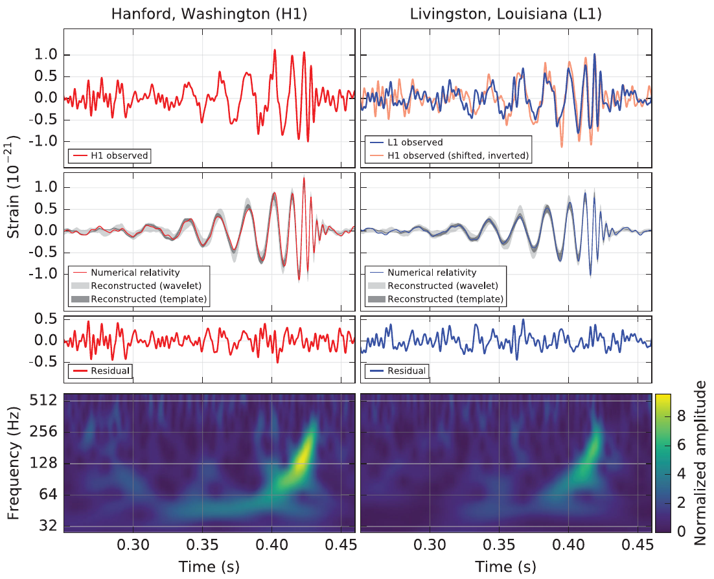
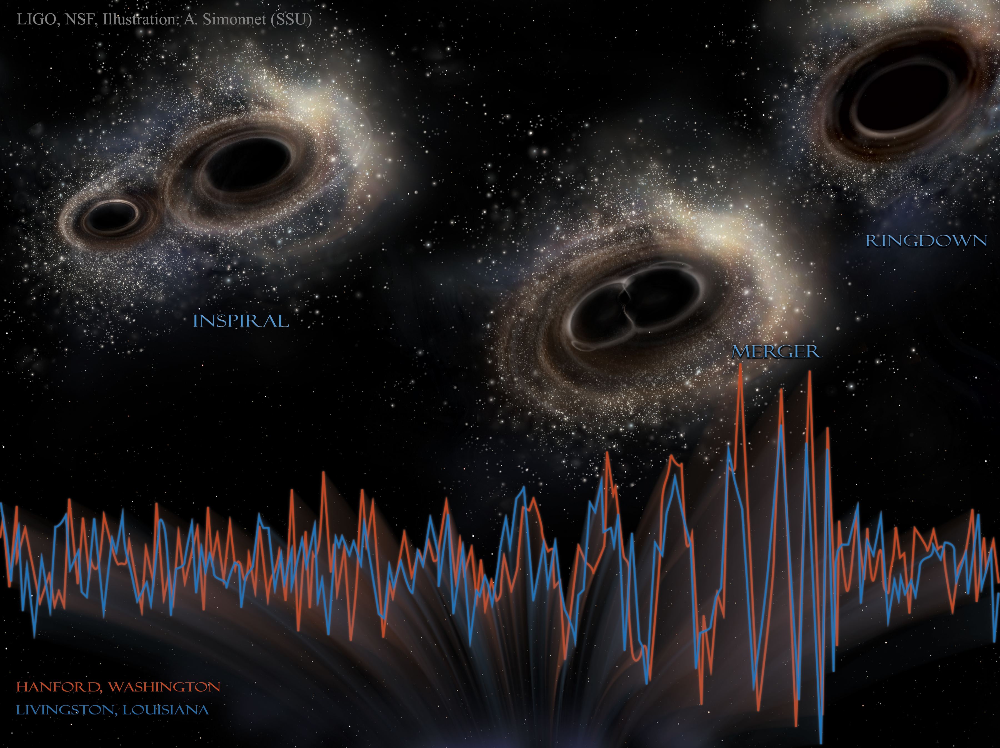

---
format:
    html:
        code-fold: true
        bibliography: ../../../rehear.bib
    beamer:
        execute:
            echo: false
        bibliography: ../../../rehear.bib
    revealjs:
        execute:
            echo: false
        menu:
            side: right
            width: wide
        bibliography: ../../../rehear.bib
        self-contained: true
author: Jacopo Tissino
date: 2025-03-28
title: Precision gravitational wave science on the Moon
subtitle: IPAG - SHERPAS group meeting
aspectratio: 169
---

```{python}
from thesis_scripts.plotting import plot_contours
from matplotlib import ticker
from matplotlib.lines import Line2D
import pandas as pd
from thesis_scripts.plotting import make_arcmin_grid
from thesis_scripts import data_path
import yaml
import numpy as np
import matplotlib.pyplot as plt

from cmcrameri import cm

cmap_full = cm.devon
cmap_ew = cm.lajolla

def make_legend():

    custom_lines = [
        Line2D([0], [0], color=cmap_full(.8), markersize=10, marker='o', lw=0),
        Line2D([0], [0], color=cmap_full(.4), markersize=10, marker='o', lw=0),
    ]
    
    plt.legend(
        custom_lines, 
        [
            '50\% probability contained',
            '90\% probability contained',
        ]
    )

run_folder = data_path / 'bns_test'

injection_params = yaml.safe_load((run_folder / 'injection_parameters.yaml').read_text())

post_full = pd.read_csv(run_folder / 'chains' / 'equal_weighted_post.txt', sep=' ')

mc = injection_params['chirp_mass']

```

# 2015: the birth of gravitational wave astronomy

{height=75% fig-align="center"}

\footnotesize Figure from the [LIGO and Virgo collaborations (Abbott et al. 2016)](https://link.aps.org/doi/10.1103/PhysRevLett.116.061102).

# Black holes merging

{height=85% fig-align="center"}

# Types of GW signals: just a few examples!

- [ ] Compact binary coalescences: _short_ __template__ search
    - [x] Binaries with stellar-mass black holes (~100 so far, LVK)
    - [x] Binaries with neutron stars (few so far, LVK)
    - [ ] Binaries with white dwarfs
    - [ ] Binaries with intermediate or supermassive black holes
    - [ ] Binaries with large mass ratios
- [ ] Emission from spinning pulsars: _continuous_ __template__ search
- [ ] Bursts: _short_ __unmodelled__ search
    - [ ] Bursts from supernovae
    - [ ] Bursts from tidal disruption events
- [x] Stochastic backgrounds: _continuous_ __unmodelled__ search (PTA)

# The 2030s GW detection landscape

{height=85% fig-align="center"}

# Types of detectors

{height=75% fig-align="center"}

\footnotesize Figure from [Dupletsa et al. (2023)](https://www.sciencedirect.com/science/article/pii/S2213133722000853).

# What is LGWA?

```{python}
from thesis_scripts import *
```

{height=75% fig-align="center"}

\footnotesize Figure from the LGWA collaboration.

# Permanently shadowed regions - elevation map

{height=75% fig-align="center"}

\footnotesize Figure from the [Lunar and Planetary Institute](https://www.lpi.usra.edu/).

# Permanently shadowed regions - temperature

{#psr-temperature height=75% fig-align="center"}

\footnotesize Figure from the [Lunar and Planetary Institute](https://www.lpi.usra.edu/).

# LGWA payload

{height=75% fig-align="center"}

\footnotesize Figure from [van Heijningen et al., 2023](https://pubs.aip.org/aip/jap/article/133/24/244501/2899601/The-payload-of-the-Lunar-Gravitational-wave).

# LGWA readout 

{height=75% fig-align="center"}

\footnotesize Figure from [van Heijningen et al., 2023](https://pubs.aip.org/aip/jap/article/133/24/244501/2899601/The-payload-of-the-Lunar-Gravitational-wave).

# Inertial sensing: Watt's linkage

{height=75% fig-align="center"}

\footnotesize Figure from [Bertolini et al. (2005)](https://www.sciencedirect.com/science/article/abs/pii/S0168900205020930)

# Strain noise contributions

We want to measure gravitational wave __strain__: $h(t) \sim \delta L (t) / L_0$, where

$$ L_0(f) = \text{baseline length}(f) = \frac{\text{horizontal motion amplitude}(f)}{\text{monochromatic GW amplitude}(f)}
$$

The noise is then:

$$ \text{strain noise} (f) = \frac{\text{displacement noise} (f)}{\text{baseline length}(f)}
$$

# Noise and moonquakes

{height=75% fig-align="center"}

# Lunar response modelling

{height=75% fig-align="center"}

\footnotesize Figure from the [LGWA whitepaper (2024)](http://arxiv.org/abs/2404.09181).

# Lunar response results

{height=75% fig-align="center"}

\footnotesize Figure from Bi and Harms, 2024.

# Multi-band detections

{height=75% fig-align="center"}

\footnotesize Figure from the [LGWA whitepaper (2024)](http://arxiv.org/abs/2404.09181).

# Time to merger for stellar-mass sources

{height=75% fig-align="center"}

\footnotesize Figure from Cozzumbo et al., 2024.

# Phase constraints for a neutron star binary

```{python}
from thesis_scripts.lgwa_pe.lgwa_likelihood import LunarLikelihood
from thesis_scripts.lgwa_pe.lgwa_nested_sampling import from_bilby
like = LunarLikelihood()
like.compute_center(injection_params['time_at_center'])

f = np.geomspace(0.086816181214, 3, num=2000)

hx_0, hy_0 = like.projected_waveform(f, from_bilby(injection_params))

ratios_to_plot = 2_000
ratios = np.empty((2, ratios_to_plot, len(f)), dtype=complex)

for i in range(ratios_to_plot):
    params = from_bilby(post_full.iloc[i].to_dict())
    hx, hy = like.projected_waveform(f, params)
    ratios[0, i, :] = hx/hx_0
    ratios[1, i, :] = hy/hy_0
```

```{python}

from thesis_scripts.plotting import add_time_to_merger_axis
cmap = plt.get_cmap('Blues')

phase_diffs = np.sort(np.angle(ratios), axis=1)

fig, axs = plt.subplots(1, 1, sharex=True, figsize=(16/2, 7/2))

for percentile in [.5, .9]:
    for i in range(1):
        i_1 = int(ratios_to_plot*percentile/2.)
        i_2 = int(ratios_to_plot*(1-percentile/2.))
        axs.fill_between(f, 
            phase_diffs[i, i_1],
            phase_diffs[i, i_2],
            color=cmap(percentile)
        )
        axs.plot(f,
            phase_diffs[i, i_1],
            c='black', lw=.5
        )
        axs.plot(f, 
            phase_diffs[i, i_2],
            c='black', lw=.5
        )
        axs.set_xscale('log')
        axs.set_ylim(-0.2, 0.2)

axs.set_xlim(f[0], f[-1])
axs.set_title('$x$ channel')
# axs[1].set_title('$y$ channel')
axs.set_ylabel('Phase constraint [rad]')
# axs[1].set_ylabel('Phase constraint [rad]')
axs.set_xlabel('Frequency [Hz]')
add_time_to_merger_axis(axs, params['chirp_mass'])

```


# Sky position measurement - 1 month of observation

```{python}
import numpy as np
from thesis_scripts import *
import yaml

with open(data_path / 'gw170817_lgwa_median.yaml') as f:
    params = yaml.safe_load(f)

def fig_args(radius, params):
    return {
        'ra_lims': (
            np.rad2deg(params['ra']-radius*16/9), 
            np.rad2deg(params['ra']+radius*16/9)
        ),
        'dec_lims': (
            np.rad2deg(params['dec']-radius), 
            np.rad2deg(params['dec']+radius)
        ),
        'mollweide': False,
        'figsize': (16/2, 9/2)
    }

```

```{python}
from thesis_scripts.mismatch_plots_lgwa import mismatch_plot
from thesis_scripts.lgwa_pe.simple_bns_waveforms import time_to_merger_simple_inverse, SUN_MASS_SECONDS

fmin = time_to_merger_simple_inverse(-3600*24*60, params['chirp_mass']*SUN_MASS_SECONDS)
n_grid = 100

ax = mismatch_plot(
    params, 
    np.geomspace(fmin, 3, num=200), 
    n_grid=n_grid, 
    cache_name='cache/bns_recentered_2months', 
    **fig_args(np.deg2rad(1), params)
)
```

# Sky position measurement - 1 year

```{python}
fmin = time_to_merger_simple_inverse(-3600*24*365.25, params['chirp_mass']*SUN_MASS_SECONDS)
    
ax = mismatch_plot(
    params, 
    np.geomspace(fmin, 3, num=200), 
    n_grid=n_grid, 
    cache_name='cache/bns_recentered_1year', 
    **fig_args(np.deg2rad(1), params)
)
```

# Sky position measurement - early warning

```{python}
fmin = time_to_merger_simple_inverse(-3600*24*365.25, params['chirp_mass']*SUN_MASS_SECONDS)
fmax = time_to_merger_simple_inverse(-3600*24*30, params['chirp_mass']*SUN_MASS_SECONDS)
    
ax = mismatch_plot(
    params, 
    np.geomspace(fmin, fmax, num=200), 
    n_grid=n_grid, 
    cache_name='cache/bns_recentered_ew', 
    # cache_name=None, 
    **fig_args(np.deg2rad(1), params)
)
```

# Soundcheck sensitivity

{height=85% fig-align="center"}

# LGWA sensitivity

{height=85% fig-align="center"}

# LGWA sources

- Internal lunar sources
- Binaries with stellar-mass black holes and neutron stars (long observations, precise constraints)
- Binaries with white dwarfs (long observations, ~Mpc horizon)
- Binaries with intermediate mass black holes (optimum at ~$10^4 M_{\odot}$)
- Intermediate mass ratio inspirals ($m_1 / m_2 \sim 10^{-2} \div 10^{-5}$)
- Low-frequency asymmetric neutron stars
- Bursts from tidal disruption events
