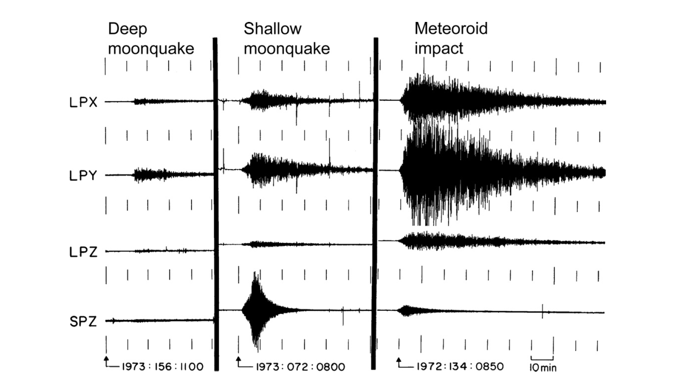

---
format:
    html:
        code-fold: true
        bibliography: ../../../rehear.bib
    beamer:
        execute:
            echo: false
        bibliography: ../../../rehear.bib
        fig-width: 8
        fig-height: 4.5
    revealjs:
        execute:
            echo: false
        menu:
            side: right
            width: wide
        bibliography: ../../../rehear.bib
        self-contained: true
author: Jacopo Tissino - Gran Sasso Science Institute
date: 2025-05-08
subtitle: Bicocca+GSSI meeting
title: Parameter estimation with the Lunar Gravitational Wave Antenna
aspectratio: 169
---

```{python}
from thesis_scripts.plotting import plot_contours
from matplotlib import ticker
from matplotlib.lines import Line2D
import pandas as pd
from thesis_scripts.plotting import make_arcmin_grid
from thesis_scripts import data_path
import yaml
import numpy as np
import matplotlib.pyplot as plt

from cmcrameri import cm

cmap_full = cm.devon
cmap_ew = cm.lajolla

def make_legend():

    custom_lines = [
        Line2D([0], [0], color=cmap_full(.8), markersize=10, marker='o', lw=0),
        Line2D([0], [0], color=cmap_full(.4), markersize=10, marker='o', lw=0),
    ]
    
    plt.legend(
        custom_lines, 
        [
            '50\% probability contained',
            '90\% probability contained',
        ]
    )

run_folder = data_path / 'bns_test'

injection_params = yaml.safe_load((run_folder / 'injection_parameters.yaml').read_text())

post_full = pd.read_csv(run_folder / 'chains' / 'equal_weighted_post.txt', sep=' ').iloc[:500]

mc = injection_params['chirp_mass']

```

# The 2030s GW detection landscape

{height="85%" fig-align="center"}

# Types of detectors

{height="75%" fig-align="center"}

\footnotesize Figure from [Dupletsa et al. (2023)](https://www.sciencedirect.com/science/article/pii/S2213133722000853).

# What is LGWA?

```{python}
from thesis_scripts import *
```

{height="75%" fig-align="center"}

\footnotesize Figure from the LGWA collaboration.

# Permanently shadowed regions

:::: {.columns}

::: {.column width="50%"}
{height="70%"}
:::

::: {.column width="50%"}
{#psr-temperature height="70%"}
:::

::::

\footnotesize Figures from the [Lunar and Planetary Institute](https://www.lpi.usra.edu/).

# LGWA payload

{height="75%" fig-align="center"}

\footnotesize Figure from [van Heijningen et al., 2023](https://pubs.aip.org/aip/jap/article/133/24/244501/2899601/The-payload-of-the-Lunar-Gravitational-wave).

# LGWA readout

{height="75%" fig-align="center"}

\footnotesize Figure from [van Heijningen et al., 2023](https://pubs.aip.org/aip/jap/article/133/24/244501/2899601/The-payload-of-the-Lunar-Gravitational-wave).

# Inertial sensing: Watt's linkage

::::: {layout="[ 60, 40 ]"}
::: {#first-column}
{height="75%" fig-align="left"}
:::

::: {#second-column}
$$ \omega_0 \approx \sqrt{ \left( \frac{M_1}{L_1} - \frac{M_2}{L_2 } \right) \frac{g}{M_1 + M_2}}
$$

\footnotesize Figure from [Bertolini et al. (2005)](https://www.sciencedirect.com/science/article/abs/pii/S0168900205020930)
:::
:::::

# Structure of LGWA

LGWA is planned to have:

-   4 **stations**, to reduce overall noise and perform active cancellation;
-   for each station, two orthogonal **horizontal measurement channels**.

# Lunar response to gravitational waves

We want to measure gravitational wave **strain**: $h(t) \sim \delta L (t) / L_0$, where

$$ L_0(f) = \text{baseline length}(f) = \frac{\text{horizontal motion amplitude}(f)}{\text{monochromatic GW amplitude}(f)}
$$

# Lunar response to gravitational waves

{height="75%" fig-align="center"}

\footnotesize Figure from the [LGWA whitepaper (2024)](http://arxiv.org/abs/2404.09181).

# Lunar response to gravitational waves

{height="75%" fig-align="center"}

\footnotesize Figure from Bi and Harms, 2024.

# Noise and moonquakes

{height="75%" fig-align="center"}

# Soundcheck sensitivity

{height="85%" fig-align="center"}

# LGWA sensitivity

{height="85%" fig-align="center"}

# Multi-band detections

{height="75%" fig-align="center"}


# Very precise parameter estimation

```{python}
#| layout-ncol: 2

x = np.linspace(-6e-7, 6e-7, num=200)
y = np.linspace(0.86, 0.95, num=200)

# plot_contours(post_ew['chirp_mass']-mc, post_ew['mass_ratio'], ax=plt.gca(), levels=[.9], cmap=cmap_ew, x=x, y=y, N=200)
fig=plt.figure(figsize=(3, 3))
plot_contours(
    post_full['chirp_mass']-mc, 
    post_full['mass_ratio'], ax=plt.gca(), levels=[.5, .9], cmap=cmap_full, x=x, y=y, N=200)
plt.grid(which='both')
plt.xlim(-2e-7, 2e-7)
plt.scatter(0, injection_params['mass_ratio'], marker='x', c='black')
plt.gca().xaxis.set_major_locator(ticker.FixedLocator(np.arange(-2, 4, 1)*1e-7))
plt.gca().xaxis.set_major_formatter(ticker.FixedFormatter(
    [
        '$- 2 \\times 10^{-7}$',
        '$-10^{-7}$',
        '$0$',
        '$ 10^{-7}$',
        '$2 \\times 10^{-7}$',
    ]
))

plt.xlabel('$\mathcal{M} - \mathcal{M}_0 [ M_{\odot}]$')
plt.ylabel('$q = m_2 / m_1$')
make_legend()
_ = plt.title('Mass constraints')
plt.show()

ra_lims = np.deg2rad([197+23.2/60, 197+30/60])
dec_lims = np.deg2rad([-24+34.5/60, -24+41.5/60])
fig=plt.figure(figsize=(3, 3))

# plot_contours(post_ew['ra'], post_ew['dec'], ax=plt.gca(), levels=[.9], cmap=cmap_ew)
plot_contours(post_full['ra'], post_full['dec'], ax=plt.gca(), levels=[.5, .9], cmap=cmap_full, N=200)
plt.scatter(injection_params['ra'], injection_params['dec'], marker='x', c='black')

make_arcmin_grid(plt.gca(), ra_lims, dec_lims)
plt.grid(which='minor', lw=.5)
plt.grid(which='major', lw=1)
plt.gca().set_aspect('equal')
plt.xlabel('Right ascension')
plt.ylabel('Declination')
make_legend()
_ = plt.title('Sky location constraints')
plt.show()
```

# Time-at-frequency constraints

```{python}
from thesis_scripts.lgwa_pe.simple_bns_waveforms import Phif3hPN
from numdifftools import Derivative

import pandas as pd
import numpy as np
from getdist import plots, MCSamples
import yaml

run_folder = data_path / 'bns_test'
fname = run_folder / 'chains' /'weighted_post.txt'
assert fname.exists()
post_pandas = pd.read_csv(fname, sep=' ')
weights = post_pandas['weight']

post_equal = pd.read_csv(fname.parent / 'equal_weighted_post.txt', sep = ' ')


def time_to_merger(mchirp, q, f=np.inf):
    eta = q / (1+q)**2
    M = mchirp / eta**(3/5)
    func = lambda freq : Phif3hPN(
            freq,
            M,
            eta,
    )
    return Derivative(func)(f) / (2*np.pi)

freqs = np.geomspace(0.5, 4, num=100)
samples_to_use = 1000
m = post_equal['chirp_mass'].to_numpy()[:samples_to_use]
q = post_equal['mass_ratio'].to_numpy()[:samples_to_use]
t = post_equal['time_at_center'].to_numpy()[:samples_to_use]

correlations = [
    np.corrcoef(
        m, 
        t + time_to_merger(m, q, freq)
        )[0, 1] for freq in freqs]

correlations_q = [
    np.corrcoef(
        q, 
        t + time_to_merger(m, q, freq)
        )[0, 1] for freq in freqs]


correlations_ttm = [
    np.corrcoef(
        m, 
        time_to_merger(m, q, freq)
        )[0, 1] for freq in freqs]

correlations_ttm_q = [
    np.corrcoef(
        q, 
        time_to_merger(m, q, freq)
        )[0, 1] for freq in freqs]


stds = [
    np.std(t + time_to_merger(m, q, freq)) 
    for freq in freqs]

fig, axs = plt.subplots(2, 1, sharex=True, figsize=(16/2, 7/2), gridspec_kw={'hspace': 0.})

c_1 = '#117733'
c_2 = '#DDCC77'

lines = []

lines.append(axs[0].plot(freqs, correlations, label='Correlation betwen t(f) and chirp mass', c=c_1, ls='--')[0])
lines.append(axs[0].plot(freqs, correlations_q, label='Correlation betwen t(f) and mass ratio', c=c_2, ls='--')[0])
# lines.append(axs[0].plot(freqs, correlations_ttm, label='Correlation betwen time to merger and chirp mass', c=c_1)[0])
# lines.append(axs[0].plot(freqs, correlations_ttm_q, label='Correlation betwen time to merger and mass ratio', c=c_2)[0])
lines.append(axs[1].plot(freqs, stds, label='Standard deviation of t(f) [s]', c='black')[0])
axs[1].set_xscale('log')
axs[1].set_xlabel('Frequency [Hz]')
axs[1].legend(handles=lines)
axs[0].set_ylim(-1.1, 1.1)
plt.grid()
```


# LGWA sources

-   Internal lunar sources
-   Binaries with stellar-mass black holes and neutron stars (long observations, precise constraints)
-   Binaries with white dwarfs (long observations, \~Mpc horizon)
-   Binaries with intermediate mass black holes (optimum at \~$10^4 M_{\odot}$)
-   Intermediate mass ratio inspirals ($m_1 / m_2 \sim 10^{-2} \div 10^{-5}$)
-   Low-frequency asymmetric neutron stars
-   Bursts from tidal disruption events

# Backup: higher order modes

```{python}
#| label: fig-gw150914-modes
#| fig-cap: "Projected higher order modes for GW150914." 

from thesis_scripts.lgwa_pe.higher_order_modes import make_gw150914_modes_plot

plt.figure(figsize=(16/2, 7/2))
make_gw150914_modes_plot()
```

# Backup: parameter selection

```{python}
#| label: fig-gw150914-with-lgwa

import h5py
import matplotlib.pyplot as plt
import numpy as np
from tqdm import tqdm
from thesis_scripts.lgwa_pe.lgwa_likelihood import LunarLikelihood
from thesis_scripts.lgwa_pe.lgwa_nested_sampling import from_bilby

like = LunarLikelihood()
freq = np.geomspace(1e-3, 3, num=10000)

# load GWTC-1 posterior for GW170817
# from here: https://gwosc.org/eventapi/html/GWTC-1-confident/GW170817/v3/
gw150914_file = h5py.File(data_path / 'GW150914_GWTC-1.hdf5', 'r')

# keys (gw150914_file['Overall_posterior'].dtype):
# dtype([
# ('costheta_jn', '<f8'), 0
# ('luminosity_distance_Mpc', '<f8'), 1
# ('right_ascension', '<f8'), 2
# ('declination', '<f8'), 3
# ('m1_detector_frame_Msun', '<f8'), 4
# ('m2_detector_frame_Msun', '<f8'), 5
# ('spin1', '<f8'), 6
# ('spin2', '<f8'), 7
# ('costilt1', '<f8'), 8
# ('costilt2', '<f8')]) 9

rng = np.random.default_rng(seed=1)

n_post = len(gw150914_file['Overall_posterior'])
phase = rng.uniform(0, 2*np.pi, size=n_post)
psi = rng.uniform(0, 2*np.pi, size=n_post)
ra = rng.uniform(0, 2*np.pi, size=n_post)
dec = np.pi/2. - np.arccos(rng.uniform(-1, 1, size=n_post))
time = rng.uniform(1.5e9, 2e9, size=n_post)

def params_from_sample_150914(i, sample):
    m1, m2 = sample[4], sample[5]
    return {
        'theta_jn': np.arccos(sample[0]),
        'luminosity_distance': sample[1],
        'ra': sample[2],
        'dec': sample[3],
        'chirp_mass': (m1*m2)**(3/5) / (m1+m2)**(1/5),
        'mass_ratio': m2/m1,
        'lambda_1': 0.,
        'lambda_2': 0.,
        'chi_1': sample[6]*sample[8],
        'chi_2': sample[7]*sample[9],
        'phase': phase[i],
        'psi': psi[i],
        'time_at_center': 1126259462.4,
    }

fname_snrs = data_path / 'cache' / 'snrs_150914.npy'
fname_snrs_random_sky = data_path / 'cache' / 'snrs_150914_random_sky.npy'

if fname_snrs.exists() and fname_snrs_random_sky.exists():
    snrs = np.load(fname_snrs)
    snrs_random_sky = np.load(fname_snrs_random_sky)
else:
    rng = np.random.default_rng(seed=1)

    snrs = []
    snrs_random_sky = []

    for i, sample in tqdm(enumerate(gw150914_file['Overall_posterior'])):
        params = params_from_sample_150914(i, sample)
        snrs.append(
            like.optimal_snr(freq, from_bilby(params)))
        snrs_random_sky.append(
            like.optimal_snr(freq, from_bilby(
                params | 
                {
                    'ra': ra[i],
                    'dec': dec[i],
                    'time_at_center': time[i],
                }
            )
        ))
    np.save(fname_snrs, snrs)
    np.save(fname_snrs_random_sky, snrs_random_sky)

colors = ['#004D40', '#FFC107']

plt.figure(figsize=(16/2, 7/2))

_ = plt.hist(snrs, bins=50, alpha=.5, label='GWTC-1 posterior', density=True, color=colors[1])
_ = plt.hist(snrs_random_sky, bins=50, alpha=.5, label='GWTC-1 posterior, randomized time and location', density=True, color=colors[0])

i_median = np.argsort(snrs_random_sky)[len(snrs) //2]
plt.axvline(snrs_random_sky[i_median], c='black', ls='--', label='Selected injection', ymax=0.75)
with open(data_path / 'gw150914_lgwa_median.yaml', 'w') as f:

    params = params_from_sample_150914(i_median, gw150914_file['Overall_posterior'][i_median])
    params.update({
        'ra': ra[i_median],
        'dec': dec[i_median],
        'time_at_center': time[i_median],
    })
    yaml.dump(
        {key: float(val) for key, val in 
            params.items()
    },
    f
    )

_ = plt.xlabel('LGWA SNR')
_ = plt.ylabel('Probability density')
_ = plt.legend()

_ = plt.xlim(0, 60)

_ = plt.title('GW150914')
```

# Backup: phase constraint by frequency

```{python}
from thesis_scripts.lgwa_pe.lgwa_likelihood import LunarLikelihood
from thesis_scripts.lgwa_pe.lgwa_nested_sampling import from_bilby
like = LunarLikelihood()
like.compute_center(injection_params['time_at_center'])

f = np.geomspace(0.086816181214, 3, num=2000)

hx_0, hy_0 = like.projected_waveform(f, from_bilby(injection_params))

ratios_to_plot = len(post_full)
ratios = np.empty((2, ratios_to_plot, len(f)), dtype=complex)

for i in range(ratios_to_plot):
    params = from_bilby(post_full.iloc[i].to_dict())
    hx, hy = like.projected_waveform(f, params)
    ratios[0, i, :] = hx/hx_0
    ratios[1, i, :] = hy/hy_0
```

```{python}
3
from thesis_scripts.plotting import add_time_to_merger_axis
cmap = plt.get_cmap('Blues')

phase_diffs = np.sort(np.angle(ratios), axis=1)

fig, axs = plt.subplots(1, 1, sharex=True, figsize=(16/2, 7/2))

for percentile in [.5, .9]:
    for i in range(1):
        i_1 = int(ratios_to_plot*percentile/2.)
        i_2 = int(ratios_to_plot*(1-percentile/2.))
        axs.fill_between(f, 
            phase_diffs[i, i_1],
            phase_diffs[i, i_2],
            color=cmap(percentile)
        )
        axs.plot(f,
            phase_diffs[i, i_1],
            c='black', lw=.5
        )
        axs.plot(f, 
            phase_diffs[i, i_2],
            c='black', lw=.5
        )
        axs.set_xscale('log')
        axs.set_ylim(-0.2, 0.2)

axs.set_xlim(f[0], f[-1])
axs.set_title('$x$ channel')
# axs[1].set_title('$y$ channel')
axs.set_ylabel('Phase constraint [rad]')
# axs[1].set_ylabel('Phase constraint [rad]')
axs.set_xlabel('Frequency [Hz]')
add_time_to_merger_axis(axs, params['chirp_mass'])

```

# Backup: sky position measurement - 1 month

```{python}
import numpy as np
from thesis_scripts import *
import yaml

with open(data_path / 'gw170817_lgwa_median.yaml') as f:
    params = yaml.safe_load(f)

def fig_args(radius, params):
    return {
        'ra_lims': (
            np.rad2deg(params['ra']-radius*16/9), 
            np.rad2deg(params['ra']+radius*16/9)
        ),
        'dec_lims': (
            np.rad2deg(params['dec']-radius), 
            np.rad2deg(params['dec']+radius)
        ),
        'mollweide': False,
        'figsize': (16/2, 9/2)
    }
```

```{python}
from thesis_scripts.mismatch_plots_lgwa import mismatch_plot
from thesis_scripts.lgwa_pe.simple_bns_waveforms import time_to_merger_simple_inverse, SUN_MASS_SECONDS

fmin = time_to_merger_simple_inverse(-3600*24*60, params['chirp_mass']*SUN_MASS_SECONDS)
n_grid = 80

ax = mismatch_plot(
    params, 
    np.geomspace(fmin, 3, num=400), 
    n_grid=n_grid, 
    cache_name='cache/bns_recentered_2months', 
    **fig_args(np.deg2rad(1.), params)
)
```

# Backup: sky position measurement - 1 year

```{python}
fmin = time_to_merger_simple_inverse(-3600*24*365.25, params['chirp_mass']*SUN_MASS_SECONDS)
    
ax = mismatch_plot(
    params, 
    np.geomspace(fmin, 3, num=400), 
    n_grid=n_grid, 
    cache_name='cache/bns_recentered_1year', 
    # cache_name='cache/bns_recentered_1year', 
    **fig_args(np.deg2rad(1.), params)
)
```

# Backup: sky position measurement - early warning

```{python}
fmin = time_to_merger_simple_inverse(-3600*24*365.25, params['chirp_mass']*SUN_MASS_SECONDS)
fmax = time_to_merger_simple_inverse(-3600*24*30, params['chirp_mass']*SUN_MASS_SECONDS)
    
ax = mismatch_plot(
    params, 
    np.geomspace(fmin, fmax, num=400), 
    n_grid=n_grid, 
    cache_name='cache/bns_recentered_ew', 
    # cache_name=None, 
    **fig_args(np.deg2rad(1.), params)
)
```
