## Outline

::: {.incremental}
- GW250114: what we learned from the best$^*$ black hole coalescence ever;
- as seen by the Lunar Gravitational Wave Antenna:
  - the arrival time problem;
- as seen by the Einstein Telescope:
  - multimodalities and configuration comparison.
:::

# GW250114: the clearest signal yet

## 11 years ago: GW150914

{width="65%"}

::::: footer

[@ligoscientificcollaborationandvirgocollaborationObservationGravitationalWaves2016]
:::::

## A decade of improvement

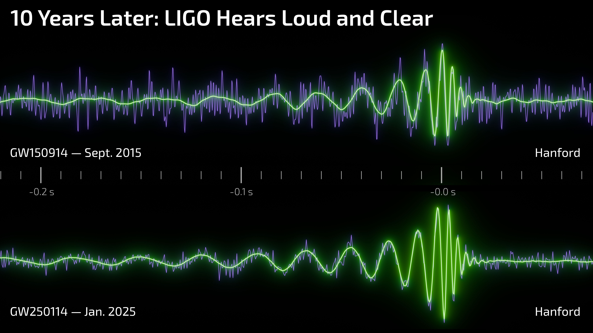{width="100%"}

::::: footer

LIGO, J. Tissino, R. Hurt (Caltech-IPAC).
:::::

## What the detectors saw

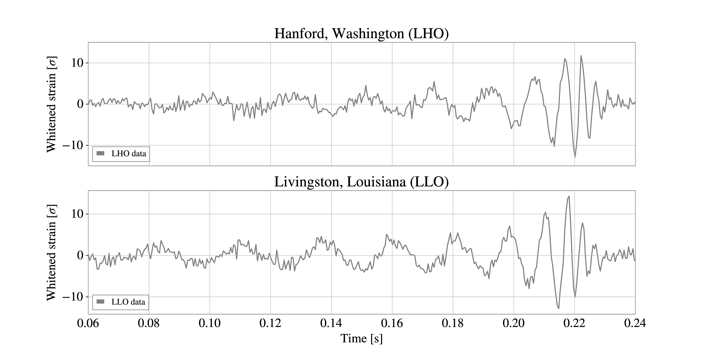{width="100%"}

::::: footer
Adapted from @abacGW250114TestingHawkings2025
:::::

## How we modelled it

{width="100%"}

::::: footer
[@abacGW250114TestingHawkings2025]
:::::

## How we interpreted it

:::: {layout="[ 50, 50 ]"}

::: {#first-column}

Two black holes colliding, with masses
$m_1 = 33.6_{-0.8}^{+1.2} M_{\odot}$ and
$m_2 = 32.2_{-1.3}^{+0.8} M_{\odot}$.

Small spins $|\chi_{1, 2}| \leq 0.26$, 
negligible eccentricity $e_{13 \text{Hz}} \leq 0.03$. 

:::

::: {#second-column .fragment}

:::

::::

::::: footer

[@abacGW250114TestingHawkings2025]
:::::

## How we analyzed it 

Bayesian inference, accounting for our uncertainty on:

- source masses $m_i$ and spins $\vec{\chi}_i$;
- source location $(\alpha, \delta)$ and distance $d_L$;
- source inclination $\theta_{\text{JN}}$ and polarization $\psi$;
- coalescence phase $\phi_c$ and merger time $t_c$;
- eccentricity $e$ and eccentric anomaly $\zeta$;
- detector calibration.

## The observed ringdown

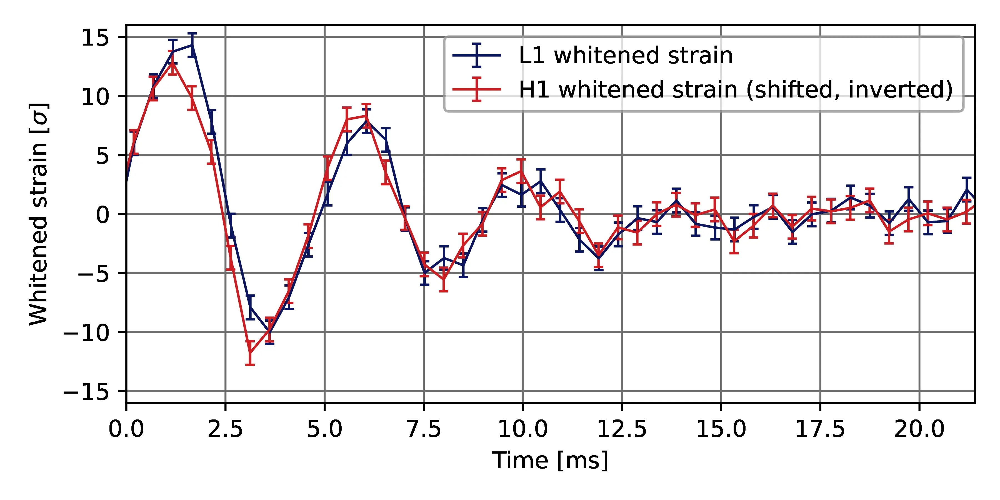{width="100%"}

## Modelling the ringdown

A superposition of damped sinusoids: _quasinormal modes_.

. . .

$$
\begin{aligned}
h_{+}(t)-ih_{\times}(t) &\approx \sum_{\ell=2}^{\infty} \sum_{m=-\ell}^{\ell} \sum_{n=0}^{\infty} h_{\ell m n} S_{\ell mn}  \\
h_{\ell m n} &= A_{\ell mn} \exp\left[i(\omega_{\ell mn}(t-t_\text{ref})+\phi^{x}_{\ell mn})\right] \\
\omega_{\ell mn} &= 2 \pi f_{\ell mn} + i / \tau _{\ell mn}
\end{aligned}
$$

. . .

For earlier signals, $\ell mn = 220$ was sufficient.

## Testing the Kerr hypothesis

For GW250114, the overtone $\ell mn = 221$ was also required to explain the data.

. . .

Under the Kerr assumption, perturbation theory predicts the spectrum $f_{\ell mn} (M_f, \chi_f)$.

. . .

We parameterize deviations as

$$
f_{221} = e^{\delta f_{221}} f_{221}^{\text{Kerr}}
$$

## Testing the Kerr hypothesis

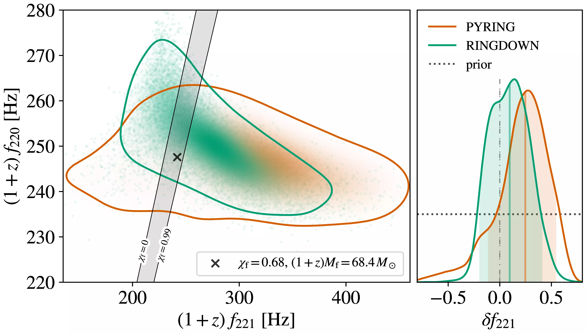{width="100%"}

::::: footer

[@abacGW250114TestingHawkings2025]
:::::

--- 

::: {.center style="text-align: center; justify-content: center; align-items: center;"}

[We'll come back to GW250114.]{.fragment }

[To get _long_ gravitational wave signals, we need lower frequencies, which require a quiet place.]{.fragment}

:::

# Lunar Gravitational Wave Antenna

---

## The lunar north pole

## Detector configuration

:::: {layout="[ 40, 60 ]"}

::: {#first-column}

Measuring seismic motion at 4 locations inside a lunar crater,
with cryogenics and seismic noise cancellation.

:::

::: {#second-column}

{width=70%}
:::
::::

::::: footer

[@vanheijningenPayloadLunarGravitationalwave2023]
:::::

## Watt's linkage

:::: {layout="[ 40, 60 ]"}

::: {#first-column}

Pendulum + inverted pendulum.

We measure **horizontal displacement** between the ground and this **inertial mass**,
along two axes.

:::

::: {#second-column}

{width=70%}

:::
::::

::::: footer

[@bertoliniMechanicalDesignSingleaxis2006]
:::::

## The Moon as a sensor

The displacement measured at the detector is 

$$ s(t _{\text{det}}; f) = h_{ij}(t; f) D_{ij}(t _{\text{det}}) L(f) + \text{noise}
$$

. . .

with

$$ D = \text{vertical} \otimes \text{horizontal}
$$

. . .

$$ L(f) = \frac{\text{ground displacement}}{\text{GW strain}}
$$

## Sensitivity curve

::::: footer
[@ajithLunarGravitationalwaveAntenna2025]
:::::

## The deci-Hertz band

::::: footer
Adapted from @cozzumboOpportunitiesLimitsLunar2024
:::::

## GW250114 with the LGWA

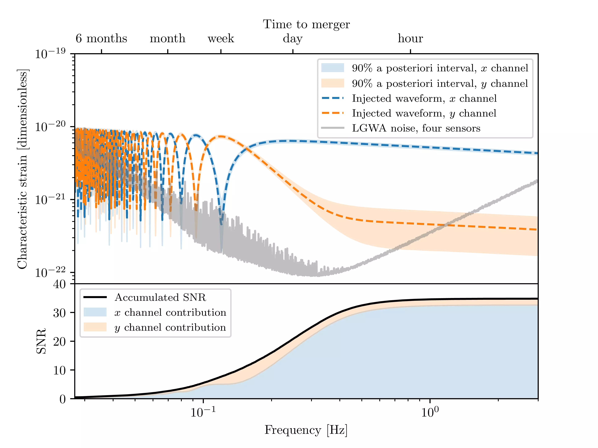{width="80%"}

::::: footer
[@tissinoGeometryLunarGravitational2026]
:::::

# The signal's arrival time

## When did the signal arrive?

. . .

Detector motion causes a nonlinear relation between source-frame and detector-frame time,

$$ t _{\text{det}} = t + t_0 - \frac{\hat{n} \cdot \vec{r}(t _{\text{det}})}{c}\,,
$$

- $\vec{r}$ connects the origin and the detector's position, 
- $\hat{n}$ points to the GW source.

. . .

The timing parameter is:

$$ t _{\text{ref}} = \text{time when a reference event reaches the origin}\,.
$$

## What origin? 

Standard approaches:

::: {.incremental}
- space-based detectors: the Solar System Barycenter (SSB),
- ground-based detectors: the center of the Earth,
  - only valid assuming a short observation, such that $\vec{r}_{\text{Earth}} \approx \vec{r}_0 + \vec{v} t$.
:::

. . .

New approach: 

- SSB with a constant shift of origin.

## Why does it matter? An experiment

::: {.incremental}
- correlations between $t_{\text{ref}}$ and sky position lead to:
  - increased uncertainty on $t_{\text{ref}}$ (requires a larger prior)
  - a more complex likelihood surface (difficult sampling)
:::

. . .

::::: {style="font-size: 80%;"}

|   Likelihood evaluations  |   Sampling time [min] |   Timing uncertainty [s] |   Prior width [s]  | Origin   |
|-------------------------:|----------------------:|-------------------------:|------------------:|:---------|
|                        $0.8\times 10^6$ |                   17   |                  0.075 |               0.5 | shifted  |
|                       $1.5\times 10^6$ |                   33 |                    0.075 |              27   | shifted  |
|                       $9.1\times 10^6$ |                  199 |                    4.733 |              27   | SSB      |

:::::

## What reference event?

{width="100%"}

## Impact of a different reference event

{width="100%"}

## Recap: combining the two

Uncertainty on $t_{\text{ref}}$ is a proxy for sampling efficiency.

. . .

It depends on origin position $\vec{r}_0$ and reference frequency $f$.

. . .

As a function of $f$, we can compute 

$$ \vec{r}_{\text{opt}}(f) = \text{argmin}_{\vec{r}_0} \text{var} [t_{\text{ref}}(\vec{r}_0, f)]
$$

. . .

and reframe this as $\vec{r}_{\text{opt}}(t)$ using the signal's $t(f)$.

---

{width="90%"}

# Multi-band with the Einstein Telescope

## The multi-band concept

{width="80%"}

::::: footer
[@ajithLunarGravitationalwaveAntenna2025]
:::::

## The multi-band horizon

{width="80%"}

::::: footer
[@ajithLunarGravitationalwaveAntenna2025]
:::::

## Einstein Telescope configurations

::: {.incremental}
- ET-$\Delta$: equilateral triangle with 10km arms;
  - location: EMR region.
- ET-2L: two L-shaped detectors with 15km arms;
  - locations: Sardinia and Saxony; 
  - misaligned arms by $45^\circ$.
:::

## GW250114, now and in the future

We compare:

::: {.incremental}
- The LVK detection of GW250114 (SNR 77--80);
- a zero-noise injection with the LGWA (SNR 35);
- a zero-noise injection with ET-$\Delta$ (SNR 682);
- a zero-noise injection with ET-2L (SNR 835).
:::

## Intrinsic parameters

:::: {layout="[ 50, 50 ]"}

::: {#first-column}

- LGWA complementary with ET on mass;
- LGWA more precise than LVK on effective spin.
- ET extremely precise on mass ratio and spin.

::::: footer
[@tissinoGeometryLunarGravitational2026]
:::::

:::

::: {#second-column}

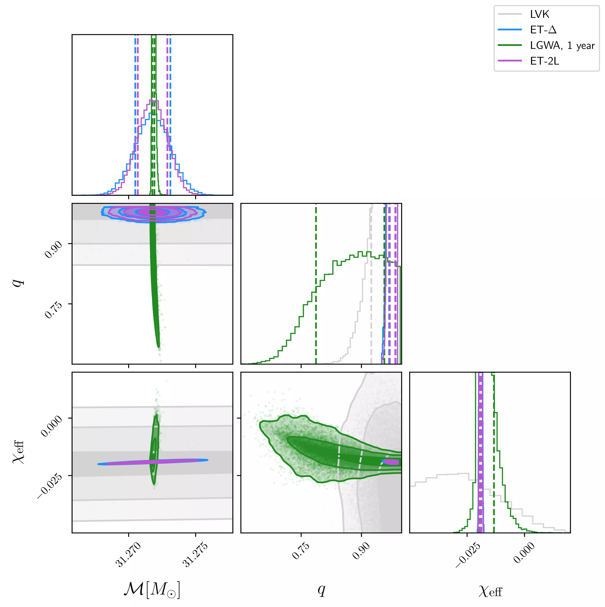{width=80%}
:::

::::

## Extrinsic parameters

:::: {layout="[ 50, 50 ]"}

::: {#first-column}

- LGWA localization tighter and "rounder" than LVK;
- inclination not well constrained by LGWA;
- ET-2L: tight, near Gaussian.
- ET-$\Delta$: tight, bimodal!

::::: footer

[@tissinoGeometryLunarGravitational2026]
:::::

:::

::: {#second-column}

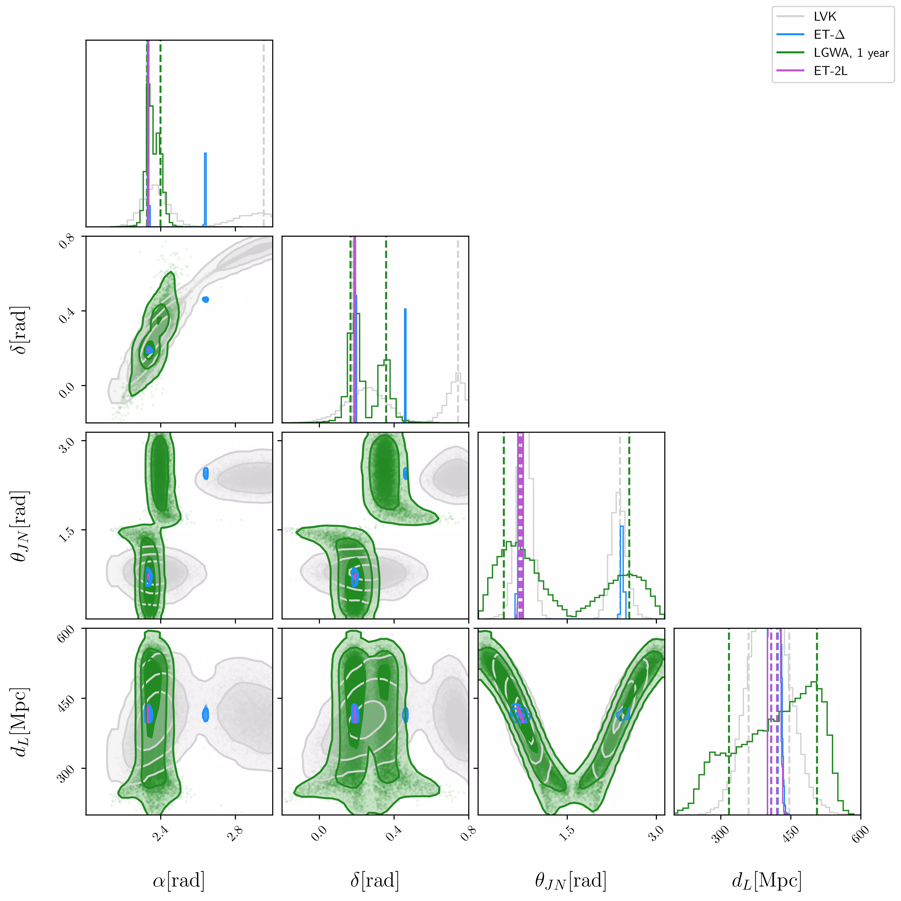{width=80%}
:::

::::

# Multimodalities with Einstein Telescope

## GW250114 with ET-$\Delta$

::::: footer
Adapted from @tissinoGeometryLunarGravitational2026
:::::

## Symmetry in the antenna patterns

The GW signal is obtained as 

$$ h(t) = F_+ h_+(t) + F_{\times} h_{\times}(t)
$$

::: {.fragment fragment-index=1}

The antenna patterns $F_{+ / \times}^{\text{ET-}\Delta}$, a function of the 
local sky coordinates, altitude $\beta$ and azimuth $\lambda$, 
are symmetric[^1] under:

- $\beta \to - \beta$,
- $\lambda \to \lambda + \pi / 2$.

:::

[^1]: [Other parameters need to change simultaneously: $t_{\text{geo}}$, $\theta_{\text{JN}}$, $\phi$, $\psi$. ]{.fragment fragment-index=2}

## Massive BBH: sky posterior

{width=80%} 

::: footer
[@santoliquidoFastAccurateParameter2025]
:::

## Massive BBH: multimodalities

:::: {layout="[ 40, 60 ]"}

::: {#first-column}
Sky localization modes for high mass 

($150 M_{\odot} \lesssim \mathcal{M} \leq 1100 M_{\odot}$)

and distant ($D_L \gtrsim 6 \text{Gpc}$) BBH.

::::: footer
[@santoliquidoComparingNextgenerationDetector2026]
:::::

:::

::: {#second-column}
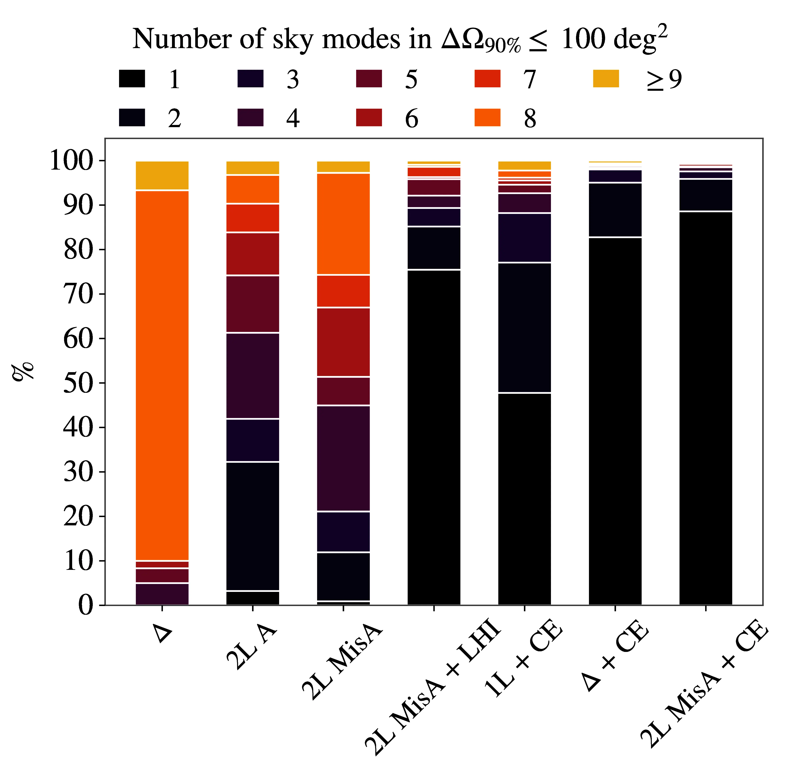{width=60% }
:::

::::

## How to resolve these multimodalities?

::: {.incremental}
- imprint of the rotation of the Earth;
- imprint of frequency-dependent antenna patterns;
- short-baseline triangulation;
- other detectors.
::: 

## GW250114: arrival times at the vertices 

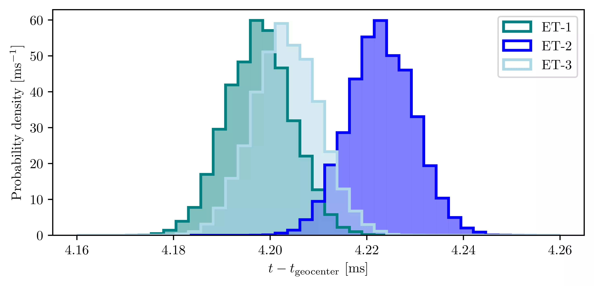 

## Summary

::: {.incremental}
- The Kerr metric is still compatible with observations;
- the LGWA could have measured GW250114 and provided strong constraints:
  - standard analysis assumptions need to be revised for deci-Hertz observations;
- the Einstein Telescope could have exquisitely measured GW250114:
  - but in its $\Delta$ configuration it would have exhibited a multimodality.
:::

# Extra information

## Ask me about 

- Hawking's area theorem constrained with GW250114;
- caveats to LGWA analyses;
- the LGWA's localization capabilities;
- the variation of timing uncertainty with position.

The thesis is available as a website at [https://jacopok.github.io/thesis](https://jacopok.github.io/thesis).

## Testing Hawking's area theorem

The area of a black hole is:

$$
\mathcal{A}(M, \chi) = 8 \pi \left(  \frac{GM}{c^{2}} \right)^{2} \left( 1+\sqrt{ 1-\chi^{2} } \right)
$$

. . .

Hawking's area theorem implies:

$$ \mathcal{A_i} = \mathcal{A}_1 + \mathcal{A}_2 < \mathcal{A_f}
$$

. . . 

We tested this __ignoring__ the __strong-field__ portion of the signal. 

## Testing Hawking's area theorem

:::: {layout="[ 50, 50 ]"}

::: {#first-column}

:::::: {.incremental}
- Data before $t_<$ leads to $(1+z)^2 \mathcal{A_i}$.
- Data after $t_>$ leads to $(1+z)^2 \mathcal{A_f}$.
::::::

:::::: {.fragment}

A violation of the theorem would be

$$ \frac{\mathcal{A_f} - \mathcal{A_i}}{\mathcal{A_i}} < 0.
$$

::::::

:::

::: {#second-column .fragment}

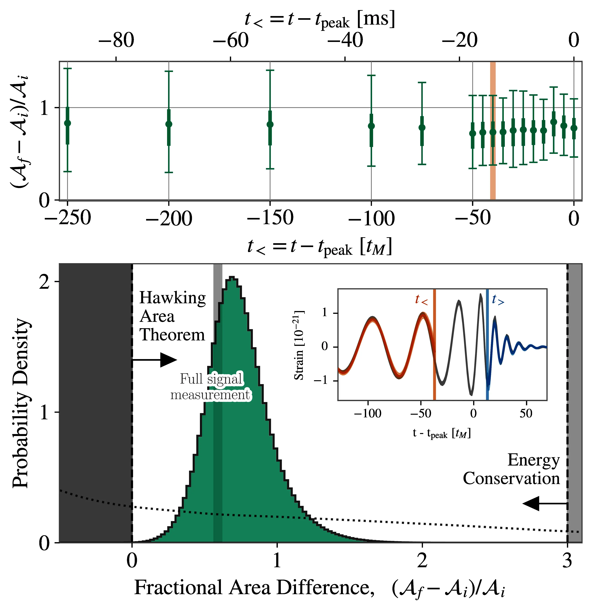{width="100%"}

:::

::::

::::: footer
[@abacGW250114TestingHawkings2025]
:::::

## Main caveats for LGWA

::: {.incremental}
- Assuming a known lunar response $L(f)$;
- assuming no data gaps due to lunar events;
- assuming stationary noise;
- assuming a simple geometry for seismic wave propagation;
- working directly in the frequency domain with a heterodyned likelihood;
- only considering the dominant, $\ell |m| = 22$ mode of GW emission with a Post-Newtonian model;
- performing zero-noise injections.
:::

## Moonquakes

::::: footer
[@ajithLunarGravitationalwaveAntenna2025]
:::::

## On the zero-noise assumption

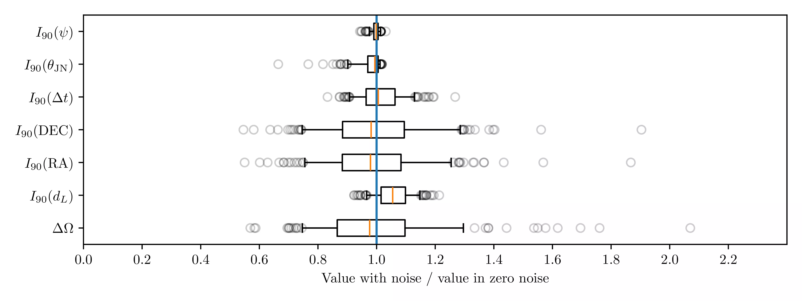

## On the zero-noise assumption

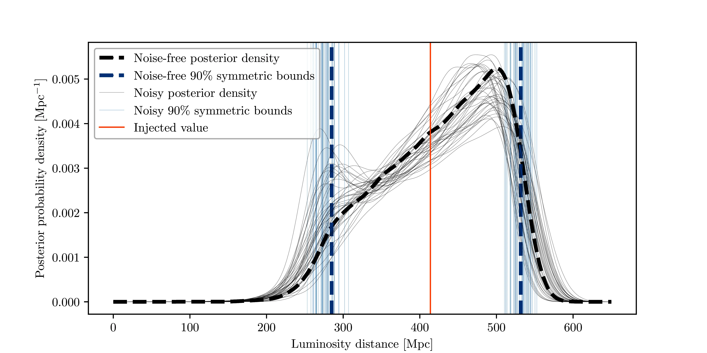

## Analytical timing uncertainty

Length scale of the timing uncertainty variation:

$$ r \sim c \frac{\sigma_t}{\sigma_\theta}
$$

- $r$ is the displacement to get a doubling of the timing variance;
- $\sigma_t$ is the minimal timing uncertainty;
- $\sigma_\theta$ is the angular parameter uncertainty along a given axis.

## Timing uncertainty ellipses

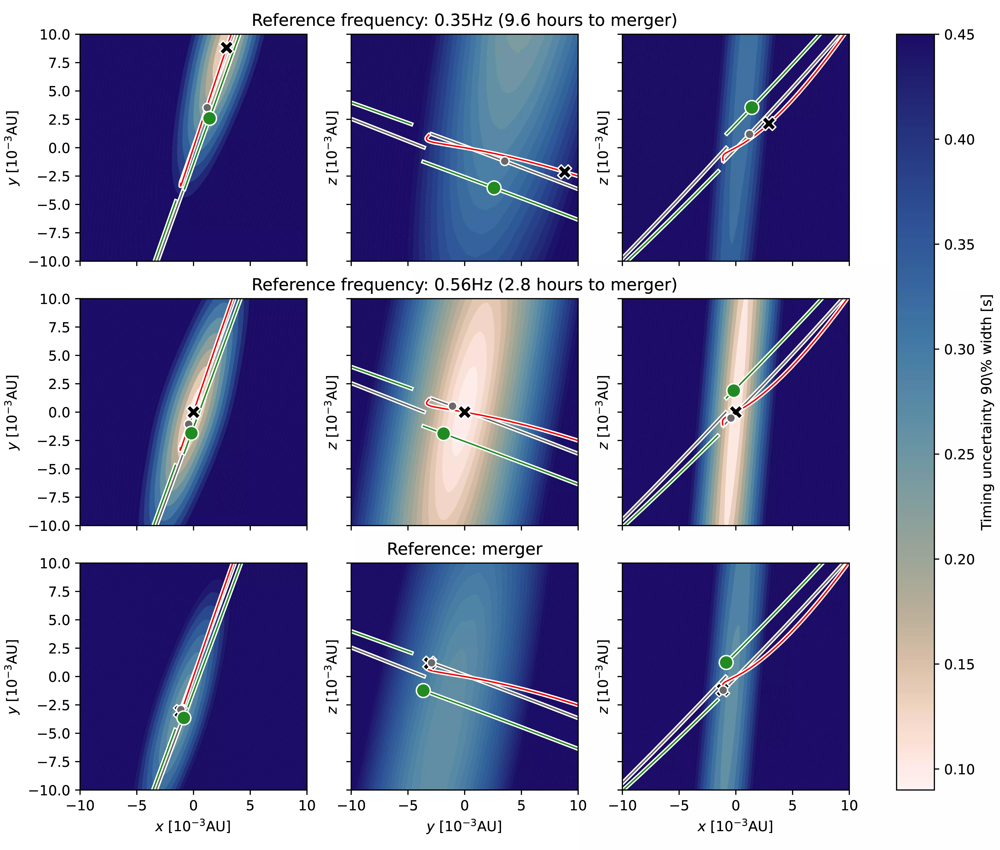

::::: footer
[@tissinoGeometryLunarGravitational2026]
:::::

## Analytical angular resolution

$$ \Delta \Omega \approx \frac{c^{2}}{(f_0 \rho_{T})^{2} A_s(T)}
$$

$$ A_s(T)= 2\pi \sqrt{\mathrm{Var}(r_\theta)\mathrm{Var}(r_\phi)-\mathrm{Cov}^2(r_\theta,r_\phi)}
$$

- $f_0$ is the monochromatic signal's frequency
- $\rho_T$ is the signal-to-noise ratio

::::: footer
[@wenGeometricalExpressionAngular2010], [@tissinoGeometryLunarGravitational2026]
:::::

## Validating the expression

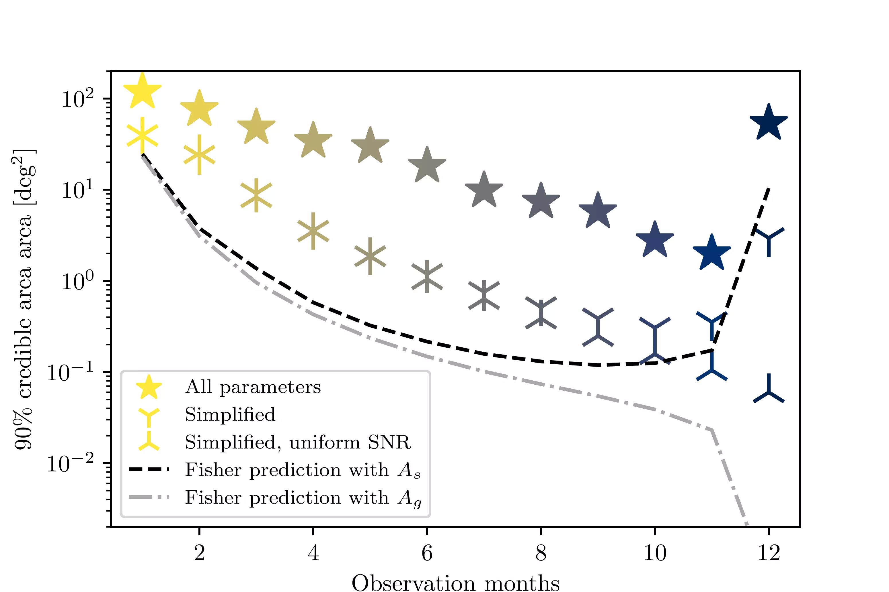

## Trajectories and areas

::::: footer
[@tissinoGeometryLunarGravitational2026]
:::::

## References

